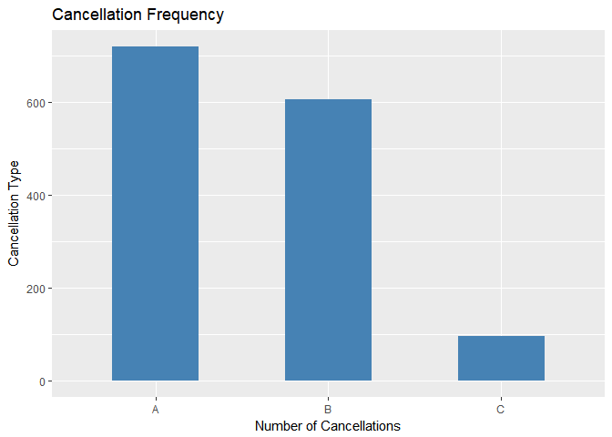

STA 380, Part 2: Exercises 2
================
Bhat Cui Ishita Srikanth
August 12, 2017

### Problem 1 Flights at ABIA

``` r
abia = read.csv('ABIA.csv')
library(dplyr)
```

    ## 
    ## Attaching package: 'dplyr'

    ## The following objects are masked from 'package:stats':
    ## 
    ##     filter, lag

    ## The following objects are masked from 'package:base':
    ## 
    ##     intersect, setdiff, setequal, union

``` r
library(ggplot2)
```

Departure Delay:

``` r
abia_delayed_subset =abia %>% filter(abia$Cancelled ==0)
ggplot(abia_delayed_subset,aes(DepDelay/60)) + geom_bar(color='steelblue')+labs(y = "Number of Flights",x="Departure Delay (in hrs)", title='Departure Delay vs Number of Flights')+xlim(-1,4)
```

    ## Warning: Removed 249 rows containing non-finite values (stat_count).


For departures, median flight delay is 0 min. In fact, majority of the flights depart ~0-15 min before the scheduled departure time. Only, a relatively small number of flights have significant delays in departing time. As a result, we decided to move on to explore the arrival delays for different airlines.

Arrival Delay:

``` r
abia_delayed_subset =abia %>% filter(abia$Cancelled ==0)
ggplot(abia_delayed_subset,aes(ArrDelay/60)) + geom_bar(color='steelblue')+labs(y = "Number of Flights",x="Arrival Delay (in hrs)", title='Arrival Delay vs Number of Flights')+xlim(-1,4)
```

    ## Warning: Removed 466 rows containing non-finite values (stat_count).


From the above plot, we see that most of the flights are delayed by less than half an hour. There are few flights which are delayed by more than 6 hrs as well ( we have removed those points from the graph for the purpose of better representation)

Now we try to explore if there are any seasonal trends in the arrival delays

``` r
# 
abia_delayed_subset =  na.omit(abia_delayed_subset)
avg_delay_carrier_month=abia_delayed_subset %>% group_by(Month,UniqueCarrier) %>% summarise(avgArrDelay = mean(ArrDelay),total_flight=n()) 

# ggplot(dfplot, mapping = aes(x = DateTime, y = value, color = key) ) + geom_line()

ggplot(avg_delay_carrier_month[which(avg_delay_carrier_month$total_flight>30),],aes(x=Month,y=avgArrDelay,color=UniqueCarrier)) + geom_line()+labs(y = "Average Arrival Delay",x="Month", title='Average arrival Delay by month')+xlim(1,12)
```

 Out of the airlines that fly more than 30 times in a month, we see that OO has the most average arrival delay, which is in month of December followed by Endeavor Airlines(9E)in the month of April. Delta Airlines (DL) has the least number of avg delays in September( though we see that it is amongst one of the highest in July)

``` r
# 
avg_delay_carrier_DoW=abia_delayed_subset %>% group_by(DayOfWeek,UniqueCarrier) %>% summarise(avgArrDelay = mean(ArrDelay),total_flight=n()/52) ##Assuming that each Mon/Tue/Wed.. occurs 52 times a year

# ggplot(dfplot, mapping = aes(x = DateTime, y = value, color = key) ) + geom_line()

ggplot(avg_delay_carrier_DoW[which(avg_delay_carrier_DoW$total_flight>=1),],aes(x=DayOfWeek,y=avgArrDelay,color=UniqueCarrier)) + geom_line()+labs(y = "Average Arrival Delay",x="Day of Week", title='Average arrival Delay by Day of Week')+xlim(1,7)
```

 Now we try to look at the the delays at day of week level. We observe that flights such as B6, EV and US have increased delays over the weekend starting Friday.Our hypothesis for this trend is that people go away for weekends on Friday. Since the frequency of flights is suspected to be more at this time, the probability of delays increases as well. To test our hypothesis, we plotted the below graph and we saw that Friday had the most number of scheduled flights.

``` r
ggplot(abia_delayed_subset,aes(DayOfWeek,fill=UniqueCarrier)) + geom_bar()+labs(y="Number of Flights",x = "Day of Week",title='Flight Frequency by Day of Week')
```


Now we try to see if there is a correlation between the distance of the flight and arrival delays.

``` r
avg_delay_carrier_distance=abia_delayed_subset %>% group_by(Distance, UniqueCarrier) %>% summarise(avgArrDelay = mean(ArrDelay)) 

# ggplot(dfplot, mapping = aes(x = DateTime, y = value, color = key) ) + geom_line()

ggplot(avg_delay_carrier_distance,aes(x=Distance,y=avgArrDelay,color=UniqueCarrier)) + geom_line()+labs(y = "Average Arrival Delay",x="Distance", title='Average arrival Delay by Distance')
```

 We observe very distinctly from the above plot that (Skywest Airlines) OO is considerably delayed for very short flights. As the distance increases, avg arrival delay decreases till a point after which it shoots up.We also see a similar increase(though not that significant)in delays for other flights for distance above 1000. This could be due to the fact that long haul flights must be having layovers( information not available with us). During layover there might be more chances for the flight to get delayed due to additional issues at the layover airport as well.

Cancellation:

``` r
abia_cancelled_subset =abia %>% filter(abia$Cancelled ==1)
ggplot(abia_cancelled_subset, aes(abia_cancelled_subset$CancellationCode))+geom_bar(fill="steelblue",width=0.5)+labs(x ='Number of Cancellations',y='Cancellation Type', title='Cancellation Frequency')
```

 From the above plot, we see that maximum cancellations occur due to carrier, followed by weather. Cancellation due to NAS is lower compared to the other two.

``` r
ggplot(abia_cancelled_subset,aes(Month,fill=CancellationCode)) + geom_bar()+labs(y = "Number of Cancellations",title='Distribution of Cancellation types accross Months')
```


The above plot depicts the distribution of different kind of cancellations across months. We see that most number of cancellations occur in March. Moreover, most number cancellations due to carries issues happen in April, due to weather conditions happen on september and to NAS happens in January.

``` r
par(mfrow=c(1,2))

ggplot(abia_cancelled_subset,aes(UniqueCarrier,fill=as.factor(Month))) + geom_bar()+labs(y = "Number of Cancellations",title='Distribution of Cancellations by airlines and month')
```


``` r
ggplot(abia_cancelled_subset,aes(UniqueCarrier,fill=CancellationCode)) + geom_bar()+labs(y = "Number of Cancellations",title='Distribution of Cancellations by Airlines and Code')
```

 By looking at the Carrier wise plot, we see that most number of cancellations happen for American Airlines, with type A and Type B having almost similar distribution in cancellation. Moreover, the delay happens most in April, followed by March. Now we look at cancellation rate.

``` r
# total_flights = nrow(abia)
flights_per_airline = abia %>% group_by(UniqueCarrier) %>% summarise(total=n())

cancelled_flights_per_airline = abia[which(abia$Cancelled==1),] %>% group_by(UniqueCarrier) %>% summarise(total=n())
cancelled_flight_rates = merge(flights_per_airline, cancelled_flights_per_airline, by='UniqueCarrier', all=TRUE)
cancelled_flight_rates$rate = cancelled_flight_rates$total.y/cancelled_flight_rates$total.x
cancelled_flight_rates
```

    ##    UniqueCarrier total.x total.y         rate
    ## 1             9E    2549      51 0.0200078462
    ## 2             AA   19995     568 0.0284071018
    ## 3             B6    4798      62 0.0129220509
    ## 4             CO    9230     118 0.0127843987
    ## 5             DL    2134      20 0.0093720712
    ## 6             EV     825      14 0.0169696970
    ## 7             F9    2132       2 0.0009380863
    ## 8             MQ    2663     170 0.0638377769
    ## 9             NW     121      NA           NA
    ## 10            OH    2986      58 0.0194239786
    ## 11            OO    4015      62 0.0154420922
    ## 12            UA    1866      17 0.0091103966
    ## 13            US    1458       2 0.0013717421
    ## 14            WN   34876     183 0.0052471614
    ## 15            XE    4618      29 0.0062797748
    ## 16            YV    4994      64 0.0128153785

``` r
ggplot(cancelled_flight_rates,aes(x=UniqueCarrier,y=rate)) + geom_point()+labs(y = "Average Arrival Delay",x="Distance", title='Average arrival Delay by Distance')
```

    ## Warning: Removed 1 rows containing missing values (geom_point).


``` r
# 
# barplot(cancelled_flight_rates$rate,col='steelblue',xlab='UniqueCarrier',names.arg = cancelled_flight_rates$UniqueCarrier)
```

From the above graph, we can see that cancellation rate for AA is second highest after MQ. Since AA flies more thus impacting more people, we decided to deep dive to identify it's cancellation trends.

First we need to see if the cancellation is high only for flights from Austin/ flights to Austin or both.

``` r
# abia %>% filter(abia, UniqueCarrier='AA') %>% summarise()
abia_cancelled_subset$toAustin=ifelse(abia_cancelled_subset$Origin=='AUS',0,1)
abia_AA =abia_cancelled_subset %>% filter(abia_cancelled_subset$UniqueCarrier =='AA')

ggplot(abia_AA,aes(as.factor(toAustin))) + geom_bar(fill="steelblue",width = 0.5)+labs(y = "Number of Cancellations",title='Distribution of Cancellation for flights end/originating at Austin')
```

 We observed that for AA, flights originating/landing at Austin have almost equal number of cancellations. Now we look closely into the origin/destination of these cancelled flights.

``` r
abia_AA_origin =abia_AA %>% filter(abia_AA$toAustin ==1)
par(mfrow=c(1,2))
ggplot(abia_AA_origin,aes(Origin)) + geom_bar(fill='khaki')+labs(y = "Number of Cancellations",title='Distribution of Cancellations by Origin Airport')
```


``` r
abia_AA_dest =abia_AA %>% filter(abia_AA$toAustin ==0)

ggplot(abia_AA_dest,aes(Dest)) + geom_bar(fill='khaki')+labs(y = "Number of Cancellations",title='Distribution of Cancellations by Destination Airport')
```

 From the above plots, we see that number of cancellations happen for flights to/from DFW airport followed by ORD, but this can be due to more number of flights to/from these airports. Hence we decide to plot Cancellation rate for each of these source/destination Airports

``` r
par(mfrow=c(1,2))
### Origin
abia$toAustin=ifelse(abia$Origin=='AUS',0,1)


flights_per_airpot_origin = abia%>% filter(abia$UniqueCarrier =='AA',abia$toAustin==1) %>% group_by(Origin) %>% summarise(total=n())

cancelled_flights_per_airport_origin = abia%>% filter(abia$UniqueCarrier =='AA',abia$toAustin==1, abia$Cancelled==1)%>% group_by(Origin) %>% summarise(total=n())


cancelled_flight_rates_origin = merge(flights_per_airpot_origin, cancelled_flights_per_airport_origin, by='Origin', all=TRUE)

cancelled_flight_rates_origin$rate = cancelled_flight_rates_origin$total.y/cancelled_flight_rates_origin$total.x

cancelled_flight_rates_origin
```

    ##   Origin total.x total.y        rate
    ## 1    DFW    5508     159 0.028867102
    ## 2    LAX    1064      11 0.010338346
    ## 3    ORD    1739      70 0.040253019
    ## 4    RDU     231       2 0.008658009
    ## 5    SEA     147       2 0.013605442
    ## 6    SJC     968      30 0.030991736
    ## 7    SNA     246      NA          NA
    ## 8    STL      95       6 0.063157895

``` r
ggplot(cancelled_flight_rates_origin,aes(x=Origin,y=rate)) + geom_point()+labs(x = "Origin Airport",y="Cancellation Rate", title='CAncellation Rate by Destination Airport')+theme(axis.text.x=element_text(angle=90, hjust=1))
```

    ## Warning: Removed 1 rows containing missing values (geom_point).


``` r
## Destination

flights_per_airpot_dest = abia%>% filter(abia$UniqueCarrier =='AA',abia$toAustin==0) %>% group_by(Dest) %>% summarise(total=n())

cancelled_flights_per_airport_dest = abia%>% filter(abia$UniqueCarrier =='AA',abia$toAustin==0, abia$Cancelled==1)%>% group_by(Dest) %>% summarise(total=n())


cancelled_flight_rates_dest = merge(flights_per_airpot_dest, cancelled_flights_per_airport_dest, by='Dest', all=TRUE)

cancelled_flight_rates_dest$rate = cancelled_flight_rates_dest$total.y/cancelled_flight_rates_dest$total.x

cancelled_flight_rates_dest
```

    ##   Dest total.x total.y        rate
    ## 1  DFW    5505     156 0.028337875
    ## 2  LAX    1063      13 0.012229539
    ## 3  ORD    1741      76 0.043653073
    ## 4  RDU     231       2 0.008658009
    ## 5  SEA     149       1 0.006711409
    ## 6  SJC     968      31 0.032024793
    ## 7  SNA     245       2 0.008163265
    ## 8  STL      95       7 0.073684211

``` r
ggplot(cancelled_flight_rates_dest,aes(x=Dest,y=rate)) + geom_point()+labs(x = "Destination Airport",y="Cancellation Rate", title='Cancellation Rate by Destination Airport')+theme(axis.text.x=element_text(angle=90, hjust=1))
```


We see from the above plot that the cancellation rates are highest at STL, followed by ORD, SJC and then DFW. We also saw from previous barplot that ORD had maximum number of cancellations after DWF Hence we can say that for American Airlines, we should not take flights to/from ORD(Chicago) Airport.

Concluding, we say that to aviod cancellations: 1) We should not take flights to/from ORD(Chicago) Airport. 2) We should aviod AA in month of March and April

### Problem 2 Author Attribution

``` r
rm(list=ls())
```

``` r
library(tm)
```

    ## Loading required package: NLP

    ## 
    ## Attaching package: 'NLP'

    ## The following object is masked from 'package:ggplot2':
    ## 
    ##     annotate

``` r
readerPlain = function(fname){
                readPlain(elem=list(content=readLines(fname)), 
                            id=fname, language='en') }
```

(1)First model: Naive Bayes
---------------------------

Step 1.Create a training set
----------------------------

Make a list called "authors" to get all the authors' names and a list called "files" to get the files.

``` r
author_directories = Sys.glob('ReutersC50/C50train/*')
files = NULL
authors = NULL
```

Use for loop to iterate over 50 authors and read all 2500 texts.

``` r
for(author in author_directories) {
    author_name = substring(author, first=21)
    files_to_add = Sys.glob(paste0(author, '/*.txt'))
    files = append(files, files_to_add)
    authors = append(authors, rep(author_name, length(files_to_add)))
}
my_documents = lapply(files, readerPlain) 
```

Build a corpus

``` r
names(my_documents) = files
names(my_documents) = sub('.txt', '', names(my_documents))
my_corpus = Corpus(VectorSource(my_documents))
```

Some preprocessing steps: set every character to lowercase and remove numbers & punctuations & white spaces & stopwords.

``` r
my_corpus = tm_map(my_corpus, content_transformer(tolower)) 
my_corpus = tm_map(my_corpus, content_transformer(removeNumbers))
my_corpus = tm_map(my_corpus, content_transformer(removePunctuation))
my_corpus = tm_map(my_corpus, content_transformer(stripWhitespace)) 
my_corpus = tm_map(my_corpus, content_transformer(removeWords), stopwords("SMART"))
```

Form a DTM

``` r
DTM_documents = DocumentTermMatrix(my_corpus)
DTM_documents
```

    ## <<DocumentTermMatrix (documents: 2500, terms: 32241)>>
    ## Non-/sparse entries: 473695/80128805
    ## Sparsity           : 99%
    ## Maximal term length: 40
    ## Weighting          : term frequency (tf)

Remove some sparse terms.

``` r
DTM_dcouments = removeSparseTerms(DTM_documents, 0.99)
DTM_documents
```

    ## <<DocumentTermMatrix (documents: 2500, terms: 32241)>>
    ## Non-/sparse entries: 473695/80128805
    ## Sparsity           : 99%
    ## Maximal term length: 40
    ## Weighting          : term frequency (tf)

Get the train set

``` r
X_train = as.matrix(DTM_documents) #Build a train set
smooth_count = 1/nrow(X_train) # Group smoothed train records by authors
w_train = rowsum(X_train + smooth_count,authors)
w_train= w_train/sum(w_train)
w_train = log(w_train)
```

|                                                                         |
|-------------------------------------------------------------------------|
| Step 2. Create a test set (similar to the creation of our training set) |

Make lists

``` r
author_directories= Sys.glob('ReutersC50/C50test/*')
files = NULL
authors_test = NULL
author_list = NULL
```

Use for loop to iterate over 50 authors.

``` r
for(author in author_directories) {
  author_name = substring(author, first=20)
  author_list = append(author_list,author_name)
  files_to_add = Sys.glob(paste0(author, '/*.txt'))
  files = append(files, files_to_add)
  authors_test = append(authors_test, rep(author_name, length(files_to_add)))
}
```

Build a test corpus.

``` r
my_documents = lapply(files, readerPlain) 
names(my_documents) = files
names(my_documents) = sub('.txt', '', names(my_documents))
test_corpus = Corpus(VectorSource(my_documents))
```

Some preprocessing steps: set every character to lowercase and remove numbers & punctuations & white spaces & stopwords.

``` r
test_corpus = tm_map(test_corpus, content_transformer(tolower))
test_corpus = tm_map(test_corpus, content_transformer(removeNumbers))
test_corpus = tm_map(test_corpus, content_transformer(removePunctuation))
test_corpus = tm_map(test_corpus, content_transformer(stripWhitespace)) 
test_corpus = tm_map(test_corpus, content_transformer(removeWords), stopwords("SMART"))
```

Form a test DTM.

``` r
DTM_test = DocumentTermMatrix(test_corpus,list(dictionary=colnames(DTM_documents)))
DTM_test
```

    ## <<DocumentTermMatrix (documents: 2500, terms: 32241)>>
    ## Non-/sparse entries: 456605/80145895
    ## Sparsity           : 99%
    ## Maximal term length: 40
    ## Weighting          : term frequency (tf)

``` r
X_test = as.matrix(DTM_test)
```

|                   |
|:------------------|
| Step.3 Prediction |

Get max(Naive Bayes log probs) for each test row (so the prediction is the author of the maximum prob).

``` r
predict = NULL
for (i in 1:nrow(X_test)) {
  max = -(Inf)
  author = NULL
  for (j in 1:nrow(w_train)) {
    result = sum(w_train[j,]*X_test[i,])
    if(result > max) {
      max = result
      author = rownames(w_train)[j]
    }
  }
  predict = append(predict, author)
}
```

Get the accuracy and calculate the rate of accuracy

``` r
table(authors_test == predict)['TRUE']/2500
```

    ##   TRUE 
    ## 0.0216

``` r
table(authors_test[authors_test == predict])/50
```

    ## 
    ##   AaronPressman      AlanCrosby BenjaminKangLim 
    ##            1.00            0.06            0.02

``` r
predict_results = table(authors_test,predict)
```

|                                                                                       |
|:--------------------------------------------------------------------------------------|
| Conclusion:                                                                           |
| The overall rate of accuracy (the average accuracy of all 2500 articles) is about 4%. |

We did the second model (Random Forest) in a seperate R file. Please see: "Problem 2 Author Attribution model 2.rmd"

Comparing these 2 models, we found the accuracy rate of Random Forest was better than Naive Bayes.

### Practice with association rule mining

``` r
library(arules)  
```

    ## Loading required package: Matrix

    ## 
    ## Attaching package: 'arules'

    ## The following object is masked from 'package:tm':
    ## 
    ##     inspect

    ## The following object is masked from 'package:dplyr':
    ## 
    ##     recode

    ## The following objects are masked from 'package:base':
    ## 
    ##     abbreviate, write

``` r
library(reshape)
```

    ## 
    ## Attaching package: 'reshape'

    ## The following object is masked from 'package:Matrix':
    ## 
    ##     expand

    ## The following object is masked from 'package:dplyr':
    ## 
    ##     rename

``` r
library(arulesViz)
```

    ## Loading required package: grid

``` r
# Read in groceries from file
groceries_raw <- read.table("groceries.txt", header = FALSE, sep = ",", col.names = paste0("V",seq_len(50)), fill = TRUE)

#summary(groceries_raw)
#attach(grocery_raw)

# Create User
groceries_raw$user <- seq.int(nrow(groceries_raw))


#Melt column into one row
groceries_reshaped=melt(groceries_raw, id=c("user"))

#Remove column 'Variable'
groceries_reshaped=groceries_reshaped[,-c(2)]

#sort
groceries_reshaped2<-groceries_reshaped[order(groceries_reshaped$user),]

#Remove all blank values 
groceries_reshaped3=groceries_reshaped2[groceries_reshaped2$value!="",]
# make user a factor
groceries_reshaped3$user <- factor(groceries_reshaped3$user)

summary(groceries_reshaped3)
```

    ##       user                     value       
    ##  1217   :    32   whole milk      :  2513  
    ##  2939   :    29   other vegetables:  1903  
    ##  2974   :    29   rolls/buns      :  1809  
    ##  9002   :    29   soda            :  1715  
    ##  5611   :    28   yogurt          :  1372  
    ##  (Other): 43220   (Other)         : 34055  
    ##  NA's   :177030   NA's            :177030

``` r
# First split data into a list of items for each user
groceries <- split(x=groceries_reshaped3$value, f=groceries_reshaped3$user)

## Remove duplicates ("de-dupe")
groceries <- lapply(groceries, unique)

## Cast this variable as a special arules "transactions" class.
groceriestrans <- as(groceries, "transactions")

#Create a list of possible values for support and confidence
sup = seq(.009,0.05,by=.01)
con = seq(.2,0.5,by=.05)
parmb = expand.grid(sup,con)
colnames(parmb) = c('sup','con')
nset = nrow(parmb)
avg_inspection = rep(0,nset)
# Run a loop to get optimum value of support and confidence to maximize lift
for(i in 1:nset) {
  groceryrules <- apriori(groceriestrans, parameter=list(support=parmb[i,1], confidence=parmb[i,2], maxlen=5))
  inspection=inspect(groceryrules)
  avg_inspection[i]=mean(inspection$lift)
}
```

    ## Apriori
    ## 
    ## Parameter specification:
    ##  confidence minval smax arem  aval originalSupport maxtime support minlen
    ##         0.2    0.1    1 none FALSE            TRUE       5   0.009      1
    ##  maxlen target   ext
    ##       5  rules FALSE
    ## 
    ## Algorithmic control:
    ##  filter tree heap memopt load sort verbose
    ##     0.1 TRUE TRUE  FALSE TRUE    2    TRUE
    ## 
    ## Absolute minimum support count: 88 
    ## 
    ## set item appearances ...[0 item(s)] done [0.00s].
    ## set transactions ...[169 item(s), 9835 transaction(s)] done [0.00s].
    ## sorting and recoding items ... [93 item(s)] done [0.00s].
    ## creating transaction tree ... done [0.00s].
    ## checking subsets of size 1 2 3 4 done [0.00s].
    ## writing ... [293 rule(s)] done [0.00s].
    ## creating S4 object  ... done [0.00s].
    ##       lhs                           rhs                      support confidence      lift
    ## [1]   {}                         => {whole milk}         0.255516014  0.2555160 1.0000000
    ## [2]   {baking powder}            => {whole milk}         0.009252669  0.5229885 2.0467935
    ## [3]   {grapes}                   => {other vegetables}   0.009049314  0.4045455 2.0907538
    ## [4]   {meat}                     => {other vegetables}   0.009964413  0.3858268 1.9940128
    ## [5]   {meat}                     => {whole milk}         0.009964413  0.3858268 1.5099906
    ## [6]   {frozen meals}             => {whole milk}         0.009862735  0.3476703 1.3606593
    ## [7]   {hard cheese}              => {other vegetables}   0.009456024  0.3858921 1.9943505
    ## [8]   {hard cheese}              => {whole milk}         0.010066090  0.4107884 1.6076815
    ## [9]   {butter milk}              => {other vegetables}   0.010371124  0.3709091 1.9169159
    ## [10]  {butter milk}              => {whole milk}         0.011591256  0.4145455 1.6223854
    ## [11]  {ham}                      => {other vegetables}   0.009150991  0.3515625 1.8169297
    ## [12]  {ham}                      => {whole milk}         0.011489578  0.4414062 1.7275091
    ## [13]  {sliced cheese}            => {other vegetables}   0.009049314  0.3692946 1.9085720
    ## [14]  {sliced cheese}            => {whole milk}         0.010777834  0.4398340 1.7213560
    ## [15]  {oil}                      => {other vegetables}   0.009964413  0.3550725 1.8350697
    ## [16]  {oil}                      => {whole milk}         0.011286223  0.4021739 1.5739675
    ## [17]  {onions}                   => {root vegetables}    0.009456024  0.3049180 2.7974523
    ## [18]  {onions}                   => {other vegetables}   0.014234875  0.4590164 2.3722681
    ## [19]  {onions}                   => {whole milk}         0.012099644  0.3901639 1.5269647
    ## [20]  {berries}                  => {whipped/sour cream} 0.009049314  0.2721713 3.7968855
    ## [21]  {berries}                  => {yogurt}             0.010574479  0.3180428 2.2798477
    ## [22]  {berries}                  => {other vegetables}   0.010269446  0.3088685 1.5962805
    ## [23]  {berries}                  => {whole milk}         0.011794611  0.3547401 1.3883281
    ## [24]  {hamburger meat}           => {other vegetables}   0.013828165  0.4159021 2.1494470
    ## [25]  {hamburger meat}           => {whole milk}         0.014743264  0.4434251 1.7354101
    ## [26]  {hygiene articles}         => {other vegetables}   0.009557702  0.2901235 1.4994032
    ## [27]  {hygiene articles}         => {whole milk}         0.012811388  0.3888889 1.5219746
    ## [28]  {salty snack}              => {soda}               0.009354347  0.2473118 1.4182576
    ## [29]  {salty snack}              => {other vegetables}   0.010777834  0.2849462 1.4726465
    ## [30]  {salty snack}              => {whole milk}         0.011184545  0.2956989 1.1572618
    ## [31]  {sugar}                    => {other vegetables}   0.010777834  0.3183183 1.6451186
    ## [32]  {sugar}                    => {whole milk}         0.015048297  0.4444444 1.7393996
    ## [33]  {waffles}                  => {soda}               0.009557702  0.2486772 1.4260879
    ## [34]  {waffles}                  => {rolls/buns}         0.009150991  0.2380952 1.2944537
    ## [35]  {waffles}                  => {other vegetables}   0.010066090  0.2619048 1.3535645
    ## [36]  {waffles}                  => {whole milk}         0.012709710  0.3306878 1.2941961
    ## [37]  {long life bakery product} => {other vegetables}   0.010676157  0.2853261 1.4746096
    ## [38]  {long life bakery product} => {whole milk}         0.013523132  0.3614130 1.4144438
    ## [39]  {dessert}                  => {soda}               0.009862735  0.2657534 1.5240145
    ## [40]  {dessert}                  => {yogurt}             0.009862735  0.2657534 1.9050182
    ## [41]  {dessert}                  => {other vegetables}   0.011591256  0.3123288 1.6141636
    ## [42]  {dessert}                  => {whole milk}         0.013726487  0.3698630 1.4475140
    ## [43]  {cream cheese }            => {yogurt}             0.012404677  0.3128205 2.2424123
    ## [44]  {cream cheese }            => {rolls/buns}         0.009964413  0.2512821 1.3661465
    ## [45]  {cream cheese }            => {other vegetables}   0.013726487  0.3461538 1.7889769
    ## [46]  {cream cheese }            => {whole milk}         0.016471784  0.4153846 1.6256696
    ## [47]  {chicken}                  => {root vegetables}    0.010879512  0.2535545 2.3262206
    ## [48]  {chicken}                  => {rolls/buns}         0.009659380  0.2251185 1.2239029
    ## [49]  {chicken}                  => {other vegetables}   0.017895272  0.4170616 2.1554393
    ## [50]  {chicken}                  => {whole milk}         0.017590239  0.4099526 1.6044106
    ## [51]  {white bread}              => {soda}               0.010269446  0.2439614 1.3990437
    ## [52]  {white bread}              => {yogurt}             0.009049314  0.2149758 1.5410258
    ## [53]  {white bread}              => {other vegetables}   0.013726487  0.3260870 1.6852681
    ## [54]  {white bread}              => {whole milk}         0.017081851  0.4057971 1.5881474
    ## [55]  {chocolate}                => {soda}               0.013523132  0.2725410 1.5629391
    ## [56]  {chocolate}                => {rolls/buns}         0.011794611  0.2377049 1.2923316
    ## [57]  {chocolate}                => {other vegetables}   0.012709710  0.2561475 1.3238103
    ## [58]  {chocolate}                => {whole milk}         0.016675140  0.3360656 1.3152427
    ## [59]  {coffee}                   => {other vegetables}   0.013421454  0.2311734 1.1947400
    ## [60]  {coffee}                   => {whole milk}         0.018708693  0.3222417 1.2611408
    ## [61]  {frozen vegetables}        => {root vegetables}    0.011591256  0.2410148 2.2111759
    ## [62]  {frozen vegetables}        => {yogurt}             0.012404677  0.2579281 1.8489235
    ## [63]  {frozen vegetables}        => {rolls/buns}         0.010167768  0.2114165 1.1494092
    ## [64]  {frozen vegetables}        => {other vegetables}   0.017793594  0.3699789 1.9121083
    ## [65]  {frozen vegetables}        => {whole milk}         0.020437214  0.4249471 1.6630940
    ## [66]  {beef}                     => {root vegetables}    0.017386884  0.3313953 3.0403668
    ## [67]  {beef}                     => {yogurt}             0.011692933  0.2228682 1.5976012
    ## [68]  {beef}                     => {rolls/buns}         0.013624809  0.2596899 1.4118576
    ## [69]  {beef}                     => {other vegetables}   0.019725470  0.3759690 1.9430662
    ## [70]  {beef}                     => {whole milk}         0.021250635  0.4050388 1.5851795
    ## [71]  {curd}                     => {root vegetables}    0.010879512  0.2041985 1.8734067
    ## [72]  {curd}                     => {yogurt}             0.017285206  0.3244275 2.3256154
    ## [73]  {curd}                     => {other vegetables}   0.017183528  0.3225191 1.6668288
    ## [74]  {curd}                     => {whole milk}         0.026131164  0.4904580 1.9194805
    ## [75]  {napkins}                  => {soda}               0.011997966  0.2291262 1.3139687
    ## [76]  {napkins}                  => {yogurt}             0.012302999  0.2349515 1.6842183
    ## [77]  {napkins}                  => {rolls/buns}         0.011692933  0.2233010 1.2140216
    ## [78]  {napkins}                  => {other vegetables}   0.014438231  0.2757282 1.4250060
    ## [79]  {napkins}                  => {whole milk}         0.019725470  0.3766990 1.4742678
    ## [80]  {pork}                     => {root vegetables}    0.013624809  0.2363316 2.1682099
    ## [81]  {pork}                     => {soda}               0.011896289  0.2063492 1.1833495
    ## [82]  {pork}                     => {other vegetables}   0.021657346  0.3756614 1.9414764
    ## [83]  {pork}                     => {whole milk}         0.022165735  0.3844797 1.5047187
    ## [84]  {frankfurter}              => {rolls/buns}         0.019217082  0.3258621 1.7716161
    ## [85]  {frankfurter}              => {other vegetables}   0.016471784  0.2793103 1.4435193
    ## [86]  {frankfurter}              => {whole milk}         0.020538892  0.3482759 1.3630295
    ## [87]  {bottled beer}             => {soda}               0.016980173  0.2108586 1.2092094
    ## [88]  {bottled beer}             => {other vegetables}   0.016166751  0.2007576 1.0375464
    ## [89]  {bottled beer}             => {whole milk}         0.020437214  0.2537879 0.9932367
    ## [90]  {brown bread}              => {yogurt}             0.014539908  0.2241379 1.6067030
    ## [91]  {brown bread}              => {other vegetables}   0.018708693  0.2884013 1.4905025
    ## [92]  {brown bread}              => {whole milk}         0.025216065  0.3887147 1.5212930
    ## [93]  {margarine}                => {yogurt}             0.014234875  0.2430556 1.7423115
    ## [94]  {margarine}                => {rolls/buns}         0.014743264  0.2517361 1.3686151
    ## [95]  {margarine}                => {other vegetables}   0.019725470  0.3368056 1.7406635
    ## [96]  {margarine}                => {whole milk}         0.024199288  0.4131944 1.6170980
    ## [97]  {butter}                   => {root vegetables}    0.012913066  0.2330275 2.1378971
    ## [98]  {butter}                   => {yogurt}             0.014641586  0.2642202 1.8940273
    ## [99]  {butter}                   => {rolls/buns}         0.013421454  0.2422018 1.3167800
    ## [100] {butter}                   => {other vegetables}   0.020030503  0.3614679 1.8681223
    ## [101] {butter}                   => {whole milk}         0.027554652  0.4972477 1.9460530
    ## [102] {newspapers}               => {rolls/buns}         0.019725470  0.2471338 1.3435934
    ## [103] {newspapers}               => {other vegetables}   0.019318760  0.2420382 1.2508912
    ## [104] {newspapers}               => {whole milk}         0.027351296  0.3426752 1.3411103
    ## [105] {domestic eggs}            => {root vegetables}    0.014336553  0.2259615 2.0730706
    ## [106] {domestic eggs}            => {yogurt}             0.014336553  0.2259615 1.6197753
    ## [107] {domestic eggs}            => {rolls/buns}         0.015658363  0.2467949 1.3417510
    ## [108] {domestic eggs}            => {other vegetables}   0.022267412  0.3509615 1.8138238
    ## [109] {domestic eggs}            => {whole milk}         0.029994916  0.4727564 1.8502027
    ## [110] {fruit/vegetable juice}    => {soda}               0.018403660  0.2545710 1.4598869
    ## [111] {fruit/vegetable juice}    => {yogurt}             0.018708693  0.2587904 1.8551049
    ## [112] {fruit/vegetable juice}    => {rolls/buns}         0.014539908  0.2011252 1.0934583
    ## [113] {fruit/vegetable juice}    => {other vegetables}   0.021047280  0.2911392 1.5046529
    ## [114] {fruit/vegetable juice}    => {whole milk}         0.026639553  0.3684951 1.4421604
    ## [115] {whipped/sour cream}       => {root vegetables}    0.017081851  0.2382979 2.1862496
    ## [116] {whipped/sour cream}       => {yogurt}             0.020742247  0.2893617 2.0742510
    ## [117] {whipped/sour cream}       => {rolls/buns}         0.014641586  0.2042553 1.1104760
    ## [118] {whipped/sour cream}       => {other vegetables}   0.028876462  0.4028369 2.0819237
    ## [119] {whipped/sour cream}       => {whole milk}         0.032231825  0.4496454 1.7597542
    ## [120] {pip fruit}                => {tropical fruit}     0.020437214  0.2701613 2.5746476
    ## [121] {pip fruit}                => {root vegetables}    0.015556685  0.2056452 1.8866793
    ## [122] {pip fruit}                => {yogurt}             0.017996950  0.2379032 1.7053777
    ## [123] {pip fruit}                => {other vegetables}   0.026131164  0.3454301 1.7852365
    ## [124] {pip fruit}                => {whole milk}         0.030096594  0.3978495 1.5570432
    ## [125] {pastry}                   => {soda}               0.021047280  0.2365714 1.3566647
    ## [126] {pastry}                   => {rolls/buns}         0.020945602  0.2354286 1.2799558
    ## [127] {pastry}                   => {other vegetables}   0.022572445  0.2537143 1.3112349
    ## [128] {pastry}                   => {whole milk}         0.033248602  0.3737143 1.4625865
    ## [129] {citrus fruit}             => {tropical fruit}     0.019928826  0.2407862 2.2947022
    ## [130] {citrus fruit}             => {root vegetables}    0.017691917  0.2137592 1.9611211
    ## [131] {citrus fruit}             => {yogurt}             0.021657346  0.2616708 1.8757521
    ## [132] {citrus fruit}             => {rolls/buns}         0.016776817  0.2027027 1.1020349
    ## [133] {citrus fruit}             => {other vegetables}   0.028876462  0.3488943 1.8031403
    ## [134] {citrus fruit}             => {whole milk}         0.030503305  0.3685504 1.4423768
    ## [135] {shopping bags}            => {soda}               0.024605999  0.2497420 1.4321939
    ## [136] {shopping bags}            => {other vegetables}   0.023182511  0.2352941 1.2160366
    ## [137] {shopping bags}            => {whole milk}         0.024504321  0.2487100 0.9733637
    ## [138] {sausage}                  => {soda}               0.024300966  0.2586580 1.4833245
    ## [139] {sausage}                  => {yogurt}             0.019623793  0.2088745 1.4972889
    ## [140] {sausage}                  => {rolls/buns}         0.030604982  0.3257576 1.7710480
    ## [141] {sausage}                  => {other vegetables}   0.026944586  0.2867965 1.4822091
    ## [142] {sausage}                  => {whole milk}         0.029893238  0.3181818 1.2452520
    ## [143] {bottled water}            => {soda}               0.028978139  0.2621895 1.5035766
    ## [144] {bottled water}            => {yogurt}             0.022979156  0.2079117 1.4903873
    ## [145] {bottled water}            => {rolls/buns}         0.024199288  0.2189512 1.1903734
    ## [146] {bottled water}            => {other vegetables}   0.024809354  0.2244710 1.1601012
    ## [147] {bottled water}            => {whole milk}         0.034367056  0.3109476 1.2169396
    ## [148] {tropical fruit}           => {root vegetables}    0.021047280  0.2005814 1.8402220
    ## [149] {tropical fruit}           => {yogurt}             0.029283172  0.2790698 2.0004746
    ## [150] {yogurt}                   => {tropical fruit}     0.029283172  0.2099125 2.0004746
    ## [151] {tropical fruit}           => {rolls/buns}         0.024605999  0.2344961 1.2748863
    ## [152] {tropical fruit}           => {other vegetables}   0.035892222  0.3420543 1.7677896
    ## [153] {tropical fruit}           => {whole milk}         0.042297916  0.4031008 1.5775950
    ## [154] {root vegetables}          => {yogurt}             0.025826131  0.2369403 1.6984751
    ## [155] {root vegetables}          => {rolls/buns}         0.024300966  0.2229478 1.2121013
    ## [156] {root vegetables}          => {other vegetables}   0.047381800  0.4347015 2.2466049
    ## [157] {other vegetables}         => {root vegetables}    0.047381800  0.2448765 2.2466049
    ## [158] {root vegetables}          => {whole milk}         0.048906965  0.4486940 1.7560310
    ## [159] {soda}                     => {rolls/buns}         0.038332486  0.2198251 1.1951242
    ## [160] {rolls/buns}               => {soda}               0.038332486  0.2084024 1.1951242
    ## [161] {soda}                     => {whole milk}         0.040061007  0.2297376 0.8991124
    ## [162] {yogurt}                   => {rolls/buns}         0.034367056  0.2463557 1.3393633
    ## [163] {yogurt}                   => {other vegetables}   0.043416370  0.3112245 1.6084566
    ## [164] {other vegetables}         => {yogurt}             0.043416370  0.2243826 1.6084566
    ## [165] {yogurt}                   => {whole milk}         0.056024403  0.4016035 1.5717351
    ## [166] {whole milk}               => {yogurt}             0.056024403  0.2192598 1.5717351
    ## [167] {rolls/buns}               => {other vegetables}   0.042602949  0.2316197 1.1970465
    ## [168] {other vegetables}         => {rolls/buns}         0.042602949  0.2201787 1.1970465
    ## [169] {rolls/buns}               => {whole milk}         0.056634469  0.3079049 1.2050318
    ## [170] {whole milk}               => {rolls/buns}         0.056634469  0.2216474 1.2050318
    ## [171] {other vegetables}         => {whole milk}         0.074834774  0.3867578 1.5136341
    ## [172] {whole milk}               => {other vegetables}   0.074834774  0.2928770 1.5136341
    ## [173] {frozen vegetables,                                                                
    ##        other vegetables}         => {whole milk}         0.009659380  0.5428571 2.1245523
    ## [174] {frozen vegetables,                                                                
    ##        whole milk}               => {other vegetables}   0.009659380  0.4726368 2.4426606
    ## [175] {beef,                                                                             
    ##        other vegetables}         => {whole milk}         0.009252669  0.4690722 1.8357838
    ## [176] {beef,                                                                             
    ##        whole milk}               => {other vegetables}   0.009252669  0.4354067 2.2502495
    ## [177] {curd,                                                                             
    ##        yogurt}                   => {whole milk}         0.010066090  0.5823529 2.2791250
    ## [178] {curd,                                                                             
    ##        whole milk}               => {yogurt}             0.010066090  0.3852140 2.7613555
    ## [179] {curd,                                                                             
    ##        other vegetables}         => {whole milk}         0.009862735  0.5739645 2.2462956
    ## [180] {curd,                                                                             
    ##        whole milk}               => {other vegetables}   0.009862735  0.3774319 1.9506268
    ## [181] {other vegetables,                                                                 
    ##        pork}                     => {whole milk}         0.010167768  0.4694836 1.8373939
    ## [182] {pork,                                                                             
    ##        whole milk}               => {other vegetables}   0.010167768  0.4587156 2.3707136
    ## [183] {brown bread,                                                                      
    ##        other vegetables}         => {whole milk}         0.009354347  0.5000000 1.9568245
    ## [184] {brown bread,                                                                      
    ##        whole milk}               => {other vegetables}   0.009354347  0.3709677 1.9172190
    ## [185] {margarine,                                                                        
    ##        other vegetables}         => {whole milk}         0.009252669  0.4690722 1.8357838
    ## [186] {margarine,                                                                        
    ##        whole milk}               => {other vegetables}   0.009252669  0.3823529 1.9760595
    ## [187] {butter,                                                                           
    ##        yogurt}                   => {whole milk}         0.009354347  0.6388889 2.5003869
    ## [188] {butter,                                                                           
    ##        whole milk}               => {yogurt}             0.009354347  0.3394834 2.4335417
    ## [189] {butter,                                                                           
    ##        other vegetables}         => {whole milk}         0.011489578  0.5736041 2.2448850
    ## [190] {butter,                                                                           
    ##        whole milk}               => {other vegetables}   0.011489578  0.4169742 2.1549874
    ## [191] {domestic eggs,                                                                    
    ##        other vegetables}         => {whole milk}         0.012302999  0.5525114 2.1623358
    ## [192] {domestic eggs,                                                                    
    ##        whole milk}               => {other vegetables}   0.012302999  0.4101695 2.1198197
    ## [193] {fruit/vegetable juice,                                                            
    ##        yogurt}                   => {whole milk}         0.009456024  0.5054348 1.9780943
    ## [194] {fruit/vegetable juice,                                                            
    ##        whole milk}               => {yogurt}             0.009456024  0.3549618 2.5444968
    ## [195] {fruit/vegetable juice,                                                            
    ##        other vegetables}         => {whole milk}         0.010472801  0.4975845 1.9473713
    ## [196] {fruit/vegetable juice,                                                            
    ##        whole milk}               => {other vegetables}   0.010472801  0.3931298 2.0317558
    ## [197] {root vegetables,                                                                  
    ##        whipped/sour cream}       => {whole milk}         0.009456024  0.5535714 2.1664843
    ## [198] {whipped/sour cream,                                                               
    ##        whole milk}               => {root vegetables}    0.009456024  0.2933754 2.6915550
    ## [199] {whipped/sour cream,                                                               
    ##        yogurt}                   => {other vegetables}   0.010167768  0.4901961 2.5334096
    ## [200] {other vegetables,                                                                 
    ##        whipped/sour cream}       => {yogurt}             0.010167768  0.3521127 2.5240730
    ## [201] {other vegetables,                                                                 
    ##        yogurt}                   => {whipped/sour cream} 0.010167768  0.2341920 3.2670620
    ## [202] {whipped/sour cream,                                                               
    ##        yogurt}                   => {whole milk}         0.010879512  0.5245098 2.0527473
    ## [203] {whipped/sour cream,                                                               
    ##        whole milk}               => {yogurt}             0.010879512  0.3375394 2.4196066
    ## [204] {other vegetables,                                                                 
    ##        whipped/sour cream}       => {whole milk}         0.014641586  0.5070423 1.9843854
    ## [205] {whipped/sour cream,                                                               
    ##        whole milk}               => {other vegetables}   0.014641586  0.4542587 2.3476795
    ## [206] {pip fruit,                                                                        
    ##        tropical fruit}           => {other vegetables}   0.009456024  0.4626866 2.3912361
    ## [207] {other vegetables,                                                                 
    ##        pip fruit}                => {tropical fruit}     0.009456024  0.3618677 3.4486132
    ## [208] {other vegetables,                                                                 
    ##        tropical fruit}           => {pip fruit}          0.009456024  0.2634561 3.4826487
    ## [209] {pip fruit,                                                                        
    ##        yogurt}                   => {whole milk}         0.009557702  0.5310734 2.0784351
    ## [210] {pip fruit,                                                                        
    ##        whole milk}               => {yogurt}             0.009557702  0.3175676 2.2764410
    ## [211] {other vegetables,                                                                 
    ##        pip fruit}                => {whole milk}         0.013523132  0.5175097 2.0253514
    ## [212] {pip fruit,                                                                        
    ##        whole milk}               => {other vegetables}   0.013523132  0.4493243 2.3221780
    ## [213] {pastry,                                                                           
    ##        yogurt}                   => {whole milk}         0.009150991  0.5172414 2.0243012
    ## [214] {pastry,                                                                           
    ##        whole milk}               => {yogurt}             0.009150991  0.2752294 1.9729451
    ## [215] {other vegetables,                                                                 
    ##        pastry}                   => {whole milk}         0.010574479  0.4684685 1.8334212
    ## [216] {pastry,                                                                           
    ##        whole milk}               => {other vegetables}   0.010574479  0.3180428 1.6436947
    ## [217] {citrus fruit,                                                                     
    ##        tropical fruit}           => {other vegetables}   0.009049314  0.4540816 2.3467645
    ## [218] {citrus fruit,                                                                     
    ##        other vegetables}         => {tropical fruit}     0.009049314  0.3133803 2.9865262
    ## [219] {other vegetables,                                                                 
    ##        tropical fruit}           => {citrus fruit}       0.009049314  0.2521246 3.0462480
    ## [220] {citrus fruit,                                                                     
    ##        tropical fruit}           => {whole milk}         0.009049314  0.4540816 1.7771161
    ## [221] {citrus fruit,                                                                     
    ##        whole milk}               => {tropical fruit}     0.009049314  0.2966667 2.8272448
    ## [222] {tropical fruit,                                                                   
    ##        whole milk}               => {citrus fruit}       0.009049314  0.2139423 2.5849172
    ## [223] {citrus fruit,                                                                     
    ##        root vegetables}          => {other vegetables}   0.010371124  0.5862069 3.0296084
    ## [224] {citrus fruit,                                                                     
    ##        other vegetables}         => {root vegetables}    0.010371124  0.3591549 3.2950455
    ## [225] {other vegetables,                                                                 
    ##        root vegetables}          => {citrus fruit}       0.010371124  0.2188841 2.6446257
    ## [226] {citrus fruit,                                                                     
    ##        root vegetables}          => {whole milk}         0.009150991  0.5172414 2.0243012
    ## [227] {citrus fruit,                                                                     
    ##        whole milk}               => {root vegetables}    0.009150991  0.3000000 2.7523321
    ## [228] {citrus fruit,                                                                     
    ##        yogurt}                   => {whole milk}         0.010269446  0.4741784 1.8557678
    ## [229] {citrus fruit,                                                                     
    ##        whole milk}               => {yogurt}             0.010269446  0.3366667 2.4133503
    ## [230] {citrus fruit,                                                                     
    ##        other vegetables}         => {whole milk}         0.013014743  0.4507042 1.7638982
    ## [231] {citrus fruit,                                                                     
    ##        whole milk}               => {other vegetables}   0.013014743  0.4266667 2.2050797
    ## [232] {sausage,                                                                          
    ##        soda}                     => {rolls/buns}         0.009659380  0.3974895 2.1610335
    ## [233] {rolls/buns,                                                                       
    ##        sausage}                  => {soda}               0.009659380  0.3156146 1.8099532
    ## [234] {rolls/buns,                                                                       
    ##        soda}                     => {sausage}            0.009659380  0.2519894 2.6821598
    ## [235] {rolls/buns,                                                                       
    ##        sausage}                  => {whole milk}         0.009354347  0.3056478 1.1961984
    ## [236] {sausage,                                                                          
    ##        whole milk}               => {rolls/buns}         0.009354347  0.3129252 1.7012820
    ## [237] {other vegetables,                                                                 
    ##        sausage}                  => {whole milk}         0.010167768  0.3773585 1.4768487
    ## [238] {sausage,                                                                          
    ##        whole milk}               => {other vegetables}   0.010167768  0.3401361 1.7578760
    ## [239] {bottled water,                                                                    
    ##        yogurt}                   => {whole milk}         0.009659380  0.4203540 1.6451180
    ## [240] {bottled water,                                                                    
    ##        whole milk}               => {yogurt}             0.009659380  0.2810651 2.0147778
    ## [241] {bottled water,                                                                    
    ##        other vegetables}         => {whole milk}         0.010777834  0.4344262 1.7001918
    ## [242] {bottled water,                                                                    
    ##        whole milk}               => {other vegetables}   0.010777834  0.3136095 1.6207825
    ## [243] {root vegetables,                                                                  
    ##        tropical fruit}           => {other vegetables}   0.012302999  0.5845411 3.0209991
    ## [244] {other vegetables,                                                                 
    ##        tropical fruit}           => {root vegetables}    0.012302999  0.3427762 3.1447798
    ## [245] {other vegetables,                                                                 
    ##        root vegetables}          => {tropical fruit}     0.012302999  0.2596567 2.4745380
    ## [246] {root vegetables,                                                                  
    ##        tropical fruit}           => {whole milk}         0.011997966  0.5700483 2.2309690
    ## [247] {tropical fruit,                                                                   
    ##        whole milk}               => {root vegetables}    0.011997966  0.2836538 2.6023653
    ## [248] {root vegetables,                                                                  
    ##        whole milk}               => {tropical fruit}     0.011997966  0.2453222 2.3379305
    ## [249] {tropical fruit,                                                                   
    ##        yogurt}                   => {other vegetables}   0.012302999  0.4201389 2.1713431
    ## [250] {other vegetables,                                                                 
    ##        tropical fruit}           => {yogurt}             0.012302999  0.3427762 2.4571457
    ## [251] {other vegetables,                                                                 
    ##        yogurt}                   => {tropical fruit}     0.012302999  0.2833724 2.7005496
    ## [252] {tropical fruit,                                                                   
    ##        yogurt}                   => {whole milk}         0.015149975  0.5173611 2.0247698
    ## [253] {tropical fruit,                                                                   
    ##        whole milk}               => {yogurt}             0.015149975  0.3581731 2.5675162
    ## [254] {whole milk,                                                                       
    ##        yogurt}                   => {tropical fruit}     0.015149975  0.2704174 2.5770885
    ## [255] {rolls/buns,                                                                       
    ##        tropical fruit}           => {whole milk}         0.010981190  0.4462810 1.7465872
    ## [256] {tropical fruit,                                                                   
    ##        whole milk}               => {rolls/buns}         0.010981190  0.2596154 1.4114524
    ## [257] {other vegetables,                                                                 
    ##        tropical fruit}           => {whole milk}         0.017081851  0.4759207 1.8625865
    ## [258] {tropical fruit,                                                                   
    ##        whole milk}               => {other vegetables}   0.017081851  0.4038462 2.0871397
    ## [259] {other vegetables,                                                                 
    ##        whole milk}               => {tropical fruit}     0.017081851  0.2282609 2.1753349
    ## [260] {root vegetables,                                                                  
    ##        yogurt}                   => {other vegetables}   0.012913066  0.5000000 2.5840778
    ## [261] {other vegetables,                                                                 
    ##        root vegetables}          => {yogurt}             0.012913066  0.2725322 1.9536108
    ## [262] {other vegetables,                                                                 
    ##        yogurt}                   => {root vegetables}    0.012913066  0.2974239 2.7286977
    ## [263] {root vegetables,                                                                  
    ##        yogurt}                   => {whole milk}         0.014539908  0.5629921 2.2033536
    ## [264] {root vegetables,                                                                  
    ##        whole milk}               => {yogurt}             0.014539908  0.2972973 2.1311362
    ## [265] {whole milk,                                                                       
    ##        yogurt}                   => {root vegetables}    0.014539908  0.2595281 2.3810253
    ## [266] {rolls/buns,                                                                       
    ##        root vegetables}          => {other vegetables}   0.012201322  0.5020921 2.5948898
    ## [267] {other vegetables,                                                                 
    ##        root vegetables}          => {rolls/buns}         0.012201322  0.2575107 1.4000100
    ## [268] {other vegetables,                                                                 
    ##        rolls/buns}               => {root vegetables}    0.012201322  0.2863962 2.6275247
    ## [269] {rolls/buns,                                                                       
    ##        root vegetables}          => {whole milk}         0.012709710  0.5230126 2.0468876
    ## [270] {root vegetables,                                                                  
    ##        whole milk}               => {rolls/buns}         0.012709710  0.2598753 1.4128652
    ## [271] {rolls/buns,                                                                       
    ##        whole milk}               => {root vegetables}    0.012709710  0.2244165 2.0588959
    ## [272] {other vegetables,                                                                 
    ##        root vegetables}          => {whole milk}         0.023182511  0.4892704 1.9148326
    ## [273] {root vegetables,                                                                  
    ##        whole milk}               => {other vegetables}   0.023182511  0.4740125 2.4497702
    ## [274] {other vegetables,                                                                 
    ##        whole milk}               => {root vegetables}    0.023182511  0.3097826 2.8420820
    ## [275] {soda,                                                                             
    ##        yogurt}                   => {whole milk}         0.010472801  0.3828996 1.4985348
    ## [276] {soda,                                                                             
    ##        whole milk}               => {yogurt}             0.010472801  0.2614213 1.8739641
    ## [277] {rolls/buns,                                                                       
    ##        soda}                     => {other vegetables}   0.009862735  0.2572944 1.3297376
    ## [278] {other vegetables,                                                                 
    ##        soda}                     => {rolls/buns}         0.009862735  0.3012422 1.6377653
    ## [279] {other vegetables,                                                                 
    ##        rolls/buns}               => {soda}               0.009862735  0.2315036 1.3276022
    ## [280] {other vegetables,                                                                 
    ##        soda}                     => {whole milk}         0.013929842  0.4254658 1.6651240
    ## [281] {soda,                                                                             
    ##        whole milk}               => {other vegetables}   0.013929842  0.3477157 1.7970490
    ## [282] {rolls/buns,                                                                       
    ##        yogurt}                   => {other vegetables}   0.011489578  0.3343195 1.7278153
    ## [283] {other vegetables,                                                                 
    ##        yogurt}                   => {rolls/buns}         0.011489578  0.2646370 1.4387534
    ## [284] {other vegetables,                                                                 
    ##        rolls/buns}               => {yogurt}             0.011489578  0.2696897 1.9332351
    ## [285] {rolls/buns,                                                                       
    ##        yogurt}                   => {whole milk}         0.015556685  0.4526627 1.7715630
    ## [286] {whole milk,                                                                       
    ##        yogurt}                   => {rolls/buns}         0.015556685  0.2776770 1.5096478
    ## [287] {rolls/buns,                                                                       
    ##        whole milk}               => {yogurt}             0.015556685  0.2746858 1.9690488
    ## [288] {other vegetables,                                                                 
    ##        yogurt}                   => {whole milk}         0.022267412  0.5128806 2.0072345
    ## [289] {whole milk,                                                                       
    ##        yogurt}                   => {other vegetables}   0.022267412  0.3974592 2.0541308
    ## [290] {other vegetables,                                                                 
    ##        whole milk}               => {yogurt}             0.022267412  0.2975543 2.1329789
    ## [291] {other vegetables,                                                                 
    ##        rolls/buns}               => {whole milk}         0.017895272  0.4200477 1.6439194
    ## [292] {rolls/buns,                                                                       
    ##        whole milk}               => {other vegetables}   0.017895272  0.3159785 1.6330258
    ## [293] {other vegetables,                                                                 
    ##        whole milk}               => {rolls/buns}         0.017895272  0.2391304 1.3000817

    ## Warning in mean.default(inspection$lift): argument is not numeric or
    ## logical: returning NA

    ## Apriori
    ## 
    ## Parameter specification:
    ##  confidence minval smax arem  aval originalSupport maxtime support minlen
    ##         0.2    0.1    1 none FALSE            TRUE       5   0.019      1
    ##  maxlen target   ext
    ##       5  rules FALSE
    ## 
    ## Algorithmic control:
    ##  filter tree heap memopt load sort verbose
    ##     0.1 TRUE TRUE  FALSE TRUE    2    TRUE
    ## 
    ## Absolute minimum support count: 186 
    ## 
    ## set item appearances ...[0 item(s)] done [0.00s].
    ## set transactions ...[169 item(s), 9835 transaction(s)] done [0.00s].
    ## sorting and recoding items ... [62 item(s)] done [0.00s].
    ## creating transaction tree ... done [0.01s].
    ## checking subsets of size 1 2 3 done [0.00s].
    ## writing ... [81 rule(s)] done [0.00s].
    ## creating S4 object  ... done [0.00s].
    ##      lhs                                   rhs                support   
    ## [1]  {}                                 => {whole milk}       0.25551601
    ## [2]  {frozen vegetables}                => {whole milk}       0.02043721
    ## [3]  {beef}                             => {other vegetables} 0.01972547
    ## [4]  {beef}                             => {whole milk}       0.02125064
    ## [5]  {curd}                             => {whole milk}       0.02613116
    ## [6]  {napkins}                          => {whole milk}       0.01972547
    ## [7]  {pork}                             => {other vegetables} 0.02165735
    ## [8]  {pork}                             => {whole milk}       0.02216573
    ## [9]  {frankfurter}                      => {rolls/buns}       0.01921708
    ## [10] {frankfurter}                      => {whole milk}       0.02053889
    ## [11] {bottled beer}                     => {whole milk}       0.02043721
    ## [12] {brown bread}                      => {whole milk}       0.02521607
    ## [13] {margarine}                        => {other vegetables} 0.01972547
    ## [14] {margarine}                        => {whole milk}       0.02419929
    ## [15] {butter}                           => {other vegetables} 0.02003050
    ## [16] {butter}                           => {whole milk}       0.02755465
    ## [17] {newspapers}                       => {rolls/buns}       0.01972547
    ## [18] {newspapers}                       => {other vegetables} 0.01931876
    ## [19] {newspapers}                       => {whole milk}       0.02735130
    ## [20] {domestic eggs}                    => {other vegetables} 0.02226741
    ## [21] {domestic eggs}                    => {whole milk}       0.02999492
    ## [22] {fruit/vegetable juice}            => {other vegetables} 0.02104728
    ## [23] {fruit/vegetable juice}            => {whole milk}       0.02663955
    ## [24] {whipped/sour cream}               => {yogurt}           0.02074225
    ## [25] {whipped/sour cream}               => {other vegetables} 0.02887646
    ## [26] {whipped/sour cream}               => {whole milk}       0.03223183
    ## [27] {pip fruit}                        => {tropical fruit}   0.02043721
    ## [28] {pip fruit}                        => {other vegetables} 0.02613116
    ## [29] {pip fruit}                        => {whole milk}       0.03009659
    ## [30] {pastry}                           => {soda}             0.02104728
    ## [31] {pastry}                           => {rolls/buns}       0.02094560
    ## [32] {pastry}                           => {other vegetables} 0.02257245
    ## [33] {pastry}                           => {whole milk}       0.03324860
    ## [34] {citrus fruit}                     => {tropical fruit}   0.01992883
    ## [35] {citrus fruit}                     => {yogurt}           0.02165735
    ## [36] {citrus fruit}                     => {other vegetables} 0.02887646
    ## [37] {citrus fruit}                     => {whole milk}       0.03050330
    ## [38] {shopping bags}                    => {soda}             0.02460600
    ## [39] {shopping bags}                    => {other vegetables} 0.02318251
    ## [40] {shopping bags}                    => {whole milk}       0.02450432
    ## [41] {sausage}                          => {soda}             0.02430097
    ## [42] {sausage}                          => {yogurt}           0.01962379
    ## [43] {sausage}                          => {rolls/buns}       0.03060498
    ## [44] {sausage}                          => {other vegetables} 0.02694459
    ## [45] {sausage}                          => {whole milk}       0.02989324
    ## [46] {bottled water}                    => {soda}             0.02897814
    ## [47] {bottled water}                    => {yogurt}           0.02297916
    ## [48] {bottled water}                    => {rolls/buns}       0.02419929
    ## [49] {bottled water}                    => {other vegetables} 0.02480935
    ## [50] {bottled water}                    => {whole milk}       0.03436706
    ## [51] {tropical fruit}                   => {root vegetables}  0.02104728
    ## [52] {tropical fruit}                   => {yogurt}           0.02928317
    ## [53] {yogurt}                           => {tropical fruit}   0.02928317
    ## [54] {tropical fruit}                   => {rolls/buns}       0.02460600
    ## [55] {tropical fruit}                   => {other vegetables} 0.03589222
    ## [56] {tropical fruit}                   => {whole milk}       0.04229792
    ## [57] {root vegetables}                  => {yogurt}           0.02582613
    ## [58] {root vegetables}                  => {rolls/buns}       0.02430097
    ## [59] {root vegetables}                  => {other vegetables} 0.04738180
    ## [60] {other vegetables}                 => {root vegetables}  0.04738180
    ## [61] {root vegetables}                  => {whole milk}       0.04890696
    ## [62] {soda}                             => {rolls/buns}       0.03833249
    ## [63] {rolls/buns}                       => {soda}             0.03833249
    ## [64] {soda}                             => {whole milk}       0.04006101
    ## [65] {yogurt}                           => {rolls/buns}       0.03436706
    ## [66] {yogurt}                           => {other vegetables} 0.04341637
    ## [67] {other vegetables}                 => {yogurt}           0.04341637
    ## [68] {yogurt}                           => {whole milk}       0.05602440
    ## [69] {whole milk}                       => {yogurt}           0.05602440
    ## [70] {rolls/buns}                       => {other vegetables} 0.04260295
    ## [71] {other vegetables}                 => {rolls/buns}       0.04260295
    ## [72] {rolls/buns}                       => {whole milk}       0.05663447
    ## [73] {whole milk}                       => {rolls/buns}       0.05663447
    ## [74] {other vegetables}                 => {whole milk}       0.07483477
    ## [75] {whole milk}                       => {other vegetables} 0.07483477
    ## [76] {other vegetables,root vegetables} => {whole milk}       0.02318251
    ## [77] {root vegetables,whole milk}       => {other vegetables} 0.02318251
    ## [78] {other vegetables,whole milk}      => {root vegetables}  0.02318251
    ## [79] {other vegetables,yogurt}          => {whole milk}       0.02226741
    ## [80] {whole milk,yogurt}                => {other vegetables} 0.02226741
    ## [81] {other vegetables,whole milk}      => {yogurt}           0.02226741
    ##      confidence lift     
    ## [1]  0.2555160  1.0000000
    ## [2]  0.4249471  1.6630940
    ## [3]  0.3759690  1.9430662
    ## [4]  0.4050388  1.5851795
    ## [5]  0.4904580  1.9194805
    ## [6]  0.3766990  1.4742678
    ## [7]  0.3756614  1.9414764
    ## [8]  0.3844797  1.5047187
    ## [9]  0.3258621  1.7716161
    ## [10] 0.3482759  1.3630295
    ## [11] 0.2537879  0.9932367
    ## [12] 0.3887147  1.5212930
    ## [13] 0.3368056  1.7406635
    ## [14] 0.4131944  1.6170980
    ## [15] 0.3614679  1.8681223
    ## [16] 0.4972477  1.9460530
    ## [17] 0.2471338  1.3435934
    ## [18] 0.2420382  1.2508912
    ## [19] 0.3426752  1.3411103
    ## [20] 0.3509615  1.8138238
    ## [21] 0.4727564  1.8502027
    ## [22] 0.2911392  1.5046529
    ## [23] 0.3684951  1.4421604
    ## [24] 0.2893617  2.0742510
    ## [25] 0.4028369  2.0819237
    ## [26] 0.4496454  1.7597542
    ## [27] 0.2701613  2.5746476
    ## [28] 0.3454301  1.7852365
    ## [29] 0.3978495  1.5570432
    ## [30] 0.2365714  1.3566647
    ## [31] 0.2354286  1.2799558
    ## [32] 0.2537143  1.3112349
    ## [33] 0.3737143  1.4625865
    ## [34] 0.2407862  2.2947022
    ## [35] 0.2616708  1.8757521
    ## [36] 0.3488943  1.8031403
    ## [37] 0.3685504  1.4423768
    ## [38] 0.2497420  1.4321939
    ## [39] 0.2352941  1.2160366
    ## [40] 0.2487100  0.9733637
    ## [41] 0.2586580  1.4833245
    ## [42] 0.2088745  1.4972889
    ## [43] 0.3257576  1.7710480
    ## [44] 0.2867965  1.4822091
    ## [45] 0.3181818  1.2452520
    ## [46] 0.2621895  1.5035766
    ## [47] 0.2079117  1.4903873
    ## [48] 0.2189512  1.1903734
    ## [49] 0.2244710  1.1601012
    ## [50] 0.3109476  1.2169396
    ## [51] 0.2005814  1.8402220
    ## [52] 0.2790698  2.0004746
    ## [53] 0.2099125  2.0004746
    ## [54] 0.2344961  1.2748863
    ## [55] 0.3420543  1.7677896
    ## [56] 0.4031008  1.5775950
    ## [57] 0.2369403  1.6984751
    ## [58] 0.2229478  1.2121013
    ## [59] 0.4347015  2.2466049
    ## [60] 0.2448765  2.2466049
    ## [61] 0.4486940  1.7560310
    ## [62] 0.2198251  1.1951242
    ## [63] 0.2084024  1.1951242
    ## [64] 0.2297376  0.8991124
    ## [65] 0.2463557  1.3393633
    ## [66] 0.3112245  1.6084566
    ## [67] 0.2243826  1.6084566
    ## [68] 0.4016035  1.5717351
    ## [69] 0.2192598  1.5717351
    ## [70] 0.2316197  1.1970465
    ## [71] 0.2201787  1.1970465
    ## [72] 0.3079049  1.2050318
    ## [73] 0.2216474  1.2050318
    ## [74] 0.3867578  1.5136341
    ## [75] 0.2928770  1.5136341
    ## [76] 0.4892704  1.9148326
    ## [77] 0.4740125  2.4497702
    ## [78] 0.3097826  2.8420820
    ## [79] 0.5128806  2.0072345
    ## [80] 0.3974592  2.0541308
    ## [81] 0.2975543  2.1329789
    ## Apriori
    ## 
    ## Parameter specification:
    ##  confidence minval smax arem  aval originalSupport maxtime support minlen
    ##         0.2    0.1    1 none FALSE            TRUE       5   0.029      1
    ##  maxlen target   ext
    ##       5  rules FALSE
    ## 
    ## Algorithmic control:
    ##  filter tree heap memopt load sort verbose
    ##     0.1 TRUE TRUE  FALSE TRUE    2    TRUE
    ## 
    ## Absolute minimum support count: 285 
    ## 
    ## set item appearances ...[0 item(s)] done [0.00s].
    ## set transactions ...[169 item(s), 9835 transaction(s)] done [0.00s].
    ## sorting and recoding items ... [45 item(s)] done [0.00s].
    ## creating transaction tree ... done [0.00s].
    ## checking subsets of size 1 2 3 done [0.00s].
    ## writing ... [30 rule(s)] done [0.00s].
    ## creating S4 object  ... done [0.00s].
    ##      lhs                     rhs                support    confidence
    ## [1]  {}                   => {whole milk}       0.25551601 0.2555160 
    ## [2]  {domestic eggs}      => {whole milk}       0.02999492 0.4727564 
    ## [3]  {whipped/sour cream} => {whole milk}       0.03223183 0.4496454 
    ## [4]  {pip fruit}          => {whole milk}       0.03009659 0.3978495 
    ## [5]  {pastry}             => {whole milk}       0.03324860 0.3737143 
    ## [6]  {citrus fruit}       => {whole milk}       0.03050330 0.3685504 
    ## [7]  {sausage}            => {rolls/buns}       0.03060498 0.3257576 
    ## [8]  {sausage}            => {whole milk}       0.02989324 0.3181818 
    ## [9]  {bottled water}      => {whole milk}       0.03436706 0.3109476 
    ## [10] {tropical fruit}     => {yogurt}           0.02928317 0.2790698 
    ## [11] {yogurt}             => {tropical fruit}   0.02928317 0.2099125 
    ## [12] {tropical fruit}     => {other vegetables} 0.03589222 0.3420543 
    ## [13] {tropical fruit}     => {whole milk}       0.04229792 0.4031008 
    ## [14] {root vegetables}    => {other vegetables} 0.04738180 0.4347015 
    ## [15] {other vegetables}   => {root vegetables}  0.04738180 0.2448765 
    ## [16] {root vegetables}    => {whole milk}       0.04890696 0.4486940 
    ## [17] {soda}               => {rolls/buns}       0.03833249 0.2198251 
    ## [18] {rolls/buns}         => {soda}             0.03833249 0.2084024 
    ## [19] {soda}               => {whole milk}       0.04006101 0.2297376 
    ## [20] {yogurt}             => {rolls/buns}       0.03436706 0.2463557 
    ## [21] {yogurt}             => {other vegetables} 0.04341637 0.3112245 
    ## [22] {other vegetables}   => {yogurt}           0.04341637 0.2243826 
    ## [23] {yogurt}             => {whole milk}       0.05602440 0.4016035 
    ## [24] {whole milk}         => {yogurt}           0.05602440 0.2192598 
    ## [25] {rolls/buns}         => {other vegetables} 0.04260295 0.2316197 
    ## [26] {other vegetables}   => {rolls/buns}       0.04260295 0.2201787 
    ## [27] {rolls/buns}         => {whole milk}       0.05663447 0.3079049 
    ## [28] {whole milk}         => {rolls/buns}       0.05663447 0.2216474 
    ## [29] {other vegetables}   => {whole milk}       0.07483477 0.3867578 
    ## [30] {whole milk}         => {other vegetables} 0.07483477 0.2928770 
    ##      lift     
    ## [1]  1.0000000
    ## [2]  1.8502027
    ## [3]  1.7597542
    ## [4]  1.5570432
    ## [5]  1.4625865
    ## [6]  1.4423768
    ## [7]  1.7710480
    ## [8]  1.2452520
    ## [9]  1.2169396
    ## [10] 2.0004746
    ## [11] 2.0004746
    ## [12] 1.7677896
    ## [13] 1.5775950
    ## [14] 2.2466049
    ## [15] 2.2466049
    ## [16] 1.7560310
    ## [17] 1.1951242
    ## [18] 1.1951242
    ## [19] 0.8991124
    ## [20] 1.3393633
    ## [21] 1.6084566
    ## [22] 1.6084566
    ## [23] 1.5717351
    ## [24] 1.5717351
    ## [25] 1.1970465
    ## [26] 1.1970465
    ## [27] 1.2050318
    ## [28] 1.2050318
    ## [29] 1.5136341
    ## [30] 1.5136341
    ## Apriori
    ## 
    ## Parameter specification:
    ##  confidence minval smax arem  aval originalSupport maxtime support minlen
    ##         0.2    0.1    1 none FALSE            TRUE       5   0.039      1
    ##  maxlen target   ext
    ##       5  rules FALSE
    ## 
    ## Algorithmic control:
    ##  filter tree heap memopt load sort verbose
    ##     0.1 TRUE TRUE  FALSE TRUE    2    TRUE
    ## 
    ## Absolute minimum support count: 383 
    ## 
    ## set item appearances ...[0 item(s)] done [0.00s].
    ## set transactions ...[169 item(s), 9835 transaction(s)] done [0.00s].
    ## sorting and recoding items ... [33 item(s)] done [0.00s].
    ## creating transaction tree ... done [0.00s].
    ## checking subsets of size 1 2 3 done [0.00s].
    ## writing ... [16 rule(s)] done [0.00s].
    ## creating S4 object  ... done [0.00s].
    ##      lhs                   rhs                support    confidence
    ## [1]  {}                 => {whole milk}       0.25551601 0.2555160 
    ## [2]  {tropical fruit}   => {whole milk}       0.04229792 0.4031008 
    ## [3]  {root vegetables}  => {other vegetables} 0.04738180 0.4347015 
    ## [4]  {other vegetables} => {root vegetables}  0.04738180 0.2448765 
    ## [5]  {root vegetables}  => {whole milk}       0.04890696 0.4486940 
    ## [6]  {soda}             => {whole milk}       0.04006101 0.2297376 
    ## [7]  {yogurt}           => {other vegetables} 0.04341637 0.3112245 
    ## [8]  {other vegetables} => {yogurt}           0.04341637 0.2243826 
    ## [9]  {yogurt}           => {whole milk}       0.05602440 0.4016035 
    ## [10] {whole milk}       => {yogurt}           0.05602440 0.2192598 
    ## [11] {rolls/buns}       => {other vegetables} 0.04260295 0.2316197 
    ## [12] {other vegetables} => {rolls/buns}       0.04260295 0.2201787 
    ## [13] {rolls/buns}       => {whole milk}       0.05663447 0.3079049 
    ## [14] {whole milk}       => {rolls/buns}       0.05663447 0.2216474 
    ## [15] {other vegetables} => {whole milk}       0.07483477 0.3867578 
    ## [16] {whole milk}       => {other vegetables} 0.07483477 0.2928770 
    ##      lift     
    ## [1]  1.0000000
    ## [2]  1.5775950
    ## [3]  2.2466049
    ## [4]  2.2466049
    ## [5]  1.7560310
    ## [6]  0.8991124
    ## [7]  1.6084566
    ## [8]  1.6084566
    ## [9]  1.5717351
    ## [10] 1.5717351
    ## [11] 1.1970465
    ## [12] 1.1970465
    ## [13] 1.2050318
    ## [14] 1.2050318
    ## [15] 1.5136341
    ## [16] 1.5136341
    ## Apriori
    ## 
    ## Parameter specification:
    ##  confidence minval smax arem  aval originalSupport maxtime support minlen
    ##         0.2    0.1    1 none FALSE            TRUE       5   0.049      1
    ##  maxlen target   ext
    ##       5  rules FALSE
    ## 
    ## Algorithmic control:
    ##  filter tree heap memopt load sort verbose
    ##     0.1 TRUE TRUE  FALSE TRUE    2    TRUE
    ## 
    ## Absolute minimum support count: 481 
    ## 
    ## set item appearances ...[0 item(s)] done [0.00s].
    ## set transactions ...[169 item(s), 9835 transaction(s)] done [0.02s].
    ## sorting and recoding items ... [29 item(s)] done [0.00s].
    ## creating transaction tree ... done [0.00s].
    ## checking subsets of size 1 2 done [0.00s].
    ## writing ... [7 rule(s)] done [0.00s].
    ## creating S4 object  ... done [0.00s].
    ##     lhs                   rhs                support    confidence
    ## [1] {}                 => {whole milk}       0.25551601 0.2555160 
    ## [2] {yogurt}           => {whole milk}       0.05602440 0.4016035 
    ## [3] {whole milk}       => {yogurt}           0.05602440 0.2192598 
    ## [4] {rolls/buns}       => {whole milk}       0.05663447 0.3079049 
    ## [5] {whole milk}       => {rolls/buns}       0.05663447 0.2216474 
    ## [6] {other vegetables} => {whole milk}       0.07483477 0.3867578 
    ## [7] {whole milk}       => {other vegetables} 0.07483477 0.2928770 
    ##     lift    
    ## [1] 1.000000
    ## [2] 1.571735
    ## [3] 1.571735
    ## [4] 1.205032
    ## [5] 1.205032
    ## [6] 1.513634
    ## [7] 1.513634
    ## Apriori
    ## 
    ## Parameter specification:
    ##  confidence minval smax arem  aval originalSupport maxtime support minlen
    ##        0.25    0.1    1 none FALSE            TRUE       5   0.009      1
    ##  maxlen target   ext
    ##       5  rules FALSE
    ## 
    ## Algorithmic control:
    ##  filter tree heap memopt load sort verbose
    ##     0.1 TRUE TRUE  FALSE TRUE    2    TRUE
    ## 
    ## Absolute minimum support count: 88 
    ## 
    ## set item appearances ...[0 item(s)] done [0.00s].
    ## set transactions ...[169 item(s), 9835 transaction(s)] done [0.00s].
    ## sorting and recoding items ... [93 item(s)] done [0.00s].
    ## creating transaction tree ... done [0.00s].
    ## checking subsets of size 1 2 3 4 done [0.01s].
    ## writing ... [225 rule(s)] done [0.00s].
    ## creating S4 object  ... done [0.00s].
    ##       lhs                           rhs                      support confidence      lift
    ## [1]   {}                         => {whole milk}         0.255516014  0.2555160 1.0000000
    ## [2]   {baking powder}            => {whole milk}         0.009252669  0.5229885 2.0467935
    ## [3]   {grapes}                   => {other vegetables}   0.009049314  0.4045455 2.0907538
    ## [4]   {meat}                     => {other vegetables}   0.009964413  0.3858268 1.9940128
    ## [5]   {meat}                     => {whole milk}         0.009964413  0.3858268 1.5099906
    ## [6]   {frozen meals}             => {whole milk}         0.009862735  0.3476703 1.3606593
    ## [7]   {hard cheese}              => {other vegetables}   0.009456024  0.3858921 1.9943505
    ## [8]   {hard cheese}              => {whole milk}         0.010066090  0.4107884 1.6076815
    ## [9]   {butter milk}              => {other vegetables}   0.010371124  0.3709091 1.9169159
    ## [10]  {butter milk}              => {whole milk}         0.011591256  0.4145455 1.6223854
    ## [11]  {ham}                      => {other vegetables}   0.009150991  0.3515625 1.8169297
    ## [12]  {ham}                      => {whole milk}         0.011489578  0.4414062 1.7275091
    ## [13]  {sliced cheese}            => {other vegetables}   0.009049314  0.3692946 1.9085720
    ## [14]  {sliced cheese}            => {whole milk}         0.010777834  0.4398340 1.7213560
    ## [15]  {oil}                      => {other vegetables}   0.009964413  0.3550725 1.8350697
    ## [16]  {oil}                      => {whole milk}         0.011286223  0.4021739 1.5739675
    ## [17]  {onions}                   => {root vegetables}    0.009456024  0.3049180 2.7974523
    ## [18]  {onions}                   => {other vegetables}   0.014234875  0.4590164 2.3722681
    ## [19]  {onions}                   => {whole milk}         0.012099644  0.3901639 1.5269647
    ## [20]  {berries}                  => {whipped/sour cream} 0.009049314  0.2721713 3.7968855
    ## [21]  {berries}                  => {yogurt}             0.010574479  0.3180428 2.2798477
    ## [22]  {berries}                  => {other vegetables}   0.010269446  0.3088685 1.5962805
    ## [23]  {berries}                  => {whole milk}         0.011794611  0.3547401 1.3883281
    ## [24]  {hamburger meat}           => {other vegetables}   0.013828165  0.4159021 2.1494470
    ## [25]  {hamburger meat}           => {whole milk}         0.014743264  0.4434251 1.7354101
    ## [26]  {hygiene articles}         => {other vegetables}   0.009557702  0.2901235 1.4994032
    ## [27]  {hygiene articles}         => {whole milk}         0.012811388  0.3888889 1.5219746
    ## [28]  {salty snack}              => {other vegetables}   0.010777834  0.2849462 1.4726465
    ## [29]  {salty snack}              => {whole milk}         0.011184545  0.2956989 1.1572618
    ## [30]  {sugar}                    => {other vegetables}   0.010777834  0.3183183 1.6451186
    ## [31]  {sugar}                    => {whole milk}         0.015048297  0.4444444 1.7393996
    ## [32]  {waffles}                  => {other vegetables}   0.010066090  0.2619048 1.3535645
    ## [33]  {waffles}                  => {whole milk}         0.012709710  0.3306878 1.2941961
    ## [34]  {long life bakery product} => {other vegetables}   0.010676157  0.2853261 1.4746096
    ## [35]  {long life bakery product} => {whole milk}         0.013523132  0.3614130 1.4144438
    ## [36]  {dessert}                  => {soda}               0.009862735  0.2657534 1.5240145
    ## [37]  {dessert}                  => {yogurt}             0.009862735  0.2657534 1.9050182
    ## [38]  {dessert}                  => {other vegetables}   0.011591256  0.3123288 1.6141636
    ## [39]  {dessert}                  => {whole milk}         0.013726487  0.3698630 1.4475140
    ## [40]  {cream cheese }            => {yogurt}             0.012404677  0.3128205 2.2424123
    ## [41]  {cream cheese }            => {rolls/buns}         0.009964413  0.2512821 1.3661465
    ## [42]  {cream cheese }            => {other vegetables}   0.013726487  0.3461538 1.7889769
    ## [43]  {cream cheese }            => {whole milk}         0.016471784  0.4153846 1.6256696
    ## [44]  {chicken}                  => {root vegetables}    0.010879512  0.2535545 2.3262206
    ## [45]  {chicken}                  => {other vegetables}   0.017895272  0.4170616 2.1554393
    ## [46]  {chicken}                  => {whole milk}         0.017590239  0.4099526 1.6044106
    ## [47]  {white bread}              => {other vegetables}   0.013726487  0.3260870 1.6852681
    ## [48]  {white bread}              => {whole milk}         0.017081851  0.4057971 1.5881474
    ## [49]  {chocolate}                => {soda}               0.013523132  0.2725410 1.5629391
    ## [50]  {chocolate}                => {other vegetables}   0.012709710  0.2561475 1.3238103
    ## [51]  {chocolate}                => {whole milk}         0.016675140  0.3360656 1.3152427
    ## [52]  {coffee}                   => {whole milk}         0.018708693  0.3222417 1.2611408
    ## [53]  {frozen vegetables}        => {yogurt}             0.012404677  0.2579281 1.8489235
    ## [54]  {frozen vegetables}        => {other vegetables}   0.017793594  0.3699789 1.9121083
    ## [55]  {frozen vegetables}        => {whole milk}         0.020437214  0.4249471 1.6630940
    ## [56]  {beef}                     => {root vegetables}    0.017386884  0.3313953 3.0403668
    ## [57]  {beef}                     => {rolls/buns}         0.013624809  0.2596899 1.4118576
    ## [58]  {beef}                     => {other vegetables}   0.019725470  0.3759690 1.9430662
    ## [59]  {beef}                     => {whole milk}         0.021250635  0.4050388 1.5851795
    ## [60]  {curd}                     => {yogurt}             0.017285206  0.3244275 2.3256154
    ## [61]  {curd}                     => {other vegetables}   0.017183528  0.3225191 1.6668288
    ## [62]  {curd}                     => {whole milk}         0.026131164  0.4904580 1.9194805
    ## [63]  {napkins}                  => {other vegetables}   0.014438231  0.2757282 1.4250060
    ## [64]  {napkins}                  => {whole milk}         0.019725470  0.3766990 1.4742678
    ## [65]  {pork}                     => {other vegetables}   0.021657346  0.3756614 1.9414764
    ## [66]  {pork}                     => {whole milk}         0.022165735  0.3844797 1.5047187
    ## [67]  {frankfurter}              => {rolls/buns}         0.019217082  0.3258621 1.7716161
    ## [68]  {frankfurter}              => {other vegetables}   0.016471784  0.2793103 1.4435193
    ## [69]  {frankfurter}              => {whole milk}         0.020538892  0.3482759 1.3630295
    ## [70]  {bottled beer}             => {whole milk}         0.020437214  0.2537879 0.9932367
    ## [71]  {brown bread}              => {other vegetables}   0.018708693  0.2884013 1.4905025
    ## [72]  {brown bread}              => {whole milk}         0.025216065  0.3887147 1.5212930
    ## [73]  {margarine}                => {rolls/buns}         0.014743264  0.2517361 1.3686151
    ## [74]  {margarine}                => {other vegetables}   0.019725470  0.3368056 1.7406635
    ## [75]  {margarine}                => {whole milk}         0.024199288  0.4131944 1.6170980
    ## [76]  {butter}                   => {yogurt}             0.014641586  0.2642202 1.8940273
    ## [77]  {butter}                   => {other vegetables}   0.020030503  0.3614679 1.8681223
    ## [78]  {butter}                   => {whole milk}         0.027554652  0.4972477 1.9460530
    ## [79]  {newspapers}               => {whole milk}         0.027351296  0.3426752 1.3411103
    ## [80]  {domestic eggs}            => {other vegetables}   0.022267412  0.3509615 1.8138238
    ## [81]  {domestic eggs}            => {whole milk}         0.029994916  0.4727564 1.8502027
    ## [82]  {fruit/vegetable juice}    => {soda}               0.018403660  0.2545710 1.4598869
    ## [83]  {fruit/vegetable juice}    => {yogurt}             0.018708693  0.2587904 1.8551049
    ## [84]  {fruit/vegetable juice}    => {other vegetables}   0.021047280  0.2911392 1.5046529
    ## [85]  {fruit/vegetable juice}    => {whole milk}         0.026639553  0.3684951 1.4421604
    ## [86]  {whipped/sour cream}       => {yogurt}             0.020742247  0.2893617 2.0742510
    ## [87]  {whipped/sour cream}       => {other vegetables}   0.028876462  0.4028369 2.0819237
    ## [88]  {whipped/sour cream}       => {whole milk}         0.032231825  0.4496454 1.7597542
    ## [89]  {pip fruit}                => {tropical fruit}     0.020437214  0.2701613 2.5746476
    ## [90]  {pip fruit}                => {other vegetables}   0.026131164  0.3454301 1.7852365
    ## [91]  {pip fruit}                => {whole milk}         0.030096594  0.3978495 1.5570432
    ## [92]  {pastry}                   => {other vegetables}   0.022572445  0.2537143 1.3112349
    ## [93]  {pastry}                   => {whole milk}         0.033248602  0.3737143 1.4625865
    ## [94]  {citrus fruit}             => {yogurt}             0.021657346  0.2616708 1.8757521
    ## [95]  {citrus fruit}             => {other vegetables}   0.028876462  0.3488943 1.8031403
    ## [96]  {citrus fruit}             => {whole milk}         0.030503305  0.3685504 1.4423768
    ## [97]  {sausage}                  => {soda}               0.024300966  0.2586580 1.4833245
    ## [98]  {sausage}                  => {rolls/buns}         0.030604982  0.3257576 1.7710480
    ## [99]  {sausage}                  => {other vegetables}   0.026944586  0.2867965 1.4822091
    ## [100] {sausage}                  => {whole milk}         0.029893238  0.3181818 1.2452520
    ## [101] {bottled water}            => {soda}               0.028978139  0.2621895 1.5035766
    ## [102] {bottled water}            => {whole milk}         0.034367056  0.3109476 1.2169396
    ## [103] {tropical fruit}           => {yogurt}             0.029283172  0.2790698 2.0004746
    ## [104] {tropical fruit}           => {other vegetables}   0.035892222  0.3420543 1.7677896
    ## [105] {tropical fruit}           => {whole milk}         0.042297916  0.4031008 1.5775950
    ## [106] {root vegetables}          => {other vegetables}   0.047381800  0.4347015 2.2466049
    ## [107] {root vegetables}          => {whole milk}         0.048906965  0.4486940 1.7560310
    ## [108] {yogurt}                   => {other vegetables}   0.043416370  0.3112245 1.6084566
    ## [109] {yogurt}                   => {whole milk}         0.056024403  0.4016035 1.5717351
    ## [110] {rolls/buns}               => {whole milk}         0.056634469  0.3079049 1.2050318
    ## [111] {other vegetables}         => {whole milk}         0.074834774  0.3867578 1.5136341
    ## [112] {whole milk}               => {other vegetables}   0.074834774  0.2928770 1.5136341
    ## [113] {frozen vegetables,                                                                
    ##        other vegetables}         => {whole milk}         0.009659380  0.5428571 2.1245523
    ## [114] {frozen vegetables,                                                                
    ##        whole milk}               => {other vegetables}   0.009659380  0.4726368 2.4426606
    ## [115] {beef,                                                                             
    ##        other vegetables}         => {whole milk}         0.009252669  0.4690722 1.8357838
    ## [116] {beef,                                                                             
    ##        whole milk}               => {other vegetables}   0.009252669  0.4354067 2.2502495
    ## [117] {curd,                                                                             
    ##        yogurt}                   => {whole milk}         0.010066090  0.5823529 2.2791250
    ## [118] {curd,                                                                             
    ##        whole milk}               => {yogurt}             0.010066090  0.3852140 2.7613555
    ## [119] {curd,                                                                             
    ##        other vegetables}         => {whole milk}         0.009862735  0.5739645 2.2462956
    ## [120] {curd,                                                                             
    ##        whole milk}               => {other vegetables}   0.009862735  0.3774319 1.9506268
    ## [121] {other vegetables,                                                                 
    ##        pork}                     => {whole milk}         0.010167768  0.4694836 1.8373939
    ## [122] {pork,                                                                             
    ##        whole milk}               => {other vegetables}   0.010167768  0.4587156 2.3707136
    ## [123] {brown bread,                                                                      
    ##        other vegetables}         => {whole milk}         0.009354347  0.5000000 1.9568245
    ## [124] {brown bread,                                                                      
    ##        whole milk}               => {other vegetables}   0.009354347  0.3709677 1.9172190
    ## [125] {margarine,                                                                        
    ##        other vegetables}         => {whole milk}         0.009252669  0.4690722 1.8357838
    ## [126] {margarine,                                                                        
    ##        whole milk}               => {other vegetables}   0.009252669  0.3823529 1.9760595
    ## [127] {butter,                                                                           
    ##        yogurt}                   => {whole milk}         0.009354347  0.6388889 2.5003869
    ## [128] {butter,                                                                           
    ##        whole milk}               => {yogurt}             0.009354347  0.3394834 2.4335417
    ## [129] {butter,                                                                           
    ##        other vegetables}         => {whole milk}         0.011489578  0.5736041 2.2448850
    ## [130] {butter,                                                                           
    ##        whole milk}               => {other vegetables}   0.011489578  0.4169742 2.1549874
    ## [131] {domestic eggs,                                                                    
    ##        other vegetables}         => {whole milk}         0.012302999  0.5525114 2.1623358
    ## [132] {domestic eggs,                                                                    
    ##        whole milk}               => {other vegetables}   0.012302999  0.4101695 2.1198197
    ## [133] {fruit/vegetable juice,                                                            
    ##        yogurt}                   => {whole milk}         0.009456024  0.5054348 1.9780943
    ## [134] {fruit/vegetable juice,                                                            
    ##        whole milk}               => {yogurt}             0.009456024  0.3549618 2.5444968
    ## [135] {fruit/vegetable juice,                                                            
    ##        other vegetables}         => {whole milk}         0.010472801  0.4975845 1.9473713
    ## [136] {fruit/vegetable juice,                                                            
    ##        whole milk}               => {other vegetables}   0.010472801  0.3931298 2.0317558
    ## [137] {root vegetables,                                                                  
    ##        whipped/sour cream}       => {whole milk}         0.009456024  0.5535714 2.1664843
    ## [138] {whipped/sour cream,                                                               
    ##        whole milk}               => {root vegetables}    0.009456024  0.2933754 2.6915550
    ## [139] {whipped/sour cream,                                                               
    ##        yogurt}                   => {other vegetables}   0.010167768  0.4901961 2.5334096
    ## [140] {other vegetables,                                                                 
    ##        whipped/sour cream}       => {yogurt}             0.010167768  0.3521127 2.5240730
    ## [141] {whipped/sour cream,                                                               
    ##        yogurt}                   => {whole milk}         0.010879512  0.5245098 2.0527473
    ## [142] {whipped/sour cream,                                                               
    ##        whole milk}               => {yogurt}             0.010879512  0.3375394 2.4196066
    ## [143] {other vegetables,                                                                 
    ##        whipped/sour cream}       => {whole milk}         0.014641586  0.5070423 1.9843854
    ## [144] {whipped/sour cream,                                                               
    ##        whole milk}               => {other vegetables}   0.014641586  0.4542587 2.3476795
    ## [145] {pip fruit,                                                                        
    ##        tropical fruit}           => {other vegetables}   0.009456024  0.4626866 2.3912361
    ## [146] {other vegetables,                                                                 
    ##        pip fruit}                => {tropical fruit}     0.009456024  0.3618677 3.4486132
    ## [147] {other vegetables,                                                                 
    ##        tropical fruit}           => {pip fruit}          0.009456024  0.2634561 3.4826487
    ## [148] {pip fruit,                                                                        
    ##        yogurt}                   => {whole milk}         0.009557702  0.5310734 2.0784351
    ## [149] {pip fruit,                                                                        
    ##        whole milk}               => {yogurt}             0.009557702  0.3175676 2.2764410
    ## [150] {other vegetables,                                                                 
    ##        pip fruit}                => {whole milk}         0.013523132  0.5175097 2.0253514
    ## [151] {pip fruit,                                                                        
    ##        whole milk}               => {other vegetables}   0.013523132  0.4493243 2.3221780
    ## [152] {pastry,                                                                           
    ##        yogurt}                   => {whole milk}         0.009150991  0.5172414 2.0243012
    ## [153] {pastry,                                                                           
    ##        whole milk}               => {yogurt}             0.009150991  0.2752294 1.9729451
    ## [154] {other vegetables,                                                                 
    ##        pastry}                   => {whole milk}         0.010574479  0.4684685 1.8334212
    ## [155] {pastry,                                                                           
    ##        whole milk}               => {other vegetables}   0.010574479  0.3180428 1.6436947
    ## [156] {citrus fruit,                                                                     
    ##        tropical fruit}           => {other vegetables}   0.009049314  0.4540816 2.3467645
    ## [157] {citrus fruit,                                                                     
    ##        other vegetables}         => {tropical fruit}     0.009049314  0.3133803 2.9865262
    ## [158] {other vegetables,                                                                 
    ##        tropical fruit}           => {citrus fruit}       0.009049314  0.2521246 3.0462480
    ## [159] {citrus fruit,                                                                     
    ##        tropical fruit}           => {whole milk}         0.009049314  0.4540816 1.7771161
    ## [160] {citrus fruit,                                                                     
    ##        whole milk}               => {tropical fruit}     0.009049314  0.2966667 2.8272448
    ## [161] {citrus fruit,                                                                     
    ##        root vegetables}          => {other vegetables}   0.010371124  0.5862069 3.0296084
    ## [162] {citrus fruit,                                                                     
    ##        other vegetables}         => {root vegetables}    0.010371124  0.3591549 3.2950455
    ## [163] {citrus fruit,                                                                     
    ##        root vegetables}          => {whole milk}         0.009150991  0.5172414 2.0243012
    ## [164] {citrus fruit,                                                                     
    ##        whole milk}               => {root vegetables}    0.009150991  0.3000000 2.7523321
    ## [165] {citrus fruit,                                                                     
    ##        yogurt}                   => {whole milk}         0.010269446  0.4741784 1.8557678
    ## [166] {citrus fruit,                                                                     
    ##        whole milk}               => {yogurt}             0.010269446  0.3366667 2.4133503
    ## [167] {citrus fruit,                                                                     
    ##        other vegetables}         => {whole milk}         0.013014743  0.4507042 1.7638982
    ## [168] {citrus fruit,                                                                     
    ##        whole milk}               => {other vegetables}   0.013014743  0.4266667 2.2050797
    ## [169] {sausage,                                                                          
    ##        soda}                     => {rolls/buns}         0.009659380  0.3974895 2.1610335
    ## [170] {rolls/buns,                                                                       
    ##        sausage}                  => {soda}               0.009659380  0.3156146 1.8099532
    ## [171] {rolls/buns,                                                                       
    ##        soda}                     => {sausage}            0.009659380  0.2519894 2.6821598
    ## [172] {rolls/buns,                                                                       
    ##        sausage}                  => {whole milk}         0.009354347  0.3056478 1.1961984
    ## [173] {sausage,                                                                          
    ##        whole milk}               => {rolls/buns}         0.009354347  0.3129252 1.7012820
    ## [174] {other vegetables,                                                                 
    ##        sausage}                  => {whole milk}         0.010167768  0.3773585 1.4768487
    ## [175] {sausage,                                                                          
    ##        whole milk}               => {other vegetables}   0.010167768  0.3401361 1.7578760
    ## [176] {bottled water,                                                                    
    ##        yogurt}                   => {whole milk}         0.009659380  0.4203540 1.6451180
    ## [177] {bottled water,                                                                    
    ##        whole milk}               => {yogurt}             0.009659380  0.2810651 2.0147778
    ## [178] {bottled water,                                                                    
    ##        other vegetables}         => {whole milk}         0.010777834  0.4344262 1.7001918
    ## [179] {bottled water,                                                                    
    ##        whole milk}               => {other vegetables}   0.010777834  0.3136095 1.6207825
    ## [180] {root vegetables,                                                                  
    ##        tropical fruit}           => {other vegetables}   0.012302999  0.5845411 3.0209991
    ## [181] {other vegetables,                                                                 
    ##        tropical fruit}           => {root vegetables}    0.012302999  0.3427762 3.1447798
    ## [182] {other vegetables,                                                                 
    ##        root vegetables}          => {tropical fruit}     0.012302999  0.2596567 2.4745380
    ## [183] {root vegetables,                                                                  
    ##        tropical fruit}           => {whole milk}         0.011997966  0.5700483 2.2309690
    ## [184] {tropical fruit,                                                                   
    ##        whole milk}               => {root vegetables}    0.011997966  0.2836538 2.6023653
    ## [185] {tropical fruit,                                                                   
    ##        yogurt}                   => {other vegetables}   0.012302999  0.4201389 2.1713431
    ## [186] {other vegetables,                                                                 
    ##        tropical fruit}           => {yogurt}             0.012302999  0.3427762 2.4571457
    ## [187] {other vegetables,                                                                 
    ##        yogurt}                   => {tropical fruit}     0.012302999  0.2833724 2.7005496
    ## [188] {tropical fruit,                                                                   
    ##        yogurt}                   => {whole milk}         0.015149975  0.5173611 2.0247698
    ## [189] {tropical fruit,                                                                   
    ##        whole milk}               => {yogurt}             0.015149975  0.3581731 2.5675162
    ## [190] {whole milk,                                                                       
    ##        yogurt}                   => {tropical fruit}     0.015149975  0.2704174 2.5770885
    ## [191] {rolls/buns,                                                                       
    ##        tropical fruit}           => {whole milk}         0.010981190  0.4462810 1.7465872
    ## [192] {tropical fruit,                                                                   
    ##        whole milk}               => {rolls/buns}         0.010981190  0.2596154 1.4114524
    ## [193] {other vegetables,                                                                 
    ##        tropical fruit}           => {whole milk}         0.017081851  0.4759207 1.8625865
    ## [194] {tropical fruit,                                                                   
    ##        whole milk}               => {other vegetables}   0.017081851  0.4038462 2.0871397
    ## [195] {root vegetables,                                                                  
    ##        yogurt}                   => {other vegetables}   0.012913066  0.5000000 2.5840778
    ## [196] {other vegetables,                                                                 
    ##        root vegetables}          => {yogurt}             0.012913066  0.2725322 1.9536108
    ## [197] {other vegetables,                                                                 
    ##        yogurt}                   => {root vegetables}    0.012913066  0.2974239 2.7286977
    ## [198] {root vegetables,                                                                  
    ##        yogurt}                   => {whole milk}         0.014539908  0.5629921 2.2033536
    ## [199] {root vegetables,                                                                  
    ##        whole milk}               => {yogurt}             0.014539908  0.2972973 2.1311362
    ## [200] {whole milk,                                                                       
    ##        yogurt}                   => {root vegetables}    0.014539908  0.2595281 2.3810253
    ## [201] {rolls/buns,                                                                       
    ##        root vegetables}          => {other vegetables}   0.012201322  0.5020921 2.5948898
    ## [202] {other vegetables,                                                                 
    ##        root vegetables}          => {rolls/buns}         0.012201322  0.2575107 1.4000100
    ## [203] {other vegetables,                                                                 
    ##        rolls/buns}               => {root vegetables}    0.012201322  0.2863962 2.6275247
    ## [204] {rolls/buns,                                                                       
    ##        root vegetables}          => {whole milk}         0.012709710  0.5230126 2.0468876
    ## [205] {root vegetables,                                                                  
    ##        whole milk}               => {rolls/buns}         0.012709710  0.2598753 1.4128652
    ## [206] {other vegetables,                                                                 
    ##        root vegetables}          => {whole milk}         0.023182511  0.4892704 1.9148326
    ## [207] {root vegetables,                                                                  
    ##        whole milk}               => {other vegetables}   0.023182511  0.4740125 2.4497702
    ## [208] {other vegetables,                                                                 
    ##        whole milk}               => {root vegetables}    0.023182511  0.3097826 2.8420820
    ## [209] {soda,                                                                             
    ##        yogurt}                   => {whole milk}         0.010472801  0.3828996 1.4985348
    ## [210] {soda,                                                                             
    ##        whole milk}               => {yogurt}             0.010472801  0.2614213 1.8739641
    ## [211] {rolls/buns,                                                                       
    ##        soda}                     => {other vegetables}   0.009862735  0.2572944 1.3297376
    ## [212] {other vegetables,                                                                 
    ##        soda}                     => {rolls/buns}         0.009862735  0.3012422 1.6377653
    ## [213] {other vegetables,                                                                 
    ##        soda}                     => {whole milk}         0.013929842  0.4254658 1.6651240
    ## [214] {soda,                                                                             
    ##        whole milk}               => {other vegetables}   0.013929842  0.3477157 1.7970490
    ## [215] {rolls/buns,                                                                       
    ##        yogurt}                   => {other vegetables}   0.011489578  0.3343195 1.7278153
    ## [216] {other vegetables,                                                                 
    ##        yogurt}                   => {rolls/buns}         0.011489578  0.2646370 1.4387534
    ## [217] {other vegetables,                                                                 
    ##        rolls/buns}               => {yogurt}             0.011489578  0.2696897 1.9332351
    ## [218] {rolls/buns,                                                                       
    ##        yogurt}                   => {whole milk}         0.015556685  0.4526627 1.7715630
    ## [219] {whole milk,                                                                       
    ##        yogurt}                   => {rolls/buns}         0.015556685  0.2776770 1.5096478
    ## [220] {rolls/buns,                                                                       
    ##        whole milk}               => {yogurt}             0.015556685  0.2746858 1.9690488
    ## [221] {other vegetables,                                                                 
    ##        yogurt}                   => {whole milk}         0.022267412  0.5128806 2.0072345
    ## [222] {whole milk,                                                                       
    ##        yogurt}                   => {other vegetables}   0.022267412  0.3974592 2.0541308
    ## [223] {other vegetables,                                                                 
    ##        whole milk}               => {yogurt}             0.022267412  0.2975543 2.1329789
    ## [224] {other vegetables,                                                                 
    ##        rolls/buns}               => {whole milk}         0.017895272  0.4200477 1.6439194
    ## [225] {rolls/buns,                                                                       
    ##        whole milk}               => {other vegetables}   0.017895272  0.3159785 1.6330258

    ## Warning in mean.default(inspection$lift): argument is not numeric or
    ## logical: returning NA

    ## Apriori
    ## 
    ## Parameter specification:
    ##  confidence minval smax arem  aval originalSupport maxtime support minlen
    ##        0.25    0.1    1 none FALSE            TRUE       5   0.019      1
    ##  maxlen target   ext
    ##       5  rules FALSE
    ## 
    ## Algorithmic control:
    ##  filter tree heap memopt load sort verbose
    ##     0.1 TRUE TRUE  FALSE TRUE    2    TRUE
    ## 
    ## Absolute minimum support count: 186 
    ## 
    ## set item appearances ...[0 item(s)] done [0.00s].
    ## set transactions ...[169 item(s), 9835 transaction(s)] done [0.00s].
    ## sorting and recoding items ... [62 item(s)] done [0.00s].
    ## creating transaction tree ... done [0.00s].
    ## checking subsets of size 1 2 3 done [0.00s].
    ## writing ... [54 rule(s)] done [0.00s].
    ## creating S4 object  ... done [0.00s].
    ##      lhs                                   rhs                support   
    ## [1]  {}                                 => {whole milk}       0.25551601
    ## [2]  {frozen vegetables}                => {whole milk}       0.02043721
    ## [3]  {beef}                             => {other vegetables} 0.01972547
    ## [4]  {beef}                             => {whole milk}       0.02125064
    ## [5]  {curd}                             => {whole milk}       0.02613116
    ## [6]  {napkins}                          => {whole milk}       0.01972547
    ## [7]  {pork}                             => {other vegetables} 0.02165735
    ## [8]  {pork}                             => {whole milk}       0.02216573
    ## [9]  {frankfurter}                      => {rolls/buns}       0.01921708
    ## [10] {frankfurter}                      => {whole milk}       0.02053889
    ## [11] {bottled beer}                     => {whole milk}       0.02043721
    ## [12] {brown bread}                      => {whole milk}       0.02521607
    ## [13] {margarine}                        => {other vegetables} 0.01972547
    ## [14] {margarine}                        => {whole milk}       0.02419929
    ## [15] {butter}                           => {other vegetables} 0.02003050
    ## [16] {butter}                           => {whole milk}       0.02755465
    ## [17] {newspapers}                       => {whole milk}       0.02735130
    ## [18] {domestic eggs}                    => {other vegetables} 0.02226741
    ## [19] {domestic eggs}                    => {whole milk}       0.02999492
    ## [20] {fruit/vegetable juice}            => {other vegetables} 0.02104728
    ## [21] {fruit/vegetable juice}            => {whole milk}       0.02663955
    ## [22] {whipped/sour cream}               => {yogurt}           0.02074225
    ## [23] {whipped/sour cream}               => {other vegetables} 0.02887646
    ## [24] {whipped/sour cream}               => {whole milk}       0.03223183
    ## [25] {pip fruit}                        => {tropical fruit}   0.02043721
    ## [26] {pip fruit}                        => {other vegetables} 0.02613116
    ## [27] {pip fruit}                        => {whole milk}       0.03009659
    ## [28] {pastry}                           => {other vegetables} 0.02257245
    ## [29] {pastry}                           => {whole milk}       0.03324860
    ## [30] {citrus fruit}                     => {yogurt}           0.02165735
    ## [31] {citrus fruit}                     => {other vegetables} 0.02887646
    ## [32] {citrus fruit}                     => {whole milk}       0.03050330
    ## [33] {sausage}                          => {soda}             0.02430097
    ## [34] {sausage}                          => {rolls/buns}       0.03060498
    ## [35] {sausage}                          => {other vegetables} 0.02694459
    ## [36] {sausage}                          => {whole milk}       0.02989324
    ## [37] {bottled water}                    => {soda}             0.02897814
    ## [38] {bottled water}                    => {whole milk}       0.03436706
    ## [39] {tropical fruit}                   => {yogurt}           0.02928317
    ## [40] {tropical fruit}                   => {other vegetables} 0.03589222
    ## [41] {tropical fruit}                   => {whole milk}       0.04229792
    ## [42] {root vegetables}                  => {other vegetables} 0.04738180
    ## [43] {root vegetables}                  => {whole milk}       0.04890696
    ## [44] {yogurt}                           => {other vegetables} 0.04341637
    ## [45] {yogurt}                           => {whole milk}       0.05602440
    ## [46] {rolls/buns}                       => {whole milk}       0.05663447
    ## [47] {other vegetables}                 => {whole milk}       0.07483477
    ## [48] {whole milk}                       => {other vegetables} 0.07483477
    ## [49] {other vegetables,root vegetables} => {whole milk}       0.02318251
    ## [50] {root vegetables,whole milk}       => {other vegetables} 0.02318251
    ## [51] {other vegetables,whole milk}      => {root vegetables}  0.02318251
    ## [52] {other vegetables,yogurt}          => {whole milk}       0.02226741
    ## [53] {whole milk,yogurt}                => {other vegetables} 0.02226741
    ## [54] {other vegetables,whole milk}      => {yogurt}           0.02226741
    ##      confidence lift     
    ## [1]  0.2555160  1.0000000
    ## [2]  0.4249471  1.6630940
    ## [3]  0.3759690  1.9430662
    ## [4]  0.4050388  1.5851795
    ## [5]  0.4904580  1.9194805
    ## [6]  0.3766990  1.4742678
    ## [7]  0.3756614  1.9414764
    ## [8]  0.3844797  1.5047187
    ## [9]  0.3258621  1.7716161
    ## [10] 0.3482759  1.3630295
    ## [11] 0.2537879  0.9932367
    ## [12] 0.3887147  1.5212930
    ## [13] 0.3368056  1.7406635
    ## [14] 0.4131944  1.6170980
    ## [15] 0.3614679  1.8681223
    ## [16] 0.4972477  1.9460530
    ## [17] 0.3426752  1.3411103
    ## [18] 0.3509615  1.8138238
    ## [19] 0.4727564  1.8502027
    ## [20] 0.2911392  1.5046529
    ## [21] 0.3684951  1.4421604
    ## [22] 0.2893617  2.0742510
    ## [23] 0.4028369  2.0819237
    ## [24] 0.4496454  1.7597542
    ## [25] 0.2701613  2.5746476
    ## [26] 0.3454301  1.7852365
    ## [27] 0.3978495  1.5570432
    ## [28] 0.2537143  1.3112349
    ## [29] 0.3737143  1.4625865
    ## [30] 0.2616708  1.8757521
    ## [31] 0.3488943  1.8031403
    ## [32] 0.3685504  1.4423768
    ## [33] 0.2586580  1.4833245
    ## [34] 0.3257576  1.7710480
    ## [35] 0.2867965  1.4822091
    ## [36] 0.3181818  1.2452520
    ## [37] 0.2621895  1.5035766
    ## [38] 0.3109476  1.2169396
    ## [39] 0.2790698  2.0004746
    ## [40] 0.3420543  1.7677896
    ## [41] 0.4031008  1.5775950
    ## [42] 0.4347015  2.2466049
    ## [43] 0.4486940  1.7560310
    ## [44] 0.3112245  1.6084566
    ## [45] 0.4016035  1.5717351
    ## [46] 0.3079049  1.2050318
    ## [47] 0.3867578  1.5136341
    ## [48] 0.2928770  1.5136341
    ## [49] 0.4892704  1.9148326
    ## [50] 0.4740125  2.4497702
    ## [51] 0.3097826  2.8420820
    ## [52] 0.5128806  2.0072345
    ## [53] 0.3974592  2.0541308
    ## [54] 0.2975543  2.1329789
    ## Apriori
    ## 
    ## Parameter specification:
    ##  confidence minval smax arem  aval originalSupport maxtime support minlen
    ##        0.25    0.1    1 none FALSE            TRUE       5   0.029      1
    ##  maxlen target   ext
    ##       5  rules FALSE
    ## 
    ## Algorithmic control:
    ##  filter tree heap memopt load sort verbose
    ##     0.1 TRUE TRUE  FALSE TRUE    2    TRUE
    ## 
    ## Absolute minimum support count: 285 
    ## 
    ## set item appearances ...[0 item(s)] done [0.00s].
    ## set transactions ...[169 item(s), 9835 transaction(s)] done [0.00s].
    ## sorting and recoding items ... [45 item(s)] done [0.00s].
    ## creating transaction tree ... done [0.00s].
    ## checking subsets of size 1 2 3 done [0.00s].
    ## writing ... [19 rule(s)] done [0.00s].
    ## creating S4 object  ... done [0.00s].
    ##      lhs                     rhs                support    confidence
    ## [1]  {}                   => {whole milk}       0.25551601 0.2555160 
    ## [2]  {domestic eggs}      => {whole milk}       0.02999492 0.4727564 
    ## [3]  {whipped/sour cream} => {whole milk}       0.03223183 0.4496454 
    ## [4]  {pip fruit}          => {whole milk}       0.03009659 0.3978495 
    ## [5]  {pastry}             => {whole milk}       0.03324860 0.3737143 
    ## [6]  {citrus fruit}       => {whole milk}       0.03050330 0.3685504 
    ## [7]  {sausage}            => {rolls/buns}       0.03060498 0.3257576 
    ## [8]  {sausage}            => {whole milk}       0.02989324 0.3181818 
    ## [9]  {bottled water}      => {whole milk}       0.03436706 0.3109476 
    ## [10] {tropical fruit}     => {yogurt}           0.02928317 0.2790698 
    ## [11] {tropical fruit}     => {other vegetables} 0.03589222 0.3420543 
    ## [12] {tropical fruit}     => {whole milk}       0.04229792 0.4031008 
    ## [13] {root vegetables}    => {other vegetables} 0.04738180 0.4347015 
    ## [14] {root vegetables}    => {whole milk}       0.04890696 0.4486940 
    ## [15] {yogurt}             => {other vegetables} 0.04341637 0.3112245 
    ## [16] {yogurt}             => {whole milk}       0.05602440 0.4016035 
    ## [17] {rolls/buns}         => {whole milk}       0.05663447 0.3079049 
    ## [18] {other vegetables}   => {whole milk}       0.07483477 0.3867578 
    ## [19] {whole milk}         => {other vegetables} 0.07483477 0.2928770 
    ##      lift    
    ## [1]  1.000000
    ## [2]  1.850203
    ## [3]  1.759754
    ## [4]  1.557043
    ## [5]  1.462587
    ## [6]  1.442377
    ## [7]  1.771048
    ## [8]  1.245252
    ## [9]  1.216940
    ## [10] 2.000475
    ## [11] 1.767790
    ## [12] 1.577595
    ## [13] 2.246605
    ## [14] 1.756031
    ## [15] 1.608457
    ## [16] 1.571735
    ## [17] 1.205032
    ## [18] 1.513634
    ## [19] 1.513634
    ## Apriori
    ## 
    ## Parameter specification:
    ##  confidence minval smax arem  aval originalSupport maxtime support minlen
    ##        0.25    0.1    1 none FALSE            TRUE       5   0.039      1
    ##  maxlen target   ext
    ##       5  rules FALSE
    ## 
    ## Algorithmic control:
    ##  filter tree heap memopt load sort verbose
    ##     0.1 TRUE TRUE  FALSE TRUE    2    TRUE
    ## 
    ## Absolute minimum support count: 383 
    ## 
    ## set item appearances ...[0 item(s)] done [0.00s].
    ## set transactions ...[169 item(s), 9835 transaction(s)] done [0.02s].
    ## sorting and recoding items ... [33 item(s)] done [0.00s].
    ## creating transaction tree ... done [0.00s].
    ## checking subsets of size 1 2 3 done [0.00s].
    ## writing ... [9 rule(s)] done [0.00s].
    ## creating S4 object  ... done [0.00s].
    ##     lhs                   rhs                support    confidence
    ## [1] {}                 => {whole milk}       0.25551601 0.2555160 
    ## [2] {tropical fruit}   => {whole milk}       0.04229792 0.4031008 
    ## [3] {root vegetables}  => {other vegetables} 0.04738180 0.4347015 
    ## [4] {root vegetables}  => {whole milk}       0.04890696 0.4486940 
    ## [5] {yogurt}           => {other vegetables} 0.04341637 0.3112245 
    ## [6] {yogurt}           => {whole milk}       0.05602440 0.4016035 
    ## [7] {rolls/buns}       => {whole milk}       0.05663447 0.3079049 
    ## [8] {other vegetables} => {whole milk}       0.07483477 0.3867578 
    ## [9] {whole milk}       => {other vegetables} 0.07483477 0.2928770 
    ##     lift    
    ## [1] 1.000000
    ## [2] 1.577595
    ## [3] 2.246605
    ## [4] 1.756031
    ## [5] 1.608457
    ## [6] 1.571735
    ## [7] 1.205032
    ## [8] 1.513634
    ## [9] 1.513634
    ## Apriori
    ## 
    ## Parameter specification:
    ##  confidence minval smax arem  aval originalSupport maxtime support minlen
    ##        0.25    0.1    1 none FALSE            TRUE       5   0.049      1
    ##  maxlen target   ext
    ##       5  rules FALSE
    ## 
    ## Algorithmic control:
    ##  filter tree heap memopt load sort verbose
    ##     0.1 TRUE TRUE  FALSE TRUE    2    TRUE
    ## 
    ## Absolute minimum support count: 481 
    ## 
    ## set item appearances ...[0 item(s)] done [0.00s].
    ## set transactions ...[169 item(s), 9835 transaction(s)] done [0.00s].
    ## sorting and recoding items ... [29 item(s)] done [0.00s].
    ## creating transaction tree ... done [0.00s].
    ## checking subsets of size 1 2 done [0.00s].
    ## writing ... [5 rule(s)] done [0.00s].
    ## creating S4 object  ... done [0.00s].
    ##     lhs                   rhs                support    confidence
    ## [1] {}                 => {whole milk}       0.25551601 0.2555160 
    ## [2] {yogurt}           => {whole milk}       0.05602440 0.4016035 
    ## [3] {rolls/buns}       => {whole milk}       0.05663447 0.3079049 
    ## [4] {other vegetables} => {whole milk}       0.07483477 0.3867578 
    ## [5] {whole milk}       => {other vegetables} 0.07483477 0.2928770 
    ##     lift    
    ## [1] 1.000000
    ## [2] 1.571735
    ## [3] 1.205032
    ## [4] 1.513634
    ## [5] 1.513634
    ## Apriori
    ## 
    ## Parameter specification:
    ##  confidence minval smax arem  aval originalSupport maxtime support minlen
    ##         0.3    0.1    1 none FALSE            TRUE       5   0.009      1
    ##  maxlen target   ext
    ##       5  rules FALSE
    ## 
    ## Algorithmic control:
    ##  filter tree heap memopt load sort verbose
    ##     0.1 TRUE TRUE  FALSE TRUE    2    TRUE
    ## 
    ## Absolute minimum support count: 88 
    ## 
    ## set item appearances ...[0 item(s)] done [0.00s].
    ## set transactions ...[169 item(s), 9835 transaction(s)] done [0.00s].
    ## sorting and recoding items ... [93 item(s)] done [0.00s].
    ## creating transaction tree ... done [0.00s].
    ## checking subsets of size 1 2 3 4 done [0.00s].
    ## writing ... [166 rule(s)] done [0.00s].
    ## creating S4 object  ... done [0.00s].
    ##       lhs                           rhs                    support confidence     lift
    ## [1]   {baking powder}            => {whole milk}       0.009252669  0.5229885 2.046793
    ## [2]   {grapes}                   => {other vegetables} 0.009049314  0.4045455 2.090754
    ## [3]   {meat}                     => {other vegetables} 0.009964413  0.3858268 1.994013
    ## [4]   {meat}                     => {whole milk}       0.009964413  0.3858268 1.509991
    ## [5]   {frozen meals}             => {whole milk}       0.009862735  0.3476703 1.360659
    ## [6]   {hard cheese}              => {other vegetables} 0.009456024  0.3858921 1.994350
    ## [7]   {hard cheese}              => {whole milk}       0.010066090  0.4107884 1.607682
    ## [8]   {butter milk}              => {other vegetables} 0.010371124  0.3709091 1.916916
    ## [9]   {butter milk}              => {whole milk}       0.011591256  0.4145455 1.622385
    ## [10]  {ham}                      => {other vegetables} 0.009150991  0.3515625 1.816930
    ## [11]  {ham}                      => {whole milk}       0.011489578  0.4414062 1.727509
    ## [12]  {sliced cheese}            => {other vegetables} 0.009049314  0.3692946 1.908572
    ## [13]  {sliced cheese}            => {whole milk}       0.010777834  0.4398340 1.721356
    ## [14]  {oil}                      => {other vegetables} 0.009964413  0.3550725 1.835070
    ## [15]  {oil}                      => {whole milk}       0.011286223  0.4021739 1.573968
    ## [16]  {onions}                   => {root vegetables}  0.009456024  0.3049180 2.797452
    ## [17]  {onions}                   => {other vegetables} 0.014234875  0.4590164 2.372268
    ## [18]  {onions}                   => {whole milk}       0.012099644  0.3901639 1.526965
    ## [19]  {berries}                  => {yogurt}           0.010574479  0.3180428 2.279848
    ## [20]  {berries}                  => {other vegetables} 0.010269446  0.3088685 1.596280
    ## [21]  {berries}                  => {whole milk}       0.011794611  0.3547401 1.388328
    ## [22]  {hamburger meat}           => {other vegetables} 0.013828165  0.4159021 2.149447
    ## [23]  {hamburger meat}           => {whole milk}       0.014743264  0.4434251 1.735410
    ## [24]  {hygiene articles}         => {whole milk}       0.012811388  0.3888889 1.521975
    ## [25]  {sugar}                    => {other vegetables} 0.010777834  0.3183183 1.645119
    ## [26]  {sugar}                    => {whole milk}       0.015048297  0.4444444 1.739400
    ## [27]  {waffles}                  => {whole milk}       0.012709710  0.3306878 1.294196
    ## [28]  {long life bakery product} => {whole milk}       0.013523132  0.3614130 1.414444
    ## [29]  {dessert}                  => {other vegetables} 0.011591256  0.3123288 1.614164
    ## [30]  {dessert}                  => {whole milk}       0.013726487  0.3698630 1.447514
    ## [31]  {cream cheese }            => {yogurt}           0.012404677  0.3128205 2.242412
    ## [32]  {cream cheese }            => {other vegetables} 0.013726487  0.3461538 1.788977
    ## [33]  {cream cheese }            => {whole milk}       0.016471784  0.4153846 1.625670
    ## [34]  {chicken}                  => {other vegetables} 0.017895272  0.4170616 2.155439
    ## [35]  {chicken}                  => {whole milk}       0.017590239  0.4099526 1.604411
    ## [36]  {white bread}              => {other vegetables} 0.013726487  0.3260870 1.685268
    ## [37]  {white bread}              => {whole milk}       0.017081851  0.4057971 1.588147
    ## [38]  {chocolate}                => {whole milk}       0.016675140  0.3360656 1.315243
    ## [39]  {coffee}                   => {whole milk}       0.018708693  0.3222417 1.261141
    ## [40]  {frozen vegetables}        => {other vegetables} 0.017793594  0.3699789 1.912108
    ## [41]  {frozen vegetables}        => {whole milk}       0.020437214  0.4249471 1.663094
    ## [42]  {beef}                     => {root vegetables}  0.017386884  0.3313953 3.040367
    ## [43]  {beef}                     => {other vegetables} 0.019725470  0.3759690 1.943066
    ## [44]  {beef}                     => {whole milk}       0.021250635  0.4050388 1.585180
    ## [45]  {curd}                     => {yogurt}           0.017285206  0.3244275 2.325615
    ## [46]  {curd}                     => {other vegetables} 0.017183528  0.3225191 1.666829
    ## [47]  {curd}                     => {whole milk}       0.026131164  0.4904580 1.919481
    ## [48]  {napkins}                  => {whole milk}       0.019725470  0.3766990 1.474268
    ## [49]  {pork}                     => {other vegetables} 0.021657346  0.3756614 1.941476
    ## [50]  {pork}                     => {whole milk}       0.022165735  0.3844797 1.504719
    ## [51]  {frankfurter}              => {rolls/buns}       0.019217082  0.3258621 1.771616
    ## [52]  {frankfurter}              => {whole milk}       0.020538892  0.3482759 1.363029
    ## [53]  {brown bread}              => {whole milk}       0.025216065  0.3887147 1.521293
    ## [54]  {margarine}                => {other vegetables} 0.019725470  0.3368056 1.740663
    ## [55]  {margarine}                => {whole milk}       0.024199288  0.4131944 1.617098
    ## [56]  {butter}                   => {other vegetables} 0.020030503  0.3614679 1.868122
    ## [57]  {butter}                   => {whole milk}       0.027554652  0.4972477 1.946053
    ## [58]  {newspapers}               => {whole milk}       0.027351296  0.3426752 1.341110
    ## [59]  {domestic eggs}            => {other vegetables} 0.022267412  0.3509615 1.813824
    ## [60]  {domestic eggs}            => {whole milk}       0.029994916  0.4727564 1.850203
    ## [61]  {fruit/vegetable juice}    => {whole milk}       0.026639553  0.3684951 1.442160
    ## [62]  {whipped/sour cream}       => {other vegetables} 0.028876462  0.4028369 2.081924
    ## [63]  {whipped/sour cream}       => {whole milk}       0.032231825  0.4496454 1.759754
    ## [64]  {pip fruit}                => {other vegetables} 0.026131164  0.3454301 1.785237
    ## [65]  {pip fruit}                => {whole milk}       0.030096594  0.3978495 1.557043
    ## [66]  {pastry}                   => {whole milk}       0.033248602  0.3737143 1.462587
    ## [67]  {citrus fruit}             => {other vegetables} 0.028876462  0.3488943 1.803140
    ## [68]  {citrus fruit}             => {whole milk}       0.030503305  0.3685504 1.442377
    ## [69]  {sausage}                  => {rolls/buns}       0.030604982  0.3257576 1.771048
    ## [70]  {sausage}                  => {whole milk}       0.029893238  0.3181818 1.245252
    ## [71]  {bottled water}            => {whole milk}       0.034367056  0.3109476 1.216940
    ## [72]  {tropical fruit}           => {other vegetables} 0.035892222  0.3420543 1.767790
    ## [73]  {tropical fruit}           => {whole milk}       0.042297916  0.4031008 1.577595
    ## [74]  {root vegetables}          => {other vegetables} 0.047381800  0.4347015 2.246605
    ## [75]  {root vegetables}          => {whole milk}       0.048906965  0.4486940 1.756031
    ## [76]  {yogurt}                   => {other vegetables} 0.043416370  0.3112245 1.608457
    ## [77]  {yogurt}                   => {whole milk}       0.056024403  0.4016035 1.571735
    ## [78]  {rolls/buns}               => {whole milk}       0.056634469  0.3079049 1.205032
    ## [79]  {other vegetables}         => {whole milk}       0.074834774  0.3867578 1.513634
    ## [80]  {frozen vegetables,                                                             
    ##        other vegetables}         => {whole milk}       0.009659380  0.5428571 2.124552
    ## [81]  {frozen vegetables,                                                             
    ##        whole milk}               => {other vegetables} 0.009659380  0.4726368 2.442661
    ## [82]  {beef,                                                                          
    ##        other vegetables}         => {whole milk}       0.009252669  0.4690722 1.835784
    ## [83]  {beef,                                                                          
    ##        whole milk}               => {other vegetables} 0.009252669  0.4354067 2.250250
    ## [84]  {curd,                                                                          
    ##        yogurt}                   => {whole milk}       0.010066090  0.5823529 2.279125
    ## [85]  {curd,                                                                          
    ##        whole milk}               => {yogurt}           0.010066090  0.3852140 2.761356
    ## [86]  {curd,                                                                          
    ##        other vegetables}         => {whole milk}       0.009862735  0.5739645 2.246296
    ## [87]  {curd,                                                                          
    ##        whole milk}               => {other vegetables} 0.009862735  0.3774319 1.950627
    ## [88]  {other vegetables,                                                              
    ##        pork}                     => {whole milk}       0.010167768  0.4694836 1.837394
    ## [89]  {pork,                                                                          
    ##        whole milk}               => {other vegetables} 0.010167768  0.4587156 2.370714
    ## [90]  {brown bread,                                                                   
    ##        other vegetables}         => {whole milk}       0.009354347  0.5000000 1.956825
    ## [91]  {brown bread,                                                                   
    ##        whole milk}               => {other vegetables} 0.009354347  0.3709677 1.917219
    ## [92]  {margarine,                                                                     
    ##        other vegetables}         => {whole milk}       0.009252669  0.4690722 1.835784
    ## [93]  {margarine,                                                                     
    ##        whole milk}               => {other vegetables} 0.009252669  0.3823529 1.976059
    ## [94]  {butter,                                                                        
    ##        yogurt}                   => {whole milk}       0.009354347  0.6388889 2.500387
    ## [95]  {butter,                                                                        
    ##        whole milk}               => {yogurt}           0.009354347  0.3394834 2.433542
    ## [96]  {butter,                                                                        
    ##        other vegetables}         => {whole milk}       0.011489578  0.5736041 2.244885
    ## [97]  {butter,                                                                        
    ##        whole milk}               => {other vegetables} 0.011489578  0.4169742 2.154987
    ## [98]  {domestic eggs,                                                                 
    ##        other vegetables}         => {whole milk}       0.012302999  0.5525114 2.162336
    ## [99]  {domestic eggs,                                                                 
    ##        whole milk}               => {other vegetables} 0.012302999  0.4101695 2.119820
    ## [100] {fruit/vegetable juice,                                                         
    ##        yogurt}                   => {whole milk}       0.009456024  0.5054348 1.978094
    ## [101] {fruit/vegetable juice,                                                         
    ##        whole milk}               => {yogurt}           0.009456024  0.3549618 2.544497
    ## [102] {fruit/vegetable juice,                                                         
    ##        other vegetables}         => {whole milk}       0.010472801  0.4975845 1.947371
    ## [103] {fruit/vegetable juice,                                                         
    ##        whole milk}               => {other vegetables} 0.010472801  0.3931298 2.031756
    ## [104] {root vegetables,                                                               
    ##        whipped/sour cream}       => {whole milk}       0.009456024  0.5535714 2.166484
    ## [105] {whipped/sour cream,                                                            
    ##        yogurt}                   => {other vegetables} 0.010167768  0.4901961 2.533410
    ## [106] {other vegetables,                                                              
    ##        whipped/sour cream}       => {yogurt}           0.010167768  0.3521127 2.524073
    ## [107] {whipped/sour cream,                                                            
    ##        yogurt}                   => {whole milk}       0.010879512  0.5245098 2.052747
    ## [108] {whipped/sour cream,                                                            
    ##        whole milk}               => {yogurt}           0.010879512  0.3375394 2.419607
    ## [109] {other vegetables,                                                              
    ##        whipped/sour cream}       => {whole milk}       0.014641586  0.5070423 1.984385
    ## [110] {whipped/sour cream,                                                            
    ##        whole milk}               => {other vegetables} 0.014641586  0.4542587 2.347679
    ## [111] {pip fruit,                                                                     
    ##        tropical fruit}           => {other vegetables} 0.009456024  0.4626866 2.391236
    ## [112] {other vegetables,                                                              
    ##        pip fruit}                => {tropical fruit}   0.009456024  0.3618677 3.448613
    ## [113] {pip fruit,                                                                     
    ##        yogurt}                   => {whole milk}       0.009557702  0.5310734 2.078435
    ## [114] {pip fruit,                                                                     
    ##        whole milk}               => {yogurt}           0.009557702  0.3175676 2.276441
    ## [115] {other vegetables,                                                              
    ##        pip fruit}                => {whole milk}       0.013523132  0.5175097 2.025351
    ## [116] {pip fruit,                                                                     
    ##        whole milk}               => {other vegetables} 0.013523132  0.4493243 2.322178
    ## [117] {pastry,                                                                        
    ##        yogurt}                   => {whole milk}       0.009150991  0.5172414 2.024301
    ## [118] {other vegetables,                                                              
    ##        pastry}                   => {whole milk}       0.010574479  0.4684685 1.833421
    ## [119] {pastry,                                                                        
    ##        whole milk}               => {other vegetables} 0.010574479  0.3180428 1.643695
    ## [120] {citrus fruit,                                                                  
    ##        tropical fruit}           => {other vegetables} 0.009049314  0.4540816 2.346765
    ## [121] {citrus fruit,                                                                  
    ##        other vegetables}         => {tropical fruit}   0.009049314  0.3133803 2.986526
    ## [122] {citrus fruit,                                                                  
    ##        tropical fruit}           => {whole milk}       0.009049314  0.4540816 1.777116
    ## [123] {citrus fruit,                                                                  
    ##        root vegetables}          => {other vegetables} 0.010371124  0.5862069 3.029608
    ## [124] {citrus fruit,                                                                  
    ##        other vegetables}         => {root vegetables}  0.010371124  0.3591549 3.295045
    ## [125] {citrus fruit,                                                                  
    ##        root vegetables}          => {whole milk}       0.009150991  0.5172414 2.024301
    ## [126] {citrus fruit,                                                                  
    ##        whole milk}               => {root vegetables}  0.009150991  0.3000000 2.752332
    ## [127] {citrus fruit,                                                                  
    ##        yogurt}                   => {whole milk}       0.010269446  0.4741784 1.855768
    ## [128] {citrus fruit,                                                                  
    ##        whole milk}               => {yogurt}           0.010269446  0.3366667 2.413350
    ## [129] {citrus fruit,                                                                  
    ##        other vegetables}         => {whole milk}       0.013014743  0.4507042 1.763898
    ## [130] {citrus fruit,                                                                  
    ##        whole milk}               => {other vegetables} 0.013014743  0.4266667 2.205080
    ## [131] {sausage,                                                                       
    ##        soda}                     => {rolls/buns}       0.009659380  0.3974895 2.161034
    ## [132] {rolls/buns,                                                                    
    ##        sausage}                  => {soda}             0.009659380  0.3156146 1.809953
    ## [133] {rolls/buns,                                                                    
    ##        sausage}                  => {whole milk}       0.009354347  0.3056478 1.196198
    ## [134] {sausage,                                                                       
    ##        whole milk}               => {rolls/buns}       0.009354347  0.3129252 1.701282
    ## [135] {other vegetables,                                                              
    ##        sausage}                  => {whole milk}       0.010167768  0.3773585 1.476849
    ## [136] {sausage,                                                                       
    ##        whole milk}               => {other vegetables} 0.010167768  0.3401361 1.757876
    ## [137] {bottled water,                                                                 
    ##        yogurt}                   => {whole milk}       0.009659380  0.4203540 1.645118
    ## [138] {bottled water,                                                                 
    ##        other vegetables}         => {whole milk}       0.010777834  0.4344262 1.700192
    ## [139] {bottled water,                                                                 
    ##        whole milk}               => {other vegetables} 0.010777834  0.3136095 1.620783
    ## [140] {root vegetables,                                                               
    ##        tropical fruit}           => {other vegetables} 0.012302999  0.5845411 3.020999
    ## [141] {other vegetables,                                                              
    ##        tropical fruit}           => {root vegetables}  0.012302999  0.3427762 3.144780
    ## [142] {root vegetables,                                                               
    ##        tropical fruit}           => {whole milk}       0.011997966  0.5700483 2.230969
    ## [143] {tropical fruit,                                                                
    ##        yogurt}                   => {other vegetables} 0.012302999  0.4201389 2.171343
    ## [144] {other vegetables,                                                              
    ##        tropical fruit}           => {yogurt}           0.012302999  0.3427762 2.457146
    ## [145] {tropical fruit,                                                                
    ##        yogurt}                   => {whole milk}       0.015149975  0.5173611 2.024770
    ## [146] {tropical fruit,                                                                
    ##        whole milk}               => {yogurt}           0.015149975  0.3581731 2.567516
    ## [147] {rolls/buns,                                                                    
    ##        tropical fruit}           => {whole milk}       0.010981190  0.4462810 1.746587
    ## [148] {other vegetables,                                                              
    ##        tropical fruit}           => {whole milk}       0.017081851  0.4759207 1.862587
    ## [149] {tropical fruit,                                                                
    ##        whole milk}               => {other vegetables} 0.017081851  0.4038462 2.087140
    ## [150] {root vegetables,                                                               
    ##        yogurt}                   => {other vegetables} 0.012913066  0.5000000 2.584078
    ## [151] {root vegetables,                                                               
    ##        yogurt}                   => {whole milk}       0.014539908  0.5629921 2.203354
    ## [152] {rolls/buns,                                                                    
    ##        root vegetables}          => {other vegetables} 0.012201322  0.5020921 2.594890
    ## [153] {rolls/buns,                                                                    
    ##        root vegetables}          => {whole milk}       0.012709710  0.5230126 2.046888
    ## [154] {other vegetables,                                                              
    ##        root vegetables}          => {whole milk}       0.023182511  0.4892704 1.914833
    ## [155] {root vegetables,                                                               
    ##        whole milk}               => {other vegetables} 0.023182511  0.4740125 2.449770
    ## [156] {other vegetables,                                                              
    ##        whole milk}               => {root vegetables}  0.023182511  0.3097826 2.842082
    ## [157] {soda,                                                                          
    ##        yogurt}                   => {whole milk}       0.010472801  0.3828996 1.498535
    ## [158] {other vegetables,                                                              
    ##        soda}                     => {rolls/buns}       0.009862735  0.3012422 1.637765
    ## [159] {other vegetables,                                                              
    ##        soda}                     => {whole milk}       0.013929842  0.4254658 1.665124
    ## [160] {soda,                                                                          
    ##        whole milk}               => {other vegetables} 0.013929842  0.3477157 1.797049
    ## [161] {rolls/buns,                                                                    
    ##        yogurt}                   => {other vegetables} 0.011489578  0.3343195 1.727815
    ## [162] {rolls/buns,                                                                    
    ##        yogurt}                   => {whole milk}       0.015556685  0.4526627 1.771563
    ## [163] {other vegetables,                                                              
    ##        yogurt}                   => {whole milk}       0.022267412  0.5128806 2.007235
    ## [164] {whole milk,                                                                    
    ##        yogurt}                   => {other vegetables} 0.022267412  0.3974592 2.054131
    ## [165] {other vegetables,                                                              
    ##        rolls/buns}               => {whole milk}       0.017895272  0.4200477 1.643919
    ## [166] {rolls/buns,                                                                    
    ##        whole milk}               => {other vegetables} 0.017895272  0.3159785 1.633026

    ## Warning in mean.default(inspection$lift): argument is not numeric or
    ## logical: returning NA

    ## Apriori
    ## 
    ## Parameter specification:
    ##  confidence minval smax arem  aval originalSupport maxtime support minlen
    ##         0.3    0.1    1 none FALSE            TRUE       5   0.019      1
    ##  maxlen target   ext
    ##       5  rules FALSE
    ## 
    ## Algorithmic control:
    ##  filter tree heap memopt load sort verbose
    ##     0.1 TRUE TRUE  FALSE TRUE    2    TRUE
    ## 
    ## Absolute minimum support count: 186 
    ## 
    ## set item appearances ...[0 item(s)] done [0.00s].
    ## set transactions ...[169 item(s), 9835 transaction(s)] done [0.00s].
    ## sorting and recoding items ... [62 item(s)] done [0.00s].
    ## creating transaction tree ... done [0.00s].
    ## checking subsets of size 1 2 3 done [0.00s].
    ## writing ... [41 rule(s)] done [0.00s].
    ## creating S4 object  ... done [0.00s].
    ##      lhs                                   rhs                support   
    ## [1]  {frozen vegetables}                => {whole milk}       0.02043721
    ## [2]  {beef}                             => {other vegetables} 0.01972547
    ## [3]  {beef}                             => {whole milk}       0.02125064
    ## [4]  {curd}                             => {whole milk}       0.02613116
    ## [5]  {napkins}                          => {whole milk}       0.01972547
    ## [6]  {pork}                             => {other vegetables} 0.02165735
    ## [7]  {pork}                             => {whole milk}       0.02216573
    ## [8]  {frankfurter}                      => {rolls/buns}       0.01921708
    ## [9]  {frankfurter}                      => {whole milk}       0.02053889
    ## [10] {brown bread}                      => {whole milk}       0.02521607
    ## [11] {margarine}                        => {other vegetables} 0.01972547
    ## [12] {margarine}                        => {whole milk}       0.02419929
    ## [13] {butter}                           => {other vegetables} 0.02003050
    ## [14] {butter}                           => {whole milk}       0.02755465
    ## [15] {newspapers}                       => {whole milk}       0.02735130
    ## [16] {domestic eggs}                    => {other vegetables} 0.02226741
    ## [17] {domestic eggs}                    => {whole milk}       0.02999492
    ## [18] {fruit/vegetable juice}            => {whole milk}       0.02663955
    ## [19] {whipped/sour cream}               => {other vegetables} 0.02887646
    ## [20] {whipped/sour cream}               => {whole milk}       0.03223183
    ## [21] {pip fruit}                        => {other vegetables} 0.02613116
    ## [22] {pip fruit}                        => {whole milk}       0.03009659
    ## [23] {pastry}                           => {whole milk}       0.03324860
    ## [24] {citrus fruit}                     => {other vegetables} 0.02887646
    ## [25] {citrus fruit}                     => {whole milk}       0.03050330
    ## [26] {sausage}                          => {rolls/buns}       0.03060498
    ## [27] {sausage}                          => {whole milk}       0.02989324
    ## [28] {bottled water}                    => {whole milk}       0.03436706
    ## [29] {tropical fruit}                   => {other vegetables} 0.03589222
    ## [30] {tropical fruit}                   => {whole milk}       0.04229792
    ## [31] {root vegetables}                  => {other vegetables} 0.04738180
    ## [32] {root vegetables}                  => {whole milk}       0.04890696
    ## [33] {yogurt}                           => {other vegetables} 0.04341637
    ## [34] {yogurt}                           => {whole milk}       0.05602440
    ## [35] {rolls/buns}                       => {whole milk}       0.05663447
    ## [36] {other vegetables}                 => {whole milk}       0.07483477
    ## [37] {other vegetables,root vegetables} => {whole milk}       0.02318251
    ## [38] {root vegetables,whole milk}       => {other vegetables} 0.02318251
    ## [39] {other vegetables,whole milk}      => {root vegetables}  0.02318251
    ## [40] {other vegetables,yogurt}          => {whole milk}       0.02226741
    ## [41] {whole milk,yogurt}                => {other vegetables} 0.02226741
    ##      confidence lift    
    ## [1]  0.4249471  1.663094
    ## [2]  0.3759690  1.943066
    ## [3]  0.4050388  1.585180
    ## [4]  0.4904580  1.919481
    ## [5]  0.3766990  1.474268
    ## [6]  0.3756614  1.941476
    ## [7]  0.3844797  1.504719
    ## [8]  0.3258621  1.771616
    ## [9]  0.3482759  1.363029
    ## [10] 0.3887147  1.521293
    ## [11] 0.3368056  1.740663
    ## [12] 0.4131944  1.617098
    ## [13] 0.3614679  1.868122
    ## [14] 0.4972477  1.946053
    ## [15] 0.3426752  1.341110
    ## [16] 0.3509615  1.813824
    ## [17] 0.4727564  1.850203
    ## [18] 0.3684951  1.442160
    ## [19] 0.4028369  2.081924
    ## [20] 0.4496454  1.759754
    ## [21] 0.3454301  1.785237
    ## [22] 0.3978495  1.557043
    ## [23] 0.3737143  1.462587
    ## [24] 0.3488943  1.803140
    ## [25] 0.3685504  1.442377
    ## [26] 0.3257576  1.771048
    ## [27] 0.3181818  1.245252
    ## [28] 0.3109476  1.216940
    ## [29] 0.3420543  1.767790
    ## [30] 0.4031008  1.577595
    ## [31] 0.4347015  2.246605
    ## [32] 0.4486940  1.756031
    ## [33] 0.3112245  1.608457
    ## [34] 0.4016035  1.571735
    ## [35] 0.3079049  1.205032
    ## [36] 0.3867578  1.513634
    ## [37] 0.4892704  1.914833
    ## [38] 0.4740125  2.449770
    ## [39] 0.3097826  2.842082
    ## [40] 0.5128806  2.007235
    ## [41] 0.3974592  2.054131
    ## Apriori
    ## 
    ## Parameter specification:
    ##  confidence minval smax arem  aval originalSupport maxtime support minlen
    ##         0.3    0.1    1 none FALSE            TRUE       5   0.029      1
    ##  maxlen target   ext
    ##       5  rules FALSE
    ## 
    ## Algorithmic control:
    ##  filter tree heap memopt load sort verbose
    ##     0.1 TRUE TRUE  FALSE TRUE    2    TRUE
    ## 
    ## Absolute minimum support count: 285 
    ## 
    ## set item appearances ...[0 item(s)] done [0.00s].
    ## set transactions ...[169 item(s), 9835 transaction(s)] done [0.00s].
    ## sorting and recoding items ... [45 item(s)] done [0.00s].
    ## creating transaction tree ... done [0.00s].
    ## checking subsets of size 1 2 3 done [0.00s].
    ## writing ... [16 rule(s)] done [0.00s].
    ## creating S4 object  ... done [0.00s].
    ##      lhs                     rhs                support    confidence
    ## [1]  {domestic eggs}      => {whole milk}       0.02999492 0.4727564 
    ## [2]  {whipped/sour cream} => {whole milk}       0.03223183 0.4496454 
    ## [3]  {pip fruit}          => {whole milk}       0.03009659 0.3978495 
    ## [4]  {pastry}             => {whole milk}       0.03324860 0.3737143 
    ## [5]  {citrus fruit}       => {whole milk}       0.03050330 0.3685504 
    ## [6]  {sausage}            => {rolls/buns}       0.03060498 0.3257576 
    ## [7]  {sausage}            => {whole milk}       0.02989324 0.3181818 
    ## [8]  {bottled water}      => {whole milk}       0.03436706 0.3109476 
    ## [9]  {tropical fruit}     => {other vegetables} 0.03589222 0.3420543 
    ## [10] {tropical fruit}     => {whole milk}       0.04229792 0.4031008 
    ## [11] {root vegetables}    => {other vegetables} 0.04738180 0.4347015 
    ## [12] {root vegetables}    => {whole milk}       0.04890696 0.4486940 
    ## [13] {yogurt}             => {other vegetables} 0.04341637 0.3112245 
    ## [14] {yogurt}             => {whole milk}       0.05602440 0.4016035 
    ## [15] {rolls/buns}         => {whole milk}       0.05663447 0.3079049 
    ## [16] {other vegetables}   => {whole milk}       0.07483477 0.3867578 
    ##      lift    
    ## [1]  1.850203
    ## [2]  1.759754
    ## [3]  1.557043
    ## [4]  1.462587
    ## [5]  1.442377
    ## [6]  1.771048
    ## [7]  1.245252
    ## [8]  1.216940
    ## [9]  1.767790
    ## [10] 1.577595
    ## [11] 2.246605
    ## [12] 1.756031
    ## [13] 1.608457
    ## [14] 1.571735
    ## [15] 1.205032
    ## [16] 1.513634
    ## Apriori
    ## 
    ## Parameter specification:
    ##  confidence minval smax arem  aval originalSupport maxtime support minlen
    ##         0.3    0.1    1 none FALSE            TRUE       5   0.039      1
    ##  maxlen target   ext
    ##       5  rules FALSE
    ## 
    ## Algorithmic control:
    ##  filter tree heap memopt load sort verbose
    ##     0.1 TRUE TRUE  FALSE TRUE    2    TRUE
    ## 
    ## Absolute minimum support count: 383 
    ## 
    ## set item appearances ...[0 item(s)] done [0.00s].
    ## set transactions ...[169 item(s), 9835 transaction(s)] done [0.00s].
    ## sorting and recoding items ... [33 item(s)] done [0.00s].
    ## creating transaction tree ... done [0.00s].
    ## checking subsets of size 1 2 3 done [0.00s].
    ## writing ... [7 rule(s)] done [0.00s].
    ## creating S4 object  ... done [0.00s].
    ##     lhs                   rhs                support    confidence
    ## [1] {tropical fruit}   => {whole milk}       0.04229792 0.4031008 
    ## [2] {root vegetables}  => {other vegetables} 0.04738180 0.4347015 
    ## [3] {root vegetables}  => {whole milk}       0.04890696 0.4486940 
    ## [4] {yogurt}           => {other vegetables} 0.04341637 0.3112245 
    ## [5] {yogurt}           => {whole milk}       0.05602440 0.4016035 
    ## [6] {rolls/buns}       => {whole milk}       0.05663447 0.3079049 
    ## [7] {other vegetables} => {whole milk}       0.07483477 0.3867578 
    ##     lift    
    ## [1] 1.577595
    ## [2] 2.246605
    ## [3] 1.756031
    ## [4] 1.608457
    ## [5] 1.571735
    ## [6] 1.205032
    ## [7] 1.513634
    ## Apriori
    ## 
    ## Parameter specification:
    ##  confidence minval smax arem  aval originalSupport maxtime support minlen
    ##         0.3    0.1    1 none FALSE            TRUE       5   0.049      1
    ##  maxlen target   ext
    ##       5  rules FALSE
    ## 
    ## Algorithmic control:
    ##  filter tree heap memopt load sort verbose
    ##     0.1 TRUE TRUE  FALSE TRUE    2    TRUE
    ## 
    ## Absolute minimum support count: 481 
    ## 
    ## set item appearances ...[0 item(s)] done [0.00s].
    ## set transactions ...[169 item(s), 9835 transaction(s)] done [0.00s].
    ## sorting and recoding items ... [29 item(s)] done [0.00s].
    ## creating transaction tree ... done [0.00s].
    ## checking subsets of size 1 2 done [0.00s].
    ## writing ... [3 rule(s)] done [0.00s].
    ## creating S4 object  ... done [0.00s].
    ##     lhs                   rhs          support    confidence lift    
    ## [1] {yogurt}           => {whole milk} 0.05602440 0.4016035  1.571735
    ## [2] {rolls/buns}       => {whole milk} 0.05663447 0.3079049  1.205032
    ## [3] {other vegetables} => {whole milk} 0.07483477 0.3867578  1.513634
    ## Apriori
    ## 
    ## Parameter specification:
    ##  confidence minval smax arem  aval originalSupport maxtime support minlen
    ##        0.35    0.1    1 none FALSE            TRUE       5   0.009      1
    ##  maxlen target   ext
    ##       5  rules FALSE
    ## 
    ## Algorithmic control:
    ##  filter tree heap memopt load sort verbose
    ##     0.1 TRUE TRUE  FALSE TRUE    2    TRUE
    ## 
    ## Absolute minimum support count: 88 
    ## 
    ## set item appearances ...[0 item(s)] done [0.00s].
    ## set transactions ...[169 item(s), 9835 transaction(s)] done [0.00s].
    ## sorting and recoding items ... [93 item(s)] done [0.00s].
    ## creating transaction tree ... done [0.02s].
    ## checking subsets of size 1 2 3 4 done [0.00s].
    ## writing ... [120 rule(s)] done [0.00s].
    ## creating S4 object  ... done [0.00s].
    ##       lhs                           rhs                    support confidence     lift
    ## [1]   {baking powder}            => {whole milk}       0.009252669  0.5229885 2.046793
    ## [2]   {grapes}                   => {other vegetables} 0.009049314  0.4045455 2.090754
    ## [3]   {meat}                     => {other vegetables} 0.009964413  0.3858268 1.994013
    ## [4]   {meat}                     => {whole milk}       0.009964413  0.3858268 1.509991
    ## [5]   {hard cheese}              => {other vegetables} 0.009456024  0.3858921 1.994350
    ## [6]   {hard cheese}              => {whole milk}       0.010066090  0.4107884 1.607682
    ## [7]   {butter milk}              => {other vegetables} 0.010371124  0.3709091 1.916916
    ## [8]   {butter milk}              => {whole milk}       0.011591256  0.4145455 1.622385
    ## [9]   {ham}                      => {other vegetables} 0.009150991  0.3515625 1.816930
    ## [10]  {ham}                      => {whole milk}       0.011489578  0.4414062 1.727509
    ## [11]  {sliced cheese}            => {other vegetables} 0.009049314  0.3692946 1.908572
    ## [12]  {sliced cheese}            => {whole milk}       0.010777834  0.4398340 1.721356
    ## [13]  {oil}                      => {other vegetables} 0.009964413  0.3550725 1.835070
    ## [14]  {oil}                      => {whole milk}       0.011286223  0.4021739 1.573968
    ## [15]  {onions}                   => {other vegetables} 0.014234875  0.4590164 2.372268
    ## [16]  {onions}                   => {whole milk}       0.012099644  0.3901639 1.526965
    ## [17]  {berries}                  => {whole milk}       0.011794611  0.3547401 1.388328
    ## [18]  {hamburger meat}           => {other vegetables} 0.013828165  0.4159021 2.149447
    ## [19]  {hamburger meat}           => {whole milk}       0.014743264  0.4434251 1.735410
    ## [20]  {hygiene articles}         => {whole milk}       0.012811388  0.3888889 1.521975
    ## [21]  {sugar}                    => {whole milk}       0.015048297  0.4444444 1.739400
    ## [22]  {long life bakery product} => {whole milk}       0.013523132  0.3614130 1.414444
    ## [23]  {dessert}                  => {whole milk}       0.013726487  0.3698630 1.447514
    ## [24]  {cream cheese }            => {whole milk}       0.016471784  0.4153846 1.625670
    ## [25]  {chicken}                  => {other vegetables} 0.017895272  0.4170616 2.155439
    ## [26]  {chicken}                  => {whole milk}       0.017590239  0.4099526 1.604411
    ## [27]  {white bread}              => {whole milk}       0.017081851  0.4057971 1.588147
    ## [28]  {frozen vegetables}        => {other vegetables} 0.017793594  0.3699789 1.912108
    ## [29]  {frozen vegetables}        => {whole milk}       0.020437214  0.4249471 1.663094
    ## [30]  {beef}                     => {other vegetables} 0.019725470  0.3759690 1.943066
    ## [31]  {beef}                     => {whole milk}       0.021250635  0.4050388 1.585180
    ## [32]  {curd}                     => {whole milk}       0.026131164  0.4904580 1.919481
    ## [33]  {napkins}                  => {whole milk}       0.019725470  0.3766990 1.474268
    ## [34]  {pork}                     => {other vegetables} 0.021657346  0.3756614 1.941476
    ## [35]  {pork}                     => {whole milk}       0.022165735  0.3844797 1.504719
    ## [36]  {brown bread}              => {whole milk}       0.025216065  0.3887147 1.521293
    ## [37]  {margarine}                => {whole milk}       0.024199288  0.4131944 1.617098
    ## [38]  {butter}                   => {other vegetables} 0.020030503  0.3614679 1.868122
    ## [39]  {butter}                   => {whole milk}       0.027554652  0.4972477 1.946053
    ## [40]  {domestic eggs}            => {other vegetables} 0.022267412  0.3509615 1.813824
    ## [41]  {domestic eggs}            => {whole milk}       0.029994916  0.4727564 1.850203
    ## [42]  {fruit/vegetable juice}    => {whole milk}       0.026639553  0.3684951 1.442160
    ## [43]  {whipped/sour cream}       => {other vegetables} 0.028876462  0.4028369 2.081924
    ## [44]  {whipped/sour cream}       => {whole milk}       0.032231825  0.4496454 1.759754
    ## [45]  {pip fruit}                => {whole milk}       0.030096594  0.3978495 1.557043
    ## [46]  {pastry}                   => {whole milk}       0.033248602  0.3737143 1.462587
    ## [47]  {citrus fruit}             => {whole milk}       0.030503305  0.3685504 1.442377
    ## [48]  {tropical fruit}           => {whole milk}       0.042297916  0.4031008 1.577595
    ## [49]  {root vegetables}          => {other vegetables} 0.047381800  0.4347015 2.246605
    ## [50]  {root vegetables}          => {whole milk}       0.048906965  0.4486940 1.756031
    ## [51]  {yogurt}                   => {whole milk}       0.056024403  0.4016035 1.571735
    ## [52]  {other vegetables}         => {whole milk}       0.074834774  0.3867578 1.513634
    ## [53]  {frozen vegetables,                                                             
    ##        other vegetables}         => {whole milk}       0.009659380  0.5428571 2.124552
    ## [54]  {frozen vegetables,                                                             
    ##        whole milk}               => {other vegetables} 0.009659380  0.4726368 2.442661
    ## [55]  {beef,                                                                          
    ##        other vegetables}         => {whole milk}       0.009252669  0.4690722 1.835784
    ## [56]  {beef,                                                                          
    ##        whole milk}               => {other vegetables} 0.009252669  0.4354067 2.250250
    ## [57]  {curd,                                                                          
    ##        yogurt}                   => {whole milk}       0.010066090  0.5823529 2.279125
    ## [58]  {curd,                                                                          
    ##        whole milk}               => {yogurt}           0.010066090  0.3852140 2.761356
    ## [59]  {curd,                                                                          
    ##        other vegetables}         => {whole milk}       0.009862735  0.5739645 2.246296
    ## [60]  {curd,                                                                          
    ##        whole milk}               => {other vegetables} 0.009862735  0.3774319 1.950627
    ## [61]  {other vegetables,                                                              
    ##        pork}                     => {whole milk}       0.010167768  0.4694836 1.837394
    ## [62]  {pork,                                                                          
    ##        whole milk}               => {other vegetables} 0.010167768  0.4587156 2.370714
    ## [63]  {brown bread,                                                                   
    ##        other vegetables}         => {whole milk}       0.009354347  0.5000000 1.956825
    ## [64]  {brown bread,                                                                   
    ##        whole milk}               => {other vegetables} 0.009354347  0.3709677 1.917219
    ## [65]  {margarine,                                                                     
    ##        other vegetables}         => {whole milk}       0.009252669  0.4690722 1.835784
    ## [66]  {margarine,                                                                     
    ##        whole milk}               => {other vegetables} 0.009252669  0.3823529 1.976059
    ## [67]  {butter,                                                                        
    ##        yogurt}                   => {whole milk}       0.009354347  0.6388889 2.500387
    ## [68]  {butter,                                                                        
    ##        other vegetables}         => {whole milk}       0.011489578  0.5736041 2.244885
    ## [69]  {butter,                                                                        
    ##        whole milk}               => {other vegetables} 0.011489578  0.4169742 2.154987
    ## [70]  {domestic eggs,                                                                 
    ##        other vegetables}         => {whole milk}       0.012302999  0.5525114 2.162336
    ## [71]  {domestic eggs,                                                                 
    ##        whole milk}               => {other vegetables} 0.012302999  0.4101695 2.119820
    ## [72]  {fruit/vegetable juice,                                                         
    ##        yogurt}                   => {whole milk}       0.009456024  0.5054348 1.978094
    ## [73]  {fruit/vegetable juice,                                                         
    ##        whole milk}               => {yogurt}           0.009456024  0.3549618 2.544497
    ## [74]  {fruit/vegetable juice,                                                         
    ##        other vegetables}         => {whole milk}       0.010472801  0.4975845 1.947371
    ## [75]  {fruit/vegetable juice,                                                         
    ##        whole milk}               => {other vegetables} 0.010472801  0.3931298 2.031756
    ## [76]  {root vegetables,                                                               
    ##        whipped/sour cream}       => {whole milk}       0.009456024  0.5535714 2.166484
    ## [77]  {whipped/sour cream,                                                            
    ##        yogurt}                   => {other vegetables} 0.010167768  0.4901961 2.533410
    ## [78]  {other vegetables,                                                              
    ##        whipped/sour cream}       => {yogurt}           0.010167768  0.3521127 2.524073
    ## [79]  {whipped/sour cream,                                                            
    ##        yogurt}                   => {whole milk}       0.010879512  0.5245098 2.052747
    ## [80]  {other vegetables,                                                              
    ##        whipped/sour cream}       => {whole milk}       0.014641586  0.5070423 1.984385
    ## [81]  {whipped/sour cream,                                                            
    ##        whole milk}               => {other vegetables} 0.014641586  0.4542587 2.347679
    ## [82]  {pip fruit,                                                                     
    ##        tropical fruit}           => {other vegetables} 0.009456024  0.4626866 2.391236
    ## [83]  {other vegetables,                                                              
    ##        pip fruit}                => {tropical fruit}   0.009456024  0.3618677 3.448613
    ## [84]  {pip fruit,                                                                     
    ##        yogurt}                   => {whole milk}       0.009557702  0.5310734 2.078435
    ## [85]  {other vegetables,                                                              
    ##        pip fruit}                => {whole milk}       0.013523132  0.5175097 2.025351
    ## [86]  {pip fruit,                                                                     
    ##        whole milk}               => {other vegetables} 0.013523132  0.4493243 2.322178
    ## [87]  {pastry,                                                                        
    ##        yogurt}                   => {whole milk}       0.009150991  0.5172414 2.024301
    ## [88]  {other vegetables,                                                              
    ##        pastry}                   => {whole milk}       0.010574479  0.4684685 1.833421
    ## [89]  {citrus fruit,                                                                  
    ##        tropical fruit}           => {other vegetables} 0.009049314  0.4540816 2.346765
    ## [90]  {citrus fruit,                                                                  
    ##        tropical fruit}           => {whole milk}       0.009049314  0.4540816 1.777116
    ## [91]  {citrus fruit,                                                                  
    ##        root vegetables}          => {other vegetables} 0.010371124  0.5862069 3.029608
    ## [92]  {citrus fruit,                                                                  
    ##        other vegetables}         => {root vegetables}  0.010371124  0.3591549 3.295045
    ## [93]  {citrus fruit,                                                                  
    ##        root vegetables}          => {whole milk}       0.009150991  0.5172414 2.024301
    ## [94]  {citrus fruit,                                                                  
    ##        yogurt}                   => {whole milk}       0.010269446  0.4741784 1.855768
    ## [95]  {citrus fruit,                                                                  
    ##        other vegetables}         => {whole milk}       0.013014743  0.4507042 1.763898
    ## [96]  {citrus fruit,                                                                  
    ##        whole milk}               => {other vegetables} 0.013014743  0.4266667 2.205080
    ## [97]  {sausage,                                                                       
    ##        soda}                     => {rolls/buns}       0.009659380  0.3974895 2.161034
    ## [98]  {other vegetables,                                                              
    ##        sausage}                  => {whole milk}       0.010167768  0.3773585 1.476849
    ## [99]  {bottled water,                                                                 
    ##        yogurt}                   => {whole milk}       0.009659380  0.4203540 1.645118
    ## [100] {bottled water,                                                                 
    ##        other vegetables}         => {whole milk}       0.010777834  0.4344262 1.700192
    ## [101] {root vegetables,                                                               
    ##        tropical fruit}           => {other vegetables} 0.012302999  0.5845411 3.020999
    ## [102] {root vegetables,                                                               
    ##        tropical fruit}           => {whole milk}       0.011997966  0.5700483 2.230969
    ## [103] {tropical fruit,                                                                
    ##        yogurt}                   => {other vegetables} 0.012302999  0.4201389 2.171343
    ## [104] {tropical fruit,                                                                
    ##        yogurt}                   => {whole milk}       0.015149975  0.5173611 2.024770
    ## [105] {tropical fruit,                                                                
    ##        whole milk}               => {yogurt}           0.015149975  0.3581731 2.567516
    ## [106] {rolls/buns,                                                                    
    ##        tropical fruit}           => {whole milk}       0.010981190  0.4462810 1.746587
    ## [107] {other vegetables,                                                              
    ##        tropical fruit}           => {whole milk}       0.017081851  0.4759207 1.862587
    ## [108] {tropical fruit,                                                                
    ##        whole milk}               => {other vegetables} 0.017081851  0.4038462 2.087140
    ## [109] {root vegetables,                                                               
    ##        yogurt}                   => {other vegetables} 0.012913066  0.5000000 2.584078
    ## [110] {root vegetables,                                                               
    ##        yogurt}                   => {whole milk}       0.014539908  0.5629921 2.203354
    ## [111] {rolls/buns,                                                                    
    ##        root vegetables}          => {other vegetables} 0.012201322  0.5020921 2.594890
    ## [112] {rolls/buns,                                                                    
    ##        root vegetables}          => {whole milk}       0.012709710  0.5230126 2.046888
    ## [113] {other vegetables,                                                              
    ##        root vegetables}          => {whole milk}       0.023182511  0.4892704 1.914833
    ## [114] {root vegetables,                                                               
    ##        whole milk}               => {other vegetables} 0.023182511  0.4740125 2.449770
    ## [115] {soda,                                                                          
    ##        yogurt}                   => {whole milk}       0.010472801  0.3828996 1.498535
    ## [116] {other vegetables,                                                              
    ##        soda}                     => {whole milk}       0.013929842  0.4254658 1.665124
    ## [117] {rolls/buns,                                                                    
    ##        yogurt}                   => {whole milk}       0.015556685  0.4526627 1.771563
    ## [118] {other vegetables,                                                              
    ##        yogurt}                   => {whole milk}       0.022267412  0.5128806 2.007235
    ## [119] {whole milk,                                                                    
    ##        yogurt}                   => {other vegetables} 0.022267412  0.3974592 2.054131
    ## [120] {other vegetables,                                                              
    ##        rolls/buns}               => {whole milk}       0.017895272  0.4200477 1.643919

    ## Warning in mean.default(inspection$lift): argument is not numeric or
    ## logical: returning NA

    ## Apriori
    ## 
    ## Parameter specification:
    ##  confidence minval smax arem  aval originalSupport maxtime support minlen
    ##        0.35    0.1    1 none FALSE            TRUE       5   0.019      1
    ##  maxlen target   ext
    ##       5  rules FALSE
    ## 
    ## Algorithmic control:
    ##  filter tree heap memopt load sort verbose
    ##     0.1 TRUE TRUE  FALSE TRUE    2    TRUE
    ## 
    ## Absolute minimum support count: 186 
    ## 
    ## set item appearances ...[0 item(s)] done [0.00s].
    ## set transactions ...[169 item(s), 9835 transaction(s)] done [0.01s].
    ## sorting and recoding items ... [62 item(s)] done [0.00s].
    ## creating transaction tree ... done [0.00s].
    ## checking subsets of size 1 2 3 done [0.00s].
    ## writing ... [28 rule(s)] done [0.00s].
    ## creating S4 object  ... done [0.00s].
    ##      lhs                                   rhs                support   
    ## [1]  {frozen vegetables}                => {whole milk}       0.02043721
    ## [2]  {beef}                             => {other vegetables} 0.01972547
    ## [3]  {beef}                             => {whole milk}       0.02125064
    ## [4]  {curd}                             => {whole milk}       0.02613116
    ## [5]  {napkins}                          => {whole milk}       0.01972547
    ## [6]  {pork}                             => {other vegetables} 0.02165735
    ## [7]  {pork}                             => {whole milk}       0.02216573
    ## [8]  {brown bread}                      => {whole milk}       0.02521607
    ## [9]  {margarine}                        => {whole milk}       0.02419929
    ## [10] {butter}                           => {other vegetables} 0.02003050
    ## [11] {butter}                           => {whole milk}       0.02755465
    ## [12] {domestic eggs}                    => {other vegetables} 0.02226741
    ## [13] {domestic eggs}                    => {whole milk}       0.02999492
    ## [14] {fruit/vegetable juice}            => {whole milk}       0.02663955
    ## [15] {whipped/sour cream}               => {other vegetables} 0.02887646
    ## [16] {whipped/sour cream}               => {whole milk}       0.03223183
    ## [17] {pip fruit}                        => {whole milk}       0.03009659
    ## [18] {pastry}                           => {whole milk}       0.03324860
    ## [19] {citrus fruit}                     => {whole milk}       0.03050330
    ## [20] {tropical fruit}                   => {whole milk}       0.04229792
    ## [21] {root vegetables}                  => {other vegetables} 0.04738180
    ## [22] {root vegetables}                  => {whole milk}       0.04890696
    ## [23] {yogurt}                           => {whole milk}       0.05602440
    ## [24] {other vegetables}                 => {whole milk}       0.07483477
    ## [25] {other vegetables,root vegetables} => {whole milk}       0.02318251
    ## [26] {root vegetables,whole milk}       => {other vegetables} 0.02318251
    ## [27] {other vegetables,yogurt}          => {whole milk}       0.02226741
    ## [28] {whole milk,yogurt}                => {other vegetables} 0.02226741
    ##      confidence lift    
    ## [1]  0.4249471  1.663094
    ## [2]  0.3759690  1.943066
    ## [3]  0.4050388  1.585180
    ## [4]  0.4904580  1.919481
    ## [5]  0.3766990  1.474268
    ## [6]  0.3756614  1.941476
    ## [7]  0.3844797  1.504719
    ## [8]  0.3887147  1.521293
    ## [9]  0.4131944  1.617098
    ## [10] 0.3614679  1.868122
    ## [11] 0.4972477  1.946053
    ## [12] 0.3509615  1.813824
    ## [13] 0.4727564  1.850203
    ## [14] 0.3684951  1.442160
    ## [15] 0.4028369  2.081924
    ## [16] 0.4496454  1.759754
    ## [17] 0.3978495  1.557043
    ## [18] 0.3737143  1.462587
    ## [19] 0.3685504  1.442377
    ## [20] 0.4031008  1.577595
    ## [21] 0.4347015  2.246605
    ## [22] 0.4486940  1.756031
    ## [23] 0.4016035  1.571735
    ## [24] 0.3867578  1.513634
    ## [25] 0.4892704  1.914833
    ## [26] 0.4740125  2.449770
    ## [27] 0.5128806  2.007235
    ## [28] 0.3974592  2.054131
    ## Apriori
    ## 
    ## Parameter specification:
    ##  confidence minval smax arem  aval originalSupport maxtime support minlen
    ##        0.35    0.1    1 none FALSE            TRUE       5   0.029      1
    ##  maxlen target   ext
    ##       5  rules FALSE
    ## 
    ## Algorithmic control:
    ##  filter tree heap memopt load sort verbose
    ##     0.1 TRUE TRUE  FALSE TRUE    2    TRUE
    ## 
    ## Absolute minimum support count: 285 
    ## 
    ## set item appearances ...[0 item(s)] done [0.00s].
    ## set transactions ...[169 item(s), 9835 transaction(s)] done [0.00s].
    ## sorting and recoding items ... [45 item(s)] done [0.00s].
    ## creating transaction tree ... done [0.02s].
    ## checking subsets of size 1 2 3 done [0.00s].
    ## writing ... [10 rule(s)] done [0.00s].
    ## creating S4 object  ... done [0.00s].
    ##      lhs                     rhs                support    confidence
    ## [1]  {domestic eggs}      => {whole milk}       0.02999492 0.4727564 
    ## [2]  {whipped/sour cream} => {whole milk}       0.03223183 0.4496454 
    ## [3]  {pip fruit}          => {whole milk}       0.03009659 0.3978495 
    ## [4]  {pastry}             => {whole milk}       0.03324860 0.3737143 
    ## [5]  {citrus fruit}       => {whole milk}       0.03050330 0.3685504 
    ## [6]  {tropical fruit}     => {whole milk}       0.04229792 0.4031008 
    ## [7]  {root vegetables}    => {other vegetables} 0.04738180 0.4347015 
    ## [8]  {root vegetables}    => {whole milk}       0.04890696 0.4486940 
    ## [9]  {yogurt}             => {whole milk}       0.05602440 0.4016035 
    ## [10] {other vegetables}   => {whole milk}       0.07483477 0.3867578 
    ##      lift    
    ## [1]  1.850203
    ## [2]  1.759754
    ## [3]  1.557043
    ## [4]  1.462587
    ## [5]  1.442377
    ## [6]  1.577595
    ## [7]  2.246605
    ## [8]  1.756031
    ## [9]  1.571735
    ## [10] 1.513634
    ## Apriori
    ## 
    ## Parameter specification:
    ##  confidence minval smax arem  aval originalSupport maxtime support minlen
    ##        0.35    0.1    1 none FALSE            TRUE       5   0.039      1
    ##  maxlen target   ext
    ##       5  rules FALSE
    ## 
    ## Algorithmic control:
    ##  filter tree heap memopt load sort verbose
    ##     0.1 TRUE TRUE  FALSE TRUE    2    TRUE
    ## 
    ## Absolute minimum support count: 383 
    ## 
    ## set item appearances ...[0 item(s)] done [0.00s].
    ## set transactions ...[169 item(s), 9835 transaction(s)] done [0.00s].
    ## sorting and recoding items ... [33 item(s)] done [0.00s].
    ## creating transaction tree ... done [0.00s].
    ## checking subsets of size 1 2 3 done [0.00s].
    ## writing ... [5 rule(s)] done [0.00s].
    ## creating S4 object  ... done [0.00s].
    ##     lhs                   rhs                support    confidence
    ## [1] {tropical fruit}   => {whole milk}       0.04229792 0.4031008 
    ## [2] {root vegetables}  => {other vegetables} 0.04738180 0.4347015 
    ## [3] {root vegetables}  => {whole milk}       0.04890696 0.4486940 
    ## [4] {yogurt}           => {whole milk}       0.05602440 0.4016035 
    ## [5] {other vegetables} => {whole milk}       0.07483477 0.3867578 
    ##     lift    
    ## [1] 1.577595
    ## [2] 2.246605
    ## [3] 1.756031
    ## [4] 1.571735
    ## [5] 1.513634
    ## Apriori
    ## 
    ## Parameter specification:
    ##  confidence minval smax arem  aval originalSupport maxtime support minlen
    ##        0.35    0.1    1 none FALSE            TRUE       5   0.049      1
    ##  maxlen target   ext
    ##       5  rules FALSE
    ## 
    ## Algorithmic control:
    ##  filter tree heap memopt load sort verbose
    ##     0.1 TRUE TRUE  FALSE TRUE    2    TRUE
    ## 
    ## Absolute minimum support count: 481 
    ## 
    ## set item appearances ...[0 item(s)] done [0.00s].
    ## set transactions ...[169 item(s), 9835 transaction(s)] done [0.00s].
    ## sorting and recoding items ... [29 item(s)] done [0.00s].
    ## creating transaction tree ... done [0.00s].
    ## checking subsets of size 1 2 done [0.00s].
    ## writing ... [2 rule(s)] done [0.00s].
    ## creating S4 object  ... done [0.00s].
    ##     lhs                   rhs          support    confidence lift    
    ## [1] {yogurt}           => {whole milk} 0.05602440 0.4016035  1.571735
    ## [2] {other vegetables} => {whole milk} 0.07483477 0.3867578  1.513634
    ## Apriori
    ## 
    ## Parameter specification:
    ##  confidence minval smax arem  aval originalSupport maxtime support minlen
    ##         0.4    0.1    1 none FALSE            TRUE       5   0.009      1
    ##  maxlen target   ext
    ##       5  rules FALSE
    ## 
    ## Algorithmic control:
    ##  filter tree heap memopt load sort verbose
    ##     0.1 TRUE TRUE  FALSE TRUE    2    TRUE
    ## 
    ## Absolute minimum support count: 88 
    ## 
    ## set item appearances ...[0 item(s)] done [0.00s].
    ## set transactions ...[169 item(s), 9835 transaction(s)] done [0.00s].
    ## sorting and recoding items ... [93 item(s)] done [0.00s].
    ## creating transaction tree ... done [0.00s].
    ## checking subsets of size 1 2 3 4 done [0.00s].
    ## writing ... [81 rule(s)] done [0.00s].
    ## creating S4 object  ... done [0.00s].
    ##      lhs                        rhs                    support confidence     lift
    ## [1]  {baking powder}         => {whole milk}       0.009252669  0.5229885 2.046793
    ## [2]  {grapes}                => {other vegetables} 0.009049314  0.4045455 2.090754
    ## [3]  {hard cheese}           => {whole milk}       0.010066090  0.4107884 1.607682
    ## [4]  {butter milk}           => {whole milk}       0.011591256  0.4145455 1.622385
    ## [5]  {ham}                   => {whole milk}       0.011489578  0.4414062 1.727509
    ## [6]  {sliced cheese}         => {whole milk}       0.010777834  0.4398340 1.721356
    ## [7]  {oil}                   => {whole milk}       0.011286223  0.4021739 1.573968
    ## [8]  {onions}                => {other vegetables} 0.014234875  0.4590164 2.372268
    ## [9]  {hamburger meat}        => {other vegetables} 0.013828165  0.4159021 2.149447
    ## [10] {hamburger meat}        => {whole milk}       0.014743264  0.4434251 1.735410
    ## [11] {sugar}                 => {whole milk}       0.015048297  0.4444444 1.739400
    ## [12] {cream cheese }         => {whole milk}       0.016471784  0.4153846 1.625670
    ## [13] {chicken}               => {other vegetables} 0.017895272  0.4170616 2.155439
    ## [14] {chicken}               => {whole milk}       0.017590239  0.4099526 1.604411
    ## [15] {white bread}           => {whole milk}       0.017081851  0.4057971 1.588147
    ## [16] {frozen vegetables}     => {whole milk}       0.020437214  0.4249471 1.663094
    ## [17] {beef}                  => {whole milk}       0.021250635  0.4050388 1.585180
    ## [18] {curd}                  => {whole milk}       0.026131164  0.4904580 1.919481
    ## [19] {margarine}             => {whole milk}       0.024199288  0.4131944 1.617098
    ## [20] {butter}                => {whole milk}       0.027554652  0.4972477 1.946053
    ## [21] {domestic eggs}         => {whole milk}       0.029994916  0.4727564 1.850203
    ## [22] {whipped/sour cream}    => {other vegetables} 0.028876462  0.4028369 2.081924
    ## [23] {whipped/sour cream}    => {whole milk}       0.032231825  0.4496454 1.759754
    ## [24] {tropical fruit}        => {whole milk}       0.042297916  0.4031008 1.577595
    ## [25] {root vegetables}       => {other vegetables} 0.047381800  0.4347015 2.246605
    ## [26] {root vegetables}       => {whole milk}       0.048906965  0.4486940 1.756031
    ## [27] {yogurt}                => {whole milk}       0.056024403  0.4016035 1.571735
    ## [28] {frozen vegetables,                                                          
    ##       other vegetables}      => {whole milk}       0.009659380  0.5428571 2.124552
    ## [29] {frozen vegetables,                                                          
    ##       whole milk}            => {other vegetables} 0.009659380  0.4726368 2.442661
    ## [30] {beef,                                                                       
    ##       other vegetables}      => {whole milk}       0.009252669  0.4690722 1.835784
    ## [31] {beef,                                                                       
    ##       whole milk}            => {other vegetables} 0.009252669  0.4354067 2.250250
    ## [32] {curd,                                                                       
    ##       yogurt}                => {whole milk}       0.010066090  0.5823529 2.279125
    ## [33] {curd,                                                                       
    ##       other vegetables}      => {whole milk}       0.009862735  0.5739645 2.246296
    ## [34] {other vegetables,                                                           
    ##       pork}                  => {whole milk}       0.010167768  0.4694836 1.837394
    ## [35] {pork,                                                                       
    ##       whole milk}            => {other vegetables} 0.010167768  0.4587156 2.370714
    ## [36] {brown bread,                                                                
    ##       other vegetables}      => {whole milk}       0.009354347  0.5000000 1.956825
    ## [37] {margarine,                                                                  
    ##       other vegetables}      => {whole milk}       0.009252669  0.4690722 1.835784
    ## [38] {butter,                                                                     
    ##       yogurt}                => {whole milk}       0.009354347  0.6388889 2.500387
    ## [39] {butter,                                                                     
    ##       other vegetables}      => {whole milk}       0.011489578  0.5736041 2.244885
    ## [40] {butter,                                                                     
    ##       whole milk}            => {other vegetables} 0.011489578  0.4169742 2.154987
    ## [41] {domestic eggs,                                                              
    ##       other vegetables}      => {whole milk}       0.012302999  0.5525114 2.162336
    ## [42] {domestic eggs,                                                              
    ##       whole milk}            => {other vegetables} 0.012302999  0.4101695 2.119820
    ## [43] {fruit/vegetable juice,                                                      
    ##       yogurt}                => {whole milk}       0.009456024  0.5054348 1.978094
    ## [44] {fruit/vegetable juice,                                                      
    ##       other vegetables}      => {whole milk}       0.010472801  0.4975845 1.947371
    ## [45] {root vegetables,                                                            
    ##       whipped/sour cream}    => {whole milk}       0.009456024  0.5535714 2.166484
    ## [46] {whipped/sour cream,                                                         
    ##       yogurt}                => {other vegetables} 0.010167768  0.4901961 2.533410
    ## [47] {whipped/sour cream,                                                         
    ##       yogurt}                => {whole milk}       0.010879512  0.5245098 2.052747
    ## [48] {other vegetables,                                                           
    ##       whipped/sour cream}    => {whole milk}       0.014641586  0.5070423 1.984385
    ## [49] {whipped/sour cream,                                                         
    ##       whole milk}            => {other vegetables} 0.014641586  0.4542587 2.347679
    ## [50] {pip fruit,                                                                  
    ##       tropical fruit}        => {other vegetables} 0.009456024  0.4626866 2.391236
    ## [51] {pip fruit,                                                                  
    ##       yogurt}                => {whole milk}       0.009557702  0.5310734 2.078435
    ## [52] {other vegetables,                                                           
    ##       pip fruit}             => {whole milk}       0.013523132  0.5175097 2.025351
    ## [53] {pip fruit,                                                                  
    ##       whole milk}            => {other vegetables} 0.013523132  0.4493243 2.322178
    ## [54] {pastry,                                                                     
    ##       yogurt}                => {whole milk}       0.009150991  0.5172414 2.024301
    ## [55] {other vegetables,                                                           
    ##       pastry}                => {whole milk}       0.010574479  0.4684685 1.833421
    ## [56] {citrus fruit,                                                               
    ##       tropical fruit}        => {other vegetables} 0.009049314  0.4540816 2.346765
    ## [57] {citrus fruit,                                                               
    ##       tropical fruit}        => {whole milk}       0.009049314  0.4540816 1.777116
    ## [58] {citrus fruit,                                                               
    ##       root vegetables}       => {other vegetables} 0.010371124  0.5862069 3.029608
    ## [59] {citrus fruit,                                                               
    ##       root vegetables}       => {whole milk}       0.009150991  0.5172414 2.024301
    ## [60] {citrus fruit,                                                               
    ##       yogurt}                => {whole milk}       0.010269446  0.4741784 1.855768
    ## [61] {citrus fruit,                                                               
    ##       other vegetables}      => {whole milk}       0.013014743  0.4507042 1.763898
    ## [62] {citrus fruit,                                                               
    ##       whole milk}            => {other vegetables} 0.013014743  0.4266667 2.205080
    ## [63] {bottled water,                                                              
    ##       yogurt}                => {whole milk}       0.009659380  0.4203540 1.645118
    ## [64] {bottled water,                                                              
    ##       other vegetables}      => {whole milk}       0.010777834  0.4344262 1.700192
    ## [65] {root vegetables,                                                            
    ##       tropical fruit}        => {other vegetables} 0.012302999  0.5845411 3.020999
    ## [66] {root vegetables,                                                            
    ##       tropical fruit}        => {whole milk}       0.011997966  0.5700483 2.230969
    ## [67] {tropical fruit,                                                             
    ##       yogurt}                => {other vegetables} 0.012302999  0.4201389 2.171343
    ## [68] {tropical fruit,                                                             
    ##       yogurt}                => {whole milk}       0.015149975  0.5173611 2.024770
    ## [69] {rolls/buns,                                                                 
    ##       tropical fruit}        => {whole milk}       0.010981190  0.4462810 1.746587
    ## [70] {other vegetables,                                                           
    ##       tropical fruit}        => {whole milk}       0.017081851  0.4759207 1.862587
    ## [71] {tropical fruit,                                                             
    ##       whole milk}            => {other vegetables} 0.017081851  0.4038462 2.087140
    ## [72] {root vegetables,                                                            
    ##       yogurt}                => {other vegetables} 0.012913066  0.5000000 2.584078
    ## [73] {root vegetables,                                                            
    ##       yogurt}                => {whole milk}       0.014539908  0.5629921 2.203354
    ## [74] {rolls/buns,                                                                 
    ##       root vegetables}       => {other vegetables} 0.012201322  0.5020921 2.594890
    ## [75] {rolls/buns,                                                                 
    ##       root vegetables}       => {whole milk}       0.012709710  0.5230126 2.046888
    ## [76] {other vegetables,                                                           
    ##       root vegetables}       => {whole milk}       0.023182511  0.4892704 1.914833
    ## [77] {root vegetables,                                                            
    ##       whole milk}            => {other vegetables} 0.023182511  0.4740125 2.449770
    ## [78] {other vegetables,                                                           
    ##       soda}                  => {whole milk}       0.013929842  0.4254658 1.665124
    ## [79] {rolls/buns,                                                                 
    ##       yogurt}                => {whole milk}       0.015556685  0.4526627 1.771563
    ## [80] {other vegetables,                                                           
    ##       yogurt}                => {whole milk}       0.022267412  0.5128806 2.007235
    ## [81] {other vegetables,                                                           
    ##       rolls/buns}            => {whole milk}       0.017895272  0.4200477 1.643919

    ## Warning in mean.default(inspection$lift): argument is not numeric or
    ## logical: returning NA

    ## Apriori
    ## 
    ## Parameter specification:
    ##  confidence minval smax arem  aval originalSupport maxtime support minlen
    ##         0.4    0.1    1 none FALSE            TRUE       5   0.019      1
    ##  maxlen target   ext
    ##       5  rules FALSE
    ## 
    ## Algorithmic control:
    ##  filter tree heap memopt load sort verbose
    ##     0.1 TRUE TRUE  FALSE TRUE    2    TRUE
    ## 
    ## Absolute minimum support count: 186 
    ## 
    ## set item appearances ...[0 item(s)] done [0.00s].
    ## set transactions ...[169 item(s), 9835 transaction(s)] done [0.02s].
    ## sorting and recoding items ... [62 item(s)] done [0.00s].
    ## creating transaction tree ... done [0.00s].
    ## checking subsets of size 1 2 3 done [0.00s].
    ## writing ... [15 rule(s)] done [0.00s].
    ## creating S4 object  ... done [0.00s].
    ##      lhs                                   rhs                support   
    ## [1]  {frozen vegetables}                => {whole milk}       0.02043721
    ## [2]  {beef}                             => {whole milk}       0.02125064
    ## [3]  {curd}                             => {whole milk}       0.02613116
    ## [4]  {margarine}                        => {whole milk}       0.02419929
    ## [5]  {butter}                           => {whole milk}       0.02755465
    ## [6]  {domestic eggs}                    => {whole milk}       0.02999492
    ## [7]  {whipped/sour cream}               => {other vegetables} 0.02887646
    ## [8]  {whipped/sour cream}               => {whole milk}       0.03223183
    ## [9]  {tropical fruit}                   => {whole milk}       0.04229792
    ## [10] {root vegetables}                  => {other vegetables} 0.04738180
    ## [11] {root vegetables}                  => {whole milk}       0.04890696
    ## [12] {yogurt}                           => {whole milk}       0.05602440
    ## [13] {other vegetables,root vegetables} => {whole milk}       0.02318251
    ## [14] {root vegetables,whole milk}       => {other vegetables} 0.02318251
    ## [15] {other vegetables,yogurt}          => {whole milk}       0.02226741
    ##      confidence lift    
    ## [1]  0.4249471  1.663094
    ## [2]  0.4050388  1.585180
    ## [3]  0.4904580  1.919481
    ## [4]  0.4131944  1.617098
    ## [5]  0.4972477  1.946053
    ## [6]  0.4727564  1.850203
    ## [7]  0.4028369  2.081924
    ## [8]  0.4496454  1.759754
    ## [9]  0.4031008  1.577595
    ## [10] 0.4347015  2.246605
    ## [11] 0.4486940  1.756031
    ## [12] 0.4016035  1.571735
    ## [13] 0.4892704  1.914833
    ## [14] 0.4740125  2.449770
    ## [15] 0.5128806  2.007235
    ## Apriori
    ## 
    ## Parameter specification:
    ##  confidence minval smax arem  aval originalSupport maxtime support minlen
    ##         0.4    0.1    1 none FALSE            TRUE       5   0.029      1
    ##  maxlen target   ext
    ##       5  rules FALSE
    ## 
    ## Algorithmic control:
    ##  filter tree heap memopt load sort verbose
    ##     0.1 TRUE TRUE  FALSE TRUE    2    TRUE
    ## 
    ## Absolute minimum support count: 285 
    ## 
    ## set item appearances ...[0 item(s)] done [0.00s].
    ## set transactions ...[169 item(s), 9835 transaction(s)] done [0.00s].
    ## sorting and recoding items ... [45 item(s)] done [0.00s].
    ## creating transaction tree ... done [0.02s].
    ## checking subsets of size 1 2 3 done [0.00s].
    ## writing ... [6 rule(s)] done [0.00s].
    ## creating S4 object  ... done [0.00s].
    ##     lhs                     rhs                support    confidence
    ## [1] {domestic eggs}      => {whole milk}       0.02999492 0.4727564 
    ## [2] {whipped/sour cream} => {whole milk}       0.03223183 0.4496454 
    ## [3] {tropical fruit}     => {whole milk}       0.04229792 0.4031008 
    ## [4] {root vegetables}    => {other vegetables} 0.04738180 0.4347015 
    ## [5] {root vegetables}    => {whole milk}       0.04890696 0.4486940 
    ## [6] {yogurt}             => {whole milk}       0.05602440 0.4016035 
    ##     lift    
    ## [1] 1.850203
    ## [2] 1.759754
    ## [3] 1.577595
    ## [4] 2.246605
    ## [5] 1.756031
    ## [6] 1.571735
    ## Apriori
    ## 
    ## Parameter specification:
    ##  confidence minval smax arem  aval originalSupport maxtime support minlen
    ##         0.4    0.1    1 none FALSE            TRUE       5   0.039      1
    ##  maxlen target   ext
    ##       5  rules FALSE
    ## 
    ## Algorithmic control:
    ##  filter tree heap memopt load sort verbose
    ##     0.1 TRUE TRUE  FALSE TRUE    2    TRUE
    ## 
    ## Absolute minimum support count: 383 
    ## 
    ## set item appearances ...[0 item(s)] done [0.00s].
    ## set transactions ...[169 item(s), 9835 transaction(s)] done [0.00s].
    ## sorting and recoding items ... [33 item(s)] done [0.00s].
    ## creating transaction tree ... done [0.00s].
    ## checking subsets of size 1 2 3 done [0.00s].
    ## writing ... [4 rule(s)] done [0.00s].
    ## creating S4 object  ... done [0.00s].
    ##     lhs                  rhs                support    confidence lift    
    ## [1] {tropical fruit}  => {whole milk}       0.04229792 0.4031008  1.577595
    ## [2] {root vegetables} => {other vegetables} 0.04738180 0.4347015  2.246605
    ## [3] {root vegetables} => {whole milk}       0.04890696 0.4486940  1.756031
    ## [4] {yogurt}          => {whole milk}       0.05602440 0.4016035  1.571735
    ## Apriori
    ## 
    ## Parameter specification:
    ##  confidence minval smax arem  aval originalSupport maxtime support minlen
    ##         0.4    0.1    1 none FALSE            TRUE       5   0.049      1
    ##  maxlen target   ext
    ##       5  rules FALSE
    ## 
    ## Algorithmic control:
    ##  filter tree heap memopt load sort verbose
    ##     0.1 TRUE TRUE  FALSE TRUE    2    TRUE
    ## 
    ## Absolute minimum support count: 481 
    ## 
    ## set item appearances ...[0 item(s)] done [0.00s].
    ## set transactions ...[169 item(s), 9835 transaction(s)] done [0.01s].
    ## sorting and recoding items ... [29 item(s)] done [0.00s].
    ## creating transaction tree ... done [0.00s].
    ## checking subsets of size 1 2 done [0.00s].
    ## writing ... [1 rule(s)] done [0.00s].
    ## creating S4 object  ... done [0.00s].
    ##     lhs         rhs          support   confidence lift    
    ## [1] {yogurt} => {whole milk} 0.0560244 0.4016035  1.571735
    ## Apriori
    ## 
    ## Parameter specification:
    ##  confidence minval smax arem  aval originalSupport maxtime support minlen
    ##        0.45    0.1    1 none FALSE            TRUE       5   0.009      1
    ##  maxlen target   ext
    ##       5  rules FALSE
    ## 
    ## Algorithmic control:
    ##  filter tree heap memopt load sort verbose
    ##     0.1 TRUE TRUE  FALSE TRUE    2    TRUE
    ## 
    ## Absolute minimum support count: 88 
    ## 
    ## set item appearances ...[0 item(s)] done [0.00s].
    ## set transactions ...[169 item(s), 9835 transaction(s)] done [0.00s].
    ## sorting and recoding items ... [93 item(s)] done [0.00s].
    ## creating transaction tree ... done [0.02s].
    ## checking subsets of size 1 2 3 4 done [0.00s].
    ## writing ... [47 rule(s)] done [0.00s].
    ## creating S4 object  ... done [0.00s].
    ##      lhs                        rhs                    support confidence     lift
    ## [1]  {baking powder}         => {whole milk}       0.009252669  0.5229885 2.046793
    ## [2]  {onions}                => {other vegetables} 0.014234875  0.4590164 2.372268
    ## [3]  {curd}                  => {whole milk}       0.026131164  0.4904580 1.919481
    ## [4]  {butter}                => {whole milk}       0.027554652  0.4972477 1.946053
    ## [5]  {domestic eggs}         => {whole milk}       0.029994916  0.4727564 1.850203
    ## [6]  {frozen vegetables,                                                          
    ##       other vegetables}      => {whole milk}       0.009659380  0.5428571 2.124552
    ## [7]  {frozen vegetables,                                                          
    ##       whole milk}            => {other vegetables} 0.009659380  0.4726368 2.442661
    ## [8]  {beef,                                                                       
    ##       other vegetables}      => {whole milk}       0.009252669  0.4690722 1.835784
    ## [9]  {curd,                                                                       
    ##       yogurt}                => {whole milk}       0.010066090  0.5823529 2.279125
    ## [10] {curd,                                                                       
    ##       other vegetables}      => {whole milk}       0.009862735  0.5739645 2.246296
    ## [11] {other vegetables,                                                           
    ##       pork}                  => {whole milk}       0.010167768  0.4694836 1.837394
    ## [12] {pork,                                                                       
    ##       whole milk}            => {other vegetables} 0.010167768  0.4587156 2.370714
    ## [13] {brown bread,                                                                
    ##       other vegetables}      => {whole milk}       0.009354347  0.5000000 1.956825
    ## [14] {margarine,                                                                  
    ##       other vegetables}      => {whole milk}       0.009252669  0.4690722 1.835784
    ## [15] {butter,                                                                     
    ##       yogurt}                => {whole milk}       0.009354347  0.6388889 2.500387
    ## [16] {butter,                                                                     
    ##       other vegetables}      => {whole milk}       0.011489578  0.5736041 2.244885
    ## [17] {domestic eggs,                                                              
    ##       other vegetables}      => {whole milk}       0.012302999  0.5525114 2.162336
    ## [18] {fruit/vegetable juice,                                                      
    ##       yogurt}                => {whole milk}       0.009456024  0.5054348 1.978094
    ## [19] {fruit/vegetable juice,                                                      
    ##       other vegetables}      => {whole milk}       0.010472801  0.4975845 1.947371
    ## [20] {root vegetables,                                                            
    ##       whipped/sour cream}    => {whole milk}       0.009456024  0.5535714 2.166484
    ## [21] {whipped/sour cream,                                                         
    ##       yogurt}                => {other vegetables} 0.010167768  0.4901961 2.533410
    ## [22] {whipped/sour cream,                                                         
    ##       yogurt}                => {whole milk}       0.010879512  0.5245098 2.052747
    ## [23] {other vegetables,                                                           
    ##       whipped/sour cream}    => {whole milk}       0.014641586  0.5070423 1.984385
    ## [24] {whipped/sour cream,                                                         
    ##       whole milk}            => {other vegetables} 0.014641586  0.4542587 2.347679
    ## [25] {pip fruit,                                                                  
    ##       tropical fruit}        => {other vegetables} 0.009456024  0.4626866 2.391236
    ## [26] {pip fruit,                                                                  
    ##       yogurt}                => {whole milk}       0.009557702  0.5310734 2.078435
    ## [27] {other vegetables,                                                           
    ##       pip fruit}             => {whole milk}       0.013523132  0.5175097 2.025351
    ## [28] {pastry,                                                                     
    ##       yogurt}                => {whole milk}       0.009150991  0.5172414 2.024301
    ## [29] {other vegetables,                                                           
    ##       pastry}                => {whole milk}       0.010574479  0.4684685 1.833421
    ## [30] {citrus fruit,                                                               
    ##       tropical fruit}        => {other vegetables} 0.009049314  0.4540816 2.346765
    ## [31] {citrus fruit,                                                               
    ##       tropical fruit}        => {whole milk}       0.009049314  0.4540816 1.777116
    ## [32] {citrus fruit,                                                               
    ##       root vegetables}       => {other vegetables} 0.010371124  0.5862069 3.029608
    ## [33] {citrus fruit,                                                               
    ##       root vegetables}       => {whole milk}       0.009150991  0.5172414 2.024301
    ## [34] {citrus fruit,                                                               
    ##       yogurt}                => {whole milk}       0.010269446  0.4741784 1.855768
    ## [35] {citrus fruit,                                                               
    ##       other vegetables}      => {whole milk}       0.013014743  0.4507042 1.763898
    ## [36] {root vegetables,                                                            
    ##       tropical fruit}        => {other vegetables} 0.012302999  0.5845411 3.020999
    ## [37] {root vegetables,                                                            
    ##       tropical fruit}        => {whole milk}       0.011997966  0.5700483 2.230969
    ## [38] {tropical fruit,                                                             
    ##       yogurt}                => {whole milk}       0.015149975  0.5173611 2.024770
    ## [39] {other vegetables,                                                           
    ##       tropical fruit}        => {whole milk}       0.017081851  0.4759207 1.862587
    ## [40] {root vegetables,                                                            
    ##       yogurt}                => {other vegetables} 0.012913066  0.5000000 2.584078
    ## [41] {root vegetables,                                                            
    ##       yogurt}                => {whole milk}       0.014539908  0.5629921 2.203354
    ## [42] {rolls/buns,                                                                 
    ##       root vegetables}       => {other vegetables} 0.012201322  0.5020921 2.594890
    ## [43] {rolls/buns,                                                                 
    ##       root vegetables}       => {whole milk}       0.012709710  0.5230126 2.046888
    ## [44] {other vegetables,                                                           
    ##       root vegetables}       => {whole milk}       0.023182511  0.4892704 1.914833
    ## [45] {root vegetables,                                                            
    ##       whole milk}            => {other vegetables} 0.023182511  0.4740125 2.449770
    ## [46] {rolls/buns,                                                                 
    ##       yogurt}                => {whole milk}       0.015556685  0.4526627 1.771563
    ## [47] {other vegetables,                                                           
    ##       yogurt}                => {whole milk}       0.022267412  0.5128806 2.007235

    ## Warning in mean.default(inspection$lift): argument is not numeric or
    ## logical: returning NA

    ## Apriori
    ## 
    ## Parameter specification:
    ##  confidence minval smax arem  aval originalSupport maxtime support minlen
    ##        0.45    0.1    1 none FALSE            TRUE       5   0.019      1
    ##  maxlen target   ext
    ##       5  rules FALSE
    ## 
    ## Algorithmic control:
    ##  filter tree heap memopt load sort verbose
    ##     0.1 TRUE TRUE  FALSE TRUE    2    TRUE
    ## 
    ## Absolute minimum support count: 186 
    ## 
    ## set item appearances ...[0 item(s)] done [0.00s].
    ## set transactions ...[169 item(s), 9835 transaction(s)] done [0.00s].
    ## sorting and recoding items ... [62 item(s)] done [0.00s].
    ## creating transaction tree ... done [0.00s].
    ## checking subsets of size 1 2 3 done [0.02s].
    ## writing ... [6 rule(s)] done [0.00s].
    ## creating S4 object  ... done [0.00s].
    ##     lhs                                   rhs                support   
    ## [1] {curd}                             => {whole milk}       0.02613116
    ## [2] {butter}                           => {whole milk}       0.02755465
    ## [3] {domestic eggs}                    => {whole milk}       0.02999492
    ## [4] {other vegetables,root vegetables} => {whole milk}       0.02318251
    ## [5] {root vegetables,whole milk}       => {other vegetables} 0.02318251
    ## [6] {other vegetables,yogurt}          => {whole milk}       0.02226741
    ##     confidence lift    
    ## [1] 0.4904580  1.919481
    ## [2] 0.4972477  1.946053
    ## [3] 0.4727564  1.850203
    ## [4] 0.4892704  1.914833
    ## [5] 0.4740125  2.449770
    ## [6] 0.5128806  2.007235
    ## Apriori
    ## 
    ## Parameter specification:
    ##  confidence minval smax arem  aval originalSupport maxtime support minlen
    ##        0.45    0.1    1 none FALSE            TRUE       5   0.029      1
    ##  maxlen target   ext
    ##       5  rules FALSE
    ## 
    ## Algorithmic control:
    ##  filter tree heap memopt load sort verbose
    ##     0.1 TRUE TRUE  FALSE TRUE    2    TRUE
    ## 
    ## Absolute minimum support count: 285 
    ## 
    ## set item appearances ...[0 item(s)] done [0.00s].
    ## set transactions ...[169 item(s), 9835 transaction(s)] done [0.00s].
    ## sorting and recoding items ... [45 item(s)] done [0.00s].
    ## creating transaction tree ... done [0.00s].
    ## checking subsets of size 1 2 3 done [0.00s].
    ## writing ... [1 rule(s)] done [0.00s].
    ## creating S4 object  ... done [0.00s].
    ##     lhs                rhs          support    confidence lift    
    ## [1] {domestic eggs} => {whole milk} 0.02999492 0.4727564  1.850203
    ## Apriori
    ## 
    ## Parameter specification:
    ##  confidence minval smax arem  aval originalSupport maxtime support minlen
    ##        0.45    0.1    1 none FALSE            TRUE       5   0.039      1
    ##  maxlen target   ext
    ##       5  rules FALSE
    ## 
    ## Algorithmic control:
    ##  filter tree heap memopt load sort verbose
    ##     0.1 TRUE TRUE  FALSE TRUE    2    TRUE
    ## 
    ## Absolute minimum support count: 383 
    ## 
    ## set item appearances ...[0 item(s)] done [0.00s].
    ## set transactions ...[169 item(s), 9835 transaction(s)] done [0.00s].
    ## sorting and recoding items ... [33 item(s)] done [0.00s].
    ## creating transaction tree ... done [0.00s].
    ## checking subsets of size 1 2 3 done [0.00s].
    ## writing ... [0 rule(s)] done [0.00s].
    ## creating S4 object  ... done [0.00s].

    ## Warning in mean.default(inspection$lift): argument is not numeric or
    ## logical: returning NA

    ## Apriori
    ## 
    ## Parameter specification:
    ##  confidence minval smax arem  aval originalSupport maxtime support minlen
    ##        0.45    0.1    1 none FALSE            TRUE       5   0.049      1
    ##  maxlen target   ext
    ##       5  rules FALSE
    ## 
    ## Algorithmic control:
    ##  filter tree heap memopt load sort verbose
    ##     0.1 TRUE TRUE  FALSE TRUE    2    TRUE
    ## 
    ## Absolute minimum support count: 481 
    ## 
    ## set item appearances ...[0 item(s)] done [0.00s].
    ## set transactions ...[169 item(s), 9835 transaction(s)] done [0.00s].
    ## sorting and recoding items ... [29 item(s)] done [0.00s].
    ## creating transaction tree ... done [0.00s].
    ## checking subsets of size 1 2 done [0.00s].
    ## writing ... [0 rule(s)] done [0.00s].
    ## creating S4 object  ... done [0.00s].

    ## Warning in mean.default(inspection$lift): argument is not numeric or
    ## logical: returning NA

    ## Apriori
    ## 
    ## Parameter specification:
    ##  confidence minval smax arem  aval originalSupport maxtime support minlen
    ##         0.5    0.1    1 none FALSE            TRUE       5   0.009      1
    ##  maxlen target   ext
    ##       5  rules FALSE
    ## 
    ## Algorithmic control:
    ##  filter tree heap memopt load sort verbose
    ##     0.1 TRUE TRUE  FALSE TRUE    2    TRUE
    ## 
    ## Absolute minimum support count: 88 
    ## 
    ## set item appearances ...[0 item(s)] done [0.00s].
    ## set transactions ...[169 item(s), 9835 transaction(s)] done [0.00s].
    ## sorting and recoding items ... [93 item(s)] done [0.02s].
    ## creating transaction tree ... done [0.00s].
    ## checking subsets of size 1 2 3 4 done [0.00s].
    ## writing ... [25 rule(s)] done [0.00s].
    ## creating S4 object  ... done [0.00s].
    ##      lhs                        rhs                    support confidence     lift
    ## [1]  {baking powder}         => {whole milk}       0.009252669  0.5229885 2.046793
    ## [2]  {frozen vegetables,                                                          
    ##       other vegetables}      => {whole milk}       0.009659380  0.5428571 2.124552
    ## [3]  {curd,                                                                       
    ##       yogurt}                => {whole milk}       0.010066090  0.5823529 2.279125
    ## [4]  {curd,                                                                       
    ##       other vegetables}      => {whole milk}       0.009862735  0.5739645 2.246296
    ## [5]  {brown bread,                                                                
    ##       other vegetables}      => {whole milk}       0.009354347  0.5000000 1.956825
    ## [6]  {butter,                                                                     
    ##       yogurt}                => {whole milk}       0.009354347  0.6388889 2.500387
    ## [7]  {butter,                                                                     
    ##       other vegetables}      => {whole milk}       0.011489578  0.5736041 2.244885
    ## [8]  {domestic eggs,                                                              
    ##       other vegetables}      => {whole milk}       0.012302999  0.5525114 2.162336
    ## [9]  {fruit/vegetable juice,                                                      
    ##       yogurt}                => {whole milk}       0.009456024  0.5054348 1.978094
    ## [10] {root vegetables,                                                            
    ##       whipped/sour cream}    => {whole milk}       0.009456024  0.5535714 2.166484
    ## [11] {whipped/sour cream,                                                         
    ##       yogurt}                => {whole milk}       0.010879512  0.5245098 2.052747
    ## [12] {other vegetables,                                                           
    ##       whipped/sour cream}    => {whole milk}       0.014641586  0.5070423 1.984385
    ## [13] {pip fruit,                                                                  
    ##       yogurt}                => {whole milk}       0.009557702  0.5310734 2.078435
    ## [14] {other vegetables,                                                           
    ##       pip fruit}             => {whole milk}       0.013523132  0.5175097 2.025351
    ## [15] {pastry,                                                                     
    ##       yogurt}                => {whole milk}       0.009150991  0.5172414 2.024301
    ## [16] {citrus fruit,                                                               
    ##       root vegetables}       => {other vegetables} 0.010371124  0.5862069 3.029608
    ## [17] {citrus fruit,                                                               
    ##       root vegetables}       => {whole milk}       0.009150991  0.5172414 2.024301
    ## [18] {root vegetables,                                                            
    ##       tropical fruit}        => {other vegetables} 0.012302999  0.5845411 3.020999
    ## [19] {root vegetables,                                                            
    ##       tropical fruit}        => {whole milk}       0.011997966  0.5700483 2.230969
    ## [20] {tropical fruit,                                                             
    ##       yogurt}                => {whole milk}       0.015149975  0.5173611 2.024770
    ## [21] {root vegetables,                                                            
    ##       yogurt}                => {other vegetables} 0.012913066  0.5000000 2.584078
    ## [22] {root vegetables,                                                            
    ##       yogurt}                => {whole milk}       0.014539908  0.5629921 2.203354
    ## [23] {rolls/buns,                                                                 
    ##       root vegetables}       => {other vegetables} 0.012201322  0.5020921 2.594890
    ## [24] {rolls/buns,                                                                 
    ##       root vegetables}       => {whole milk}       0.012709710  0.5230126 2.046888
    ## [25] {other vegetables,                                                           
    ##       yogurt}                => {whole milk}       0.022267412  0.5128806 2.007235

    ## Warning in mean.default(inspection$lift): argument is not numeric or
    ## logical: returning NA

    ## Apriori
    ## 
    ## Parameter specification:
    ##  confidence minval smax arem  aval originalSupport maxtime support minlen
    ##         0.5    0.1    1 none FALSE            TRUE       5   0.019      1
    ##  maxlen target   ext
    ##       5  rules FALSE
    ## 
    ## Algorithmic control:
    ##  filter tree heap memopt load sort verbose
    ##     0.1 TRUE TRUE  FALSE TRUE    2    TRUE
    ## 
    ## Absolute minimum support count: 186 
    ## 
    ## set item appearances ...[0 item(s)] done [0.00s].
    ## set transactions ...[169 item(s), 9835 transaction(s)] done [0.00s].
    ## sorting and recoding items ... [62 item(s)] done [0.00s].
    ## creating transaction tree ... done [0.01s].
    ## checking subsets of size 1 2 3 done [0.00s].
    ## writing ... [1 rule(s)] done [0.00s].
    ## creating S4 object  ... done [0.00s].
    ##     lhs                          rhs          support    confidence
    ## [1] {other vegetables,yogurt} => {whole milk} 0.02226741 0.5128806 
    ##     lift    
    ## [1] 2.007235
    ## Apriori
    ## 
    ## Parameter specification:
    ##  confidence minval smax arem  aval originalSupport maxtime support minlen
    ##         0.5    0.1    1 none FALSE            TRUE       5   0.029      1
    ##  maxlen target   ext
    ##       5  rules FALSE
    ## 
    ## Algorithmic control:
    ##  filter tree heap memopt load sort verbose
    ##     0.1 TRUE TRUE  FALSE TRUE    2    TRUE
    ## 
    ## Absolute minimum support count: 285 
    ## 
    ## set item appearances ...[0 item(s)] done [0.00s].
    ## set transactions ...[169 item(s), 9835 transaction(s)] done [0.00s].
    ## sorting and recoding items ... [45 item(s)] done [0.00s].
    ## creating transaction tree ... done [0.00s].
    ## checking subsets of size 1 2 3 done [0.00s].
    ## writing ... [0 rule(s)] done [0.00s].
    ## creating S4 object  ... done [0.00s].

    ## Warning in mean.default(inspection$lift): argument is not numeric or
    ## logical: returning NA

    ## Apriori
    ## 
    ## Parameter specification:
    ##  confidence minval smax arem  aval originalSupport maxtime support minlen
    ##         0.5    0.1    1 none FALSE            TRUE       5   0.039      1
    ##  maxlen target   ext
    ##       5  rules FALSE
    ## 
    ## Algorithmic control:
    ##  filter tree heap memopt load sort verbose
    ##     0.1 TRUE TRUE  FALSE TRUE    2    TRUE
    ## 
    ## Absolute minimum support count: 383 
    ## 
    ## set item appearances ...[0 item(s)] done [0.00s].
    ## set transactions ...[169 item(s), 9835 transaction(s)] done [0.00s].
    ## sorting and recoding items ... [33 item(s)] done [0.00s].
    ## creating transaction tree ... done [0.00s].
    ## checking subsets of size 1 2 3 done [0.00s].
    ## writing ... [0 rule(s)] done [0.00s].
    ## creating S4 object  ... done [0.00s].

    ## Warning in mean.default(inspection$lift): argument is not numeric or
    ## logical: returning NA

    ## Apriori
    ## 
    ## Parameter specification:
    ##  confidence minval smax arem  aval originalSupport maxtime support minlen
    ##         0.5    0.1    1 none FALSE            TRUE       5   0.049      1
    ##  maxlen target   ext
    ##       5  rules FALSE
    ## 
    ## Algorithmic control:
    ##  filter tree heap memopt load sort verbose
    ##     0.1 TRUE TRUE  FALSE TRUE    2    TRUE
    ## 
    ## Absolute minimum support count: 481 
    ## 
    ## set item appearances ...[0 item(s)] done [0.00s].
    ## set transactions ...[169 item(s), 9835 transaction(s)] done [0.00s].
    ## sorting and recoding items ... [29 item(s)] done [0.00s].
    ## creating transaction tree ... done [0.00s].
    ## checking subsets of size 1 2 done [0.00s].
    ## writing ... [0 rule(s)] done [0.00s].
    ## creating S4 object  ... done [0.00s].

    ## Warning in mean.default(inspection$lift): argument is not numeric or
    ## logical: returning NA

``` r
#inspection=mean(inspection)
print(cbind(parmb,avg_inspection))
```

    ##      sup  con avg_inspection
    ## 1  0.009 0.20             NA
    ## 2  0.019 0.20       1.611889
    ## 3  0.029 0.20       1.524044
    ## 4  0.039 0.20       1.494860
    ## 5  0.049 0.20       1.368686
    ## 6  0.009 0.25             NA
    ## 7  0.019 0.25       1.711049
    ## 8  0.029 0.25       1.582431
    ## 9  0.039 0.25       1.554747
    ## 10 0.049 0.25       1.360807
    ## 11 0.009 0.30             NA
    ## 12 0.019 0.30       1.730407
    ## 13 0.029 0.30       1.597005
    ## 14 0.039 0.30       1.639870
    ## 15 0.049 0.30       1.430134
    ## 16 0.009 0.35             NA
    ## 17 0.019 0.35       1.767332
    ## 18 0.029 0.35       1.673756
    ## 19 0.039 0.35       1.733120
    ## 20 0.049 0.35       1.542685
    ## 21 0.009 0.40             NA
    ## 22 0.019 0.40       1.863106
    ## 23 0.029 0.40       1.793654
    ## 24 0.039 0.40       1.787991
    ## 25 0.049 0.40       1.571735
    ## 26 0.009 0.45             NA
    ## 27 0.019 0.45       2.014596
    ## 28 0.029 0.45       1.850203
    ## 29 0.039 0.45             NA
    ## 30 0.049 0.45             NA
    ## 31 0.009 0.50             NA
    ## 32 0.019 0.50       2.007235
    ## 33 0.029 0.50             NA
    ## 34 0.039 0.50             NA
    ## 35 0.049 0.50             NA

We ran a loop with values for support ranging from 0.009 to 0.05 and confidence from 0.2 to 0.5. For these different combinations, we looked for that one that gave us max average lift, which means that there is a high association betwwen the items in the basket. Our goal was to get a high lift value with maximum support. The results we got were best for support= 0.009 and confidence =0.5 with a max average lift of 2.2255.However, increasing the support will ensure higher transactions containing items of interest. The trade off here could be the decrease in lift, which what we see here. But, a slightly higher support ensures many more transactions/rules with a minimum effect on lift. Thus, we decided to choose support to be in between the two values, at 0.01 and confidence a little lower at 0.4.

``` r
groceryrules_final1<- apriori(groceriestrans, 
    parameter=list(support=.01, confidence=.4, maxlen=5))
```

    ## Apriori
    ## 
    ## Parameter specification:
    ##  confidence minval smax arem  aval originalSupport maxtime support minlen
    ##         0.4    0.1    1 none FALSE            TRUE       5    0.01      1
    ##  maxlen target   ext
    ##       5  rules FALSE
    ## 
    ## Algorithmic control:
    ##  filter tree heap memopt load sort verbose
    ##     0.1 TRUE TRUE  FALSE TRUE    2    TRUE
    ## 
    ## Absolute minimum support count: 98 
    ## 
    ## set item appearances ...[0 item(s)] done [0.00s].
    ## set transactions ...[169 item(s), 9835 transaction(s)] done [0.00s].
    ## sorting and recoding items ... [88 item(s)] done [0.00s].
    ## creating transaction tree ... done [0.00s].
    ## checking subsets of size 1 2 3 4 done [0.00s].
    ## writing ... [62 rule(s)] done [0.00s].
    ## creating S4 object  ... done [0.00s].

``` r
inspect(subset(groceryrules_final1, subset=lift > 2))
```

    ##      lhs                     rhs                   support confidence     lift
    ## [1]  {onions}             => {other vegetables} 0.01423488  0.4590164 2.372268
    ## [2]  {hamburger meat}     => {other vegetables} 0.01382816  0.4159021 2.149447
    ## [3]  {chicken}            => {other vegetables} 0.01789527  0.4170616 2.155439
    ## [4]  {whipped/sour cream} => {other vegetables} 0.02887646  0.4028369 2.081924
    ## [5]  {root vegetables}    => {other vegetables} 0.04738180  0.4347015 2.246605
    ## [6]  {curd,                                                                   
    ##       yogurt}             => {whole milk}       0.01006609  0.5823529 2.279125
    ## [7]  {pork,                                                                   
    ##       whole milk}         => {other vegetables} 0.01016777  0.4587156 2.370714
    ## [8]  {butter,                                                                 
    ##       other vegetables}   => {whole milk}       0.01148958  0.5736041 2.244885
    ## [9]  {butter,                                                                 
    ##       whole milk}         => {other vegetables} 0.01148958  0.4169742 2.154987
    ## [10] {domestic eggs,                                                          
    ##       other vegetables}   => {whole milk}       0.01230300  0.5525114 2.162336
    ## [11] {domestic eggs,                                                          
    ##       whole milk}         => {other vegetables} 0.01230300  0.4101695 2.119820
    ## [12] {whipped/sour cream,                                                     
    ##       yogurt}             => {other vegetables} 0.01016777  0.4901961 2.533410
    ## [13] {whipped/sour cream,                                                     
    ##       yogurt}             => {whole milk}       0.01087951  0.5245098 2.052747
    ## [14] {whipped/sour cream,                                                     
    ##       whole milk}         => {other vegetables} 0.01464159  0.4542587 2.347679
    ## [15] {other vegetables,                                                       
    ##       pip fruit}          => {whole milk}       0.01352313  0.5175097 2.025351
    ## [16] {pip fruit,                                                              
    ##       whole milk}         => {other vegetables} 0.01352313  0.4493243 2.322178
    ## [17] {citrus fruit,                                                           
    ##       root vegetables}    => {other vegetables} 0.01037112  0.5862069 3.029608
    ## [18] {citrus fruit,                                                           
    ##       whole milk}         => {other vegetables} 0.01301474  0.4266667 2.205080
    ## [19] {root vegetables,                                                        
    ##       tropical fruit}     => {other vegetables} 0.01230300  0.5845411 3.020999
    ## [20] {root vegetables,                                                        
    ##       tropical fruit}     => {whole milk}       0.01199797  0.5700483 2.230969
    ## [21] {tropical fruit,                                                         
    ##       yogurt}             => {other vegetables} 0.01230300  0.4201389 2.171343
    ## [22] {tropical fruit,                                                         
    ##       yogurt}             => {whole milk}       0.01514997  0.5173611 2.024770
    ## [23] {tropical fruit,                                                         
    ##       whole milk}         => {other vegetables} 0.01708185  0.4038462 2.087140
    ## [24] {root vegetables,                                                        
    ##       yogurt}             => {other vegetables} 0.01291307  0.5000000 2.584078
    ## [25] {root vegetables,                                                        
    ##       yogurt}             => {whole milk}       0.01453991  0.5629921 2.203354
    ## [26] {rolls/buns,                                                             
    ##       root vegetables}    => {other vegetables} 0.01220132  0.5020921 2.594890
    ## [27] {rolls/buns,                                                             
    ##       root vegetables}    => {whole milk}       0.01270971  0.5230126 2.046888
    ## [28] {root vegetables,                                                        
    ##       whole milk}         => {other vegetables} 0.02318251  0.4740125 2.449770
    ## [29] {other vegetables,                                                       
    ##       yogurt}             => {whole milk}       0.02226741  0.5128806 2.007235

``` r
#inspect(groceryrules_final1)
summary(groceryrules_final1)
```

    ## set of 62 rules
    ## 
    ## rule length distribution (lhs + rhs):sizes
    ##  2  3 
    ## 25 37 
    ## 
    ##    Min. 1st Qu.  Median    Mean 3rd Qu.    Max. 
    ##   2.000   2.000   3.000   2.597   3.000   3.000 
    ## 
    ## summary of quality measures:
    ##     support          confidence          lift      
    ##  Min.   :0.01007   Min.   :0.4016   Min.   :1.572  
    ##  1st Qu.:0.01149   1st Qu.:0.4178   1st Qu.:1.729  
    ##  Median :0.01388   Median :0.4502   Median :1.947  
    ##  Mean   :0.01752   Mean   :0.4643   Mean   :1.993  
    ##  3rd Qu.:0.01790   3rd Qu.:0.4975   3rd Qu.:2.195  
    ##  Max.   :0.05602   Max.   :0.5862   Max.   :3.030  
    ## 
    ## mining info:
    ##            data ntransactions support confidence
    ##  groceriestrans          9835    0.01        0.4

We then again ran the model with chosen values of support and confidence and took a subset of only those rules whose lift was greater than 2 since the mean was very close to 2, it could have given us less associated rules as well. This gave us set of 29 rules with strong association. Out of the groups, whole milk seems to come up the most followed by other vegetables. A large % of people with various baskets are almost always interested in buying whole milk and/or other vegetables.

``` r
subset_groc = (subset(groceryrules_final1, subset=lift > 2))
plot(subset_groc,method="graph", control = list(type="items"))
```


``` r
plot(groceryrules_final1, shading="order", control = list(main = "Two-key plot",
  col=rainbow(max(size(groceryrules_final1))-1L)))
```


``` r
plot(subset_groc, method="matrix", measure="lift", control=list(reorder=TRUE))
```

    ## Itemsets in Antecedent (LHS)
    ##  [1] "{whipped/sour cream}"             "{tropical fruit,whole milk}"     
    ##  [3] "{domestic eggs,whole milk}"       "{hamburger meat}"                
    ##  [5] "{butter,whole milk}"              "{chicken}"                       
    ##  [7] "{citrus fruit,whole milk}"        "{root vegetables}"               
    ##  [9] "{pip fruit,whole milk}"           "{whipped/sour cream,whole milk}" 
    ## [11] "{pork,whole milk}"                "{onions}"                        
    ## [13] "{root vegetables,whole milk}"     "{citrus fruit,root vegetables}"  
    ## [15] "{root vegetables,tropical fruit}" "{root vegetables,yogurt}"        
    ## [17] "{rolls/buns,root vegetables}"     "{whipped/sour cream,yogurt}"     
    ## [19] "{tropical fruit,yogurt}"          "{other vegetables,yogurt}"       
    ## [21] "{other vegetables,pip fruit}"     "{domestic eggs,other vegetables}"
    ## [23] "{butter,other vegetables}"        "{curd,yogurt}"                   
    ## Itemsets in Consequent (RHS)
    ## [1] "{whole milk}"       "{other vegetables}"


``` r
subrules <- sample(subset_groc, 20)
plot(subrules, method="graph", control=list(layout=igraph::in_circle()))
```


The visualizations above gives us the strength f the associations. THe first graph gives us a depiction of the importance of the various basket items. Whole milk and other vegetables that came us to be most common are in the middle with branches extending outwards to other items. The next one gives us a two-key plot, not for only the subset but the whole set of values as a function of support and confidence. The final graphis a matrix representation of the matrix of rules with the color scale showing the lift. We can match these to the lift values above and get the exact items in the basket.
